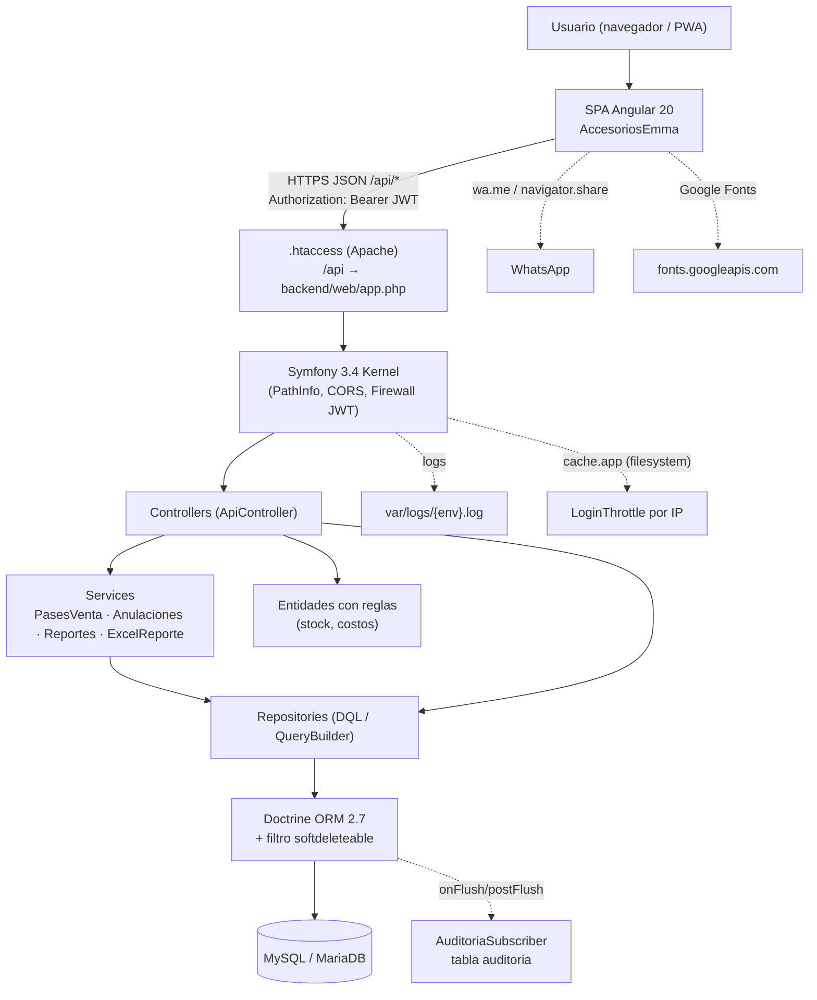
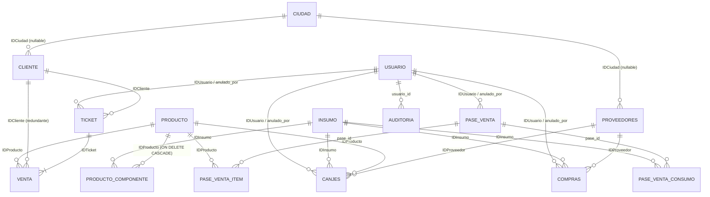
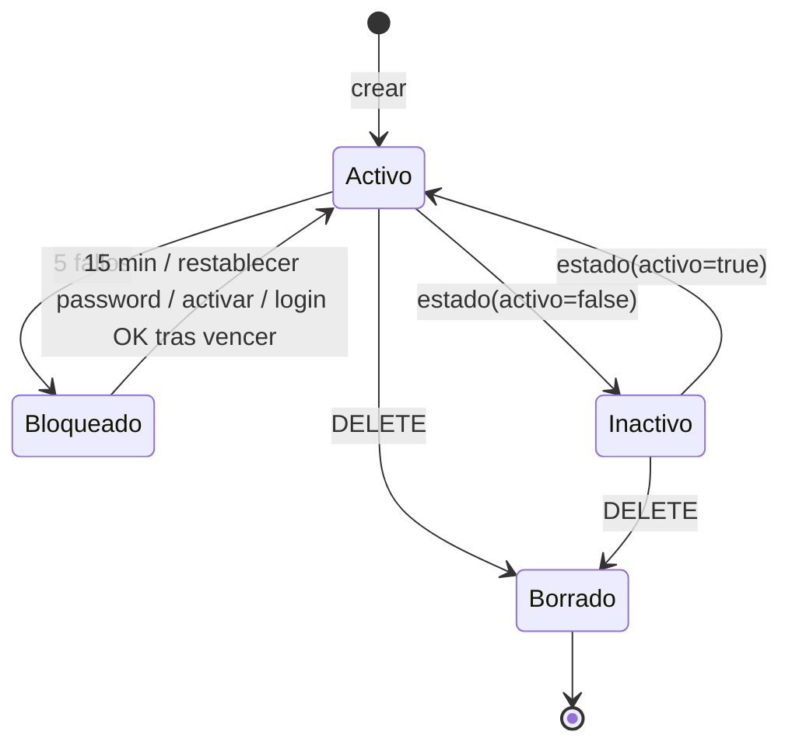
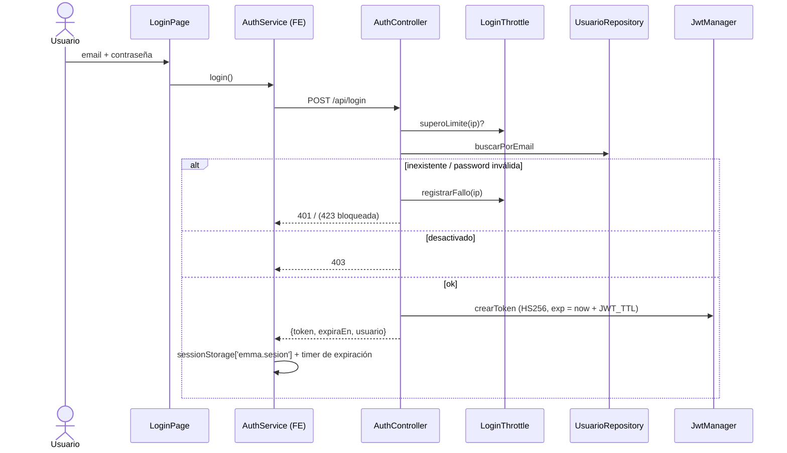
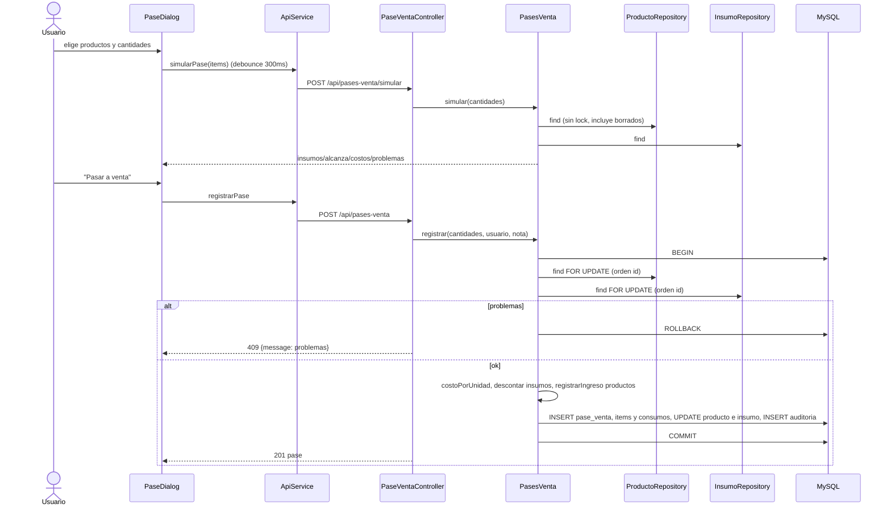
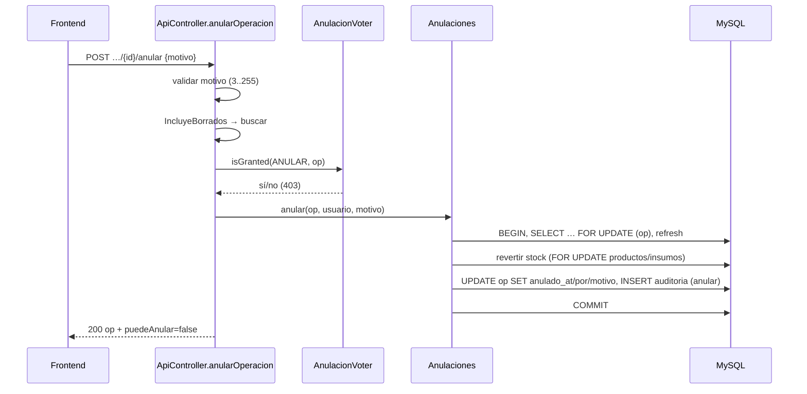
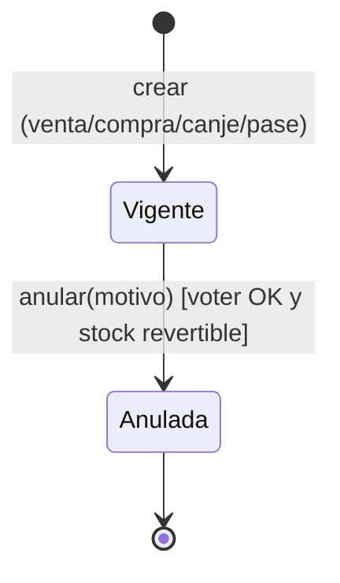
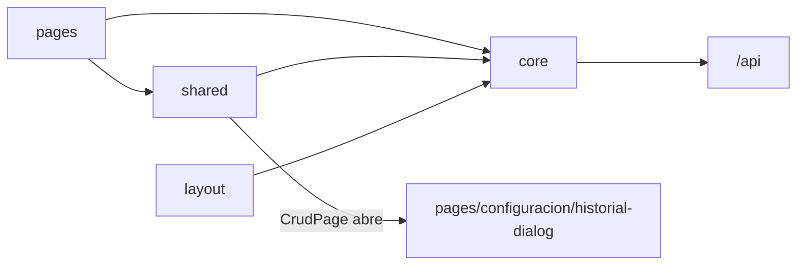

# Emma Accesorios · Documentación técnica

> Documentación para desarrolladores reconstruida a partir del código del repositorio
> (rama analizada al 08/10/2026, último commit `de7be73`). Describe el comportamiento **real**; donde
> el código contradice a otra documentación o a sí mismo, se señala.
>
> **Marcas de certeza** (ver [§29](#29-nivel-de-certeza)): **[C]** confirmado en el código ·
> **[I]** inferido · **[ND]** no determinado. Las afirmaciones sin marca son [C].
>
> Documentos relacionados: [MANUAL_USUARIO.md](MANUAL_USUARIO.md) (uso) ·
> [DESARROLLO.md](DESARROLLO.md) (documentación técnica anterior; ver contradicciones en [§30](#30-hallazgos)).

## Índice

1. [Visión general de la arquitectura](#1-visión-general-de-la-arquitectura)
2. [Stack tecnológico](#2-stack-tecnológico)
3. [Estructura del proyecto](#3-estructura-del-proyecto)
4. [Arquitectura del backend](#4-arquitectura-del-backend)
5. [Rutas](#5-rutas)
6. [Controladores](#6-controladores)
7. [Servicios](#7-servicios)
8. [Modelos y entidades](#8-modelos-y-entidades)
9. [Base de datos](#9-base-de-datos)
10. [Reglas de negocio](#10-reglas-de-negocio)
11. [Flujos técnicos](#11-flujos-técnicos)
12. [Frontend](#12-frontend)
13. [Seguridad](#13-seguridad)
14. [Integraciones externas](#14-integraciones-externas)
15. [Procesos automáticos](#15-procesos-automáticos)
16. [Configuración](#16-configuración)
17. [Instalación y puesta en marcha](#17-instalación-y-puesta-en-marcha)
18. [Deployment](#18-deployment)
19. [Testing](#19-testing)
20. [Logs y debugging](#20-logs-y-debugging)
21. [Mantenimiento](#21-mantenimiento)
22. [Dependencias y deuda técnica](#22-dependencias-y-deuda-técnica)
23. [Mapa de dependencias](#23-mapa-de-dependencias)
24. [Matriz funcional → técnica](#24-matriz-funcional--técnica)
25. [Inventario de componentes](#25-inventario-de-componentes)
26. [Decisiones arquitectónicas detectadas](#26-decisiones-arquitectónicas-detectadas)
27. [Flujos visuales](#27-flujos-visuales)
28. [Referencias exactas al código](#28-referencias-exactas-al-código)
29. [Nivel de certeza](#29-nivel-de-certeza)
30. [Hallazgos](#30-hallazgos)

Rutas de archivo abreviadas: `BE/` = `BackendEmma/src/AppBundle/`, `FE/` = `AccesoriosEmma/src/app/`.

---

## 1. Visión general de la arquitectura

Aplicación de gestión comercial compuesta por:

- **Frontend SPA** Angular 20 (standalone components, signals, Angular Material 3), instalable como
  PWA (service worker solo en build de producción).
- **Backend API REST JSON** Symfony 3.4 (un único bundle `AppBundle`), *stateless*, autenticación
  **JWT HS256** propia (Guard authenticator).
- **Base de datos** MySQL/MariaDB vía **Doctrine ORM 2.7** con mapeo por anotaciones; extensiones
  **Gedmo** (Timestampable + SoftDeleteable).
- **Despliegue** en un solo dominio (hosting compartido tipo InfinityFree): frontend en la raíz, API en
  `/api` reescrita por `.htaccess` a `backend/web/app.php`.

Patrón: **monolito por capas** en el backend (Controller → Service/Entity → Repository → Doctrine),
con **modelo de dominio rico** (las entidades contienen las reglas de stock y costos:
`Producto::descontarStock`, `Insumo::registrarEntrada`, `Ticket::agregarProducto`…). No hay DTOs ni
formularios Symfony: los controladores validan arrays JSON con `Assert\Collection` y serializan con
`toArray()` de cada entidad.



Comunicación: exclusivamente HTTP JSON (y un binario `.xlsx` en reportes). No hay colas, websockets,
emails ni tareas programadas ([§15](#15-procesos-automáticos)).

---

## 2. Stack tecnológico

Versiones tomadas de `composer.lock` y `package-lock.json` (instaladas) y de los manifiestos.

### Backend

| Tecnología | Versión (lock) | Uso |
|---|---|---|
| PHP | `>=7.1.3` (composer), plataforma fijada `7.4.33`; CI con 8.3 | Lenguaje |
| symfony/symfony | v3.4.49 | Framework (FrameworkBundle, SecurityBundle, Validator, Console…) |
| doctrine/orm | 2.7.5 | ORM, mapeo por anotaciones |
| doctrine/dbal | 2.13.9 | Conexión `pdo_mysql`, charset `utf8mb4` |
| doctrine/doctrine-bundle | 1.12.13 | Integración |
| doctrine/annotations | 1.14.4 | Anotaciones ORM/Assert |
| gedmo/doctrine-extensions | v2.4.42 | Timestampable, SoftDeleteable |
| stof/doctrine-extensions-bundle | v1.3.0 | Integración Gedmo |
| firebase/php-jwt | v6.10.0 | Firma/validación JWT HS256 |
| phpoffice/phpspreadsheet | 1.30.7 | Generación `.xlsx` |
| symfony/monolog-bundle / monolog | v3.6.0 / 1.27.1 | Logs |
| symfony/dotenv | 3.4.* | Carga de `.env` |
| phpunit/phpunit | 9.6.38 (dev) | Pruebas |
| MySQL / MariaDB | MariaDB 10.4+ o MySQL 5.7+ (README); CI usa `mysql:8.4` | Base de datos |

### Frontend

| Tecnología | Versión (lock) | Uso |
|---|---|---|
| @angular/core, common, router, forms… | 20.3.33 | Framework SPA |
| @angular/material / cdk | 20.2.14 | UI Material 3 |
| @angular/service-worker | 20.3.33 | PWA |
| @angular/build / cli | 20.3.38 | Build (esbuild), dev-server, test runner |
| typescript | 5.9.3 | Lenguaje (modo `strict`) |
| rxjs | 7.8.2 | Reactividad / HTTP |
| zone.js | 0.15.1 | Detección de cambios |
| chart.js | 4.4.9 | Gráficos del panel (carga diferida) |
| jspdf | 4.2.1 | PDF del ticket (carga diferida) |
| vitest / jsdom | 3.2.7 / 26.1.0 | Pruebas unitarias |

### Infraestructura / herramientas

| Herramienta | Uso |
|---|---|
| Apache + `mod_rewrite` (+ `mod_headers`) | Servir frontend y reescribir `/api` ([§18](#18-deployment)) |
| GitHub Actions (`.github/workflows/pruebas.yml`) | CI: PHPUnit + Vitest + `ng build` |
| `deploy/deploy.sh` (bash, rsync, composer, lftp) | Armado y subida por FTP |
| Servidor embebido Symfony (`WebServerBundle`, solo `dev`) | Desarrollo local (`server:run`) |
| Google Fonts (Roboto, Material Symbols) | Tipografía e íconos |

---

## 3. Estructura del proyecto

```
EmmaAcesorios/
├── README.md                     Puesta en marcha rápida
├── .github/workflows/pruebas.yml CI (backend + frontend)
├── deploy/
│   ├── deploy.sh                 Arma deploy/build/htdocs y sube por FTP (lftp)
│   ├── deploy.env.dist           Plantilla credenciales FTP (deploy.env está en .gitignore)
│   └── plantillas/               .htaccess del sitio, del backend, "denegar" y env.prod
├── docs/                         Manual, documentación técnica, capturas (img/)
├── BackendEmma/                  API Symfony 3.4
│   ├── app/
│   │   ├── AppKernel.php         Bundles (WebServerBundle solo en dev); var/cache, var/logs
│   │   ├── autoload.php          Composer + Dotenv(.env) + date_default_timezone_set(APP_TIMEZONE)
│   │   └── config/               config*.yml, security.yml, services.yml, routing.yml, routing/*.yml,
│   │                             parameters.yml.dist (parameters.yml en .gitignore)
│   ├── bin/console               Consola (alias s:start → server:start --env=dev)
│   ├── web/app.php, .htaccess    Front controller (SYMFONY_ENV, por defecto prod)
│   ├── src/AppBundle/
│   │   ├── Controller/           Un controlador por recurso + ApiController (base)
│   │   ├── Entity/               Entidades Doctrine (definen el esquema) + Anulable/AnulableTrait + CostoPromedio
│   │   ├── Repository/           Consultas DQL/QueryBuilder + IncluyeBorrados (helper)
│   │   ├── Service/              PasesVenta, Anulaciones, Reportes, ExcelReporte
│   │   ├── Security/             JwtManager, JwtAuthenticator, LoginThrottle, AnulacionVoter
│   │   ├── Auditoria/            AuditoriaSubscriber (listener Doctrine)
│   │   ├── EventSubscriber/      ApiExceptionSubscriber, CorsSubscriber, PathInfoSubscriber
│   │   └── Command/              app:usuario:crear, app:usuario:password (+ Passwords helper)
│   ├── sql/                      Dump v1, migraciones v1→v2, v2→v3, schema.sql (desactualizado), scripts
│   ├── tests/                    PHPUnit (ApiTestCase + controladores + entidades)
│   ├── composer.json / .lock, phpunit.xml.dist, .env.dist
│   └── var/                      cache/ y logs/ (ignorado salvo .gitkeep)
└── AccesoriosEmma/               SPA Angular 20
    ├── angular.json, proxy.conf.json (/api → 127.0.0.1:8000), ngsw-config.json
    ├── public/                   logoEmma.png, factura.png (fondo del PDF), icons/, manifest.webmanifest
    └── src/
        ├── index.html, main.ts, styles.scss (tema M3), environments/
        └── app/
            ├── app.ts, app.config.ts, app.routes.ts
            ├── core/             ApiService, AuthService, interceptor, guards, modelos, Notificacion, Tema, Conexion
            ├── shared/           DataTable, FormDialog, CrudPage, ConfirmDialog, anular, whatsapp, PageHeader, paginador
            ├── layout/           Shell (menú + barra), CambiarPasswordDialog
            └── pages/            Una carpeta por pantalla (+ diálogos de cada una)
```

Relaciones: `AccesoriosEmma` solo conoce la API por `environment.apiUrl` (`/api`, igual en dev y
prod). `deploy/` empaqueta ambos. `BackendEmma/sql` es el único mecanismo de migración para hostings
sin consola ([§9.6](#96-evolución-del-esquema-migraciones)).

---

## 4. Arquitectura del backend

| Capa | Ubicación | Responsabilidad | Notas |
|---|---|---|---|
| Front controller | `web/app.php` | Crea `AppKernel($env, $debug)` | `$debug = $env === 'dev'`. |
| Event subscribers (kernel) | `BE/EventSubscriber` | Rechazo de PATH_INFO inválido (prio 512), CORS/preflight (prio 250), errores JSON y headers (prio −10) | |
| Seguridad | `app/config/security.yml`, `BE/Security` | Firewall `api` stateless con `JwtAuthenticator`; `access_control` por prefijo; voter de anulación | |
| Controladores | `BE/Controller` | Parseo/validación de JSON, orquestación, transacciones, serialización | Heredan `ApiController`. Servicios con autowiring; acciones con argumentos inyectados (`controller.service_arguments`). |
| Servicios | `BE/Service` | Casos de uso multi-entidad: pases a venta, anulaciones, reportes, Excel | Sin interfaz; autowired. |
| Entidades (dominio) | `BE/Entity` | Estado + **reglas de negocio** (stock, costo promedio, ganancia, bloqueo de usuario) + `toArray()` | Mapeo por anotaciones; `@Assert` para validación de catálogos. |
| Repositorios | `BE/Repository` | Consultas, bloqueos `PESSIMISTIC_WRITE`, agregados para panel | `ServiceEntityRepository`. |
| Helpers | `Repository/IncluyeBorrados`, `Entity/CostoPromedio`, `Command/Passwords` | Desactivar filtro soft delete; fórmula de costo; generación de contraseñas | Excluidos del contenedor en `services.yml`. |
| Listener Doctrine | `BE/Auditoria/AuditoriaSubscriber` | Auditoría automática de altas/ediciones/bajas/anulaciones | Tag `doctrine.event_subscriber`. |
| Comandos | `BE/Command` | Alta de usuarios y reseteo de contraseña por CLI | |
| DTOs / Form types / Traits de servicio | — | **No existen** | `AnulableTrait` es trait de entidad. |

`ApiController` (`BE/Controller/ApiController.php`) provee:
- `getJson()` (400 si el cuerpo no es un objeto/array JSON),
- `validar(array, fields)` con `Assert\Collection` (`allowExtraFields: true`) → 422 `{message, errors}`;
  los paths `[items][0][cantidad]` se traducen a `items.0.cantidad`,
- `validarEntidad()` para entidades con `@Assert`,
- `valor()` (trim de strings, default si falta/null),
- restricciones reutilizables `texto()`, `numero()`, `entero()`, `opcional()`, `renglones()` (1..100),
- `ordenarPor()` (orden de bloqueo), `conPermisos()` (agrega `puedeAnular`),
- `anularOperacion()` (flujo común de anulación, [§11.6](#116-anulación)).

---

## 5. Rutas

### 5.1 API (backend)

Definidas en `app/config/routing.yml` y `app/config/routing/*.yml`. Permisos según
`security.yml`: `^/api/login$` anónimo; `^/api/admin` → `ROLE_ADMIN`; resto de `^/api` → `ROLE_USER`
(`ROLE_ADMIN` hereda `ROLE_USER`). `{id}` exige `\d+`.

| Método | Ruta | Controlador::acción | Permisos | Descripción |
|---|---|---|---|---|
| POST | `/api/login` | `AuthController::login` | Público | `{email,password}` → `{token, expiraEn, usuario}`. Throttling por IP y bloqueo por cuenta. |
| GET | `/api/me` | `AuthController::me` | USER | Usuario actual. |
| POST | `/api/me/password` | `AuthController::cambiarPassword` | USER | `{actual, nueva}` (nueva ≥ 12). |
| GET | `/api/dashboard` | `DashboardController::resumen` | USER | KPIs del mes, stock bajo. |
| GET | `/api/dashboard/graficos` | `DashboardController::graficos` | USER | Serie diaria acumulada, top 10, por usuario. |
| GET | `/api/productos` | `ProductoController::listar` | USER | `?q=` LIKE en nombre. Incluye `tieneComposicion`. |
| POST | `/api/productos` | `ProductoController::crear` | USER | `{nombre, stock, stockMinimo?, precio, coste}`. |
| GET | `/api/productos/{id}` | `ProductoController::ver` | USER | |
| PUT | `/api/productos/{id}` | `ProductoController::editar` | USER | Igual que crear. |
| DELETE | `/api/productos/{id}` | `ProductoController::borrar` | USER | Soft delete, 204. |
| GET | `/api/productos/{id}/composicion` | `ProductoController::composicion` | USER | Incluye insumos borrados (`insumoBorrado`). |
| PUT | `/api/productos/{id}/composicion` | `ProductoController::guardarComposicion` | USER | `{costoAdicional?, componentes:[{insumoId,cantidad}]}` reemplaza todo. |
| GET/POST | `/api/insumos` | `InsumoController::listar/crear` | USER | `{nombre, stock, stockMinimo?, precio, descuentoCanje?, costoPromedio?}`. |
| GET/PUT/DELETE | `/api/insumos/{id}` | `InsumoController::ver/editar/borrar` | USER | |
| GET/POST | `/api/clientes` | `ClienteController::listar/crear` | USER | Lista con `compras` y `totalComprado`. `?q=` nombre/ciudad/teléfono. |
| GET/PUT/DELETE | `/api/clientes/{id}` | `ClienteController::ver/editar/borrar` | USER | |
| GET/POST | `/api/proveedores` | `ProveedorController::listar/crear` | USER | (No hay GET por id.) |
| PUT/DELETE | `/api/proveedores/{id}` | `ProveedorController::editar/borrar` | USER | |
| GET/POST | `/api/ciudades` | `CiudadController::listar/crear` | USER | Lista con cantidad de clientes. |
| PUT/DELETE | `/api/ciudades/{id}` | `CiudadController::editar/borrar` | USER | Borrar: 409 si hay clientes/proveedores activos. |
| GET | `/api/provincias` | `CiudadController::provincias` | USER | Constante `Ciudad::PROVINCIAS` ordenada por nombre. |
| GET | `/api/compras` | `CompraController::listar` | USER | `?proveedorId&insumoId` (incluye borrados y anuladas). |
| POST | `/api/compras` | `CompraController::crear` | USER | `{proveedorId, fecha?, items:[{insumoId,cantidad,costo}]}` → array de compras. |
| POST | `/api/compras/{id}/anular` | `CompraController::anular` | USER + voter | `{motivo}`. |
| GET | `/api/canjes` | `CanjeController::listar` | USER | |
| POST | `/api/canjes` | `CanjeController::crear` | USER | `{proveedorId, descuentoProducto?, descuentoInsumo?, items:[…]}`. |
| POST | `/api/canjes/{id}/anular` | `CanjeController::anular` | USER + voter | |
| GET | `/api/pases-venta` | `PaseVentaController::listar` | USER | |
| POST | `/api/pases-venta` | `PaseVentaController::crear` | USER | `{items:[{productoId,cantidad}], nota?}`. |
| POST | `/api/pases-venta/simular` | `PaseVentaController::simular` | USER | Igual cuerpo; no persiste. |
| GET | `/api/pases-venta/{id}` | `PaseVentaController::ver` | USER | Con items y consumos. |
| POST | `/api/pases-venta/{id}/anular` | `PaseVentaController::anular` | USER + voter | |
| GET | `/api/ventas` | `VentaController::listar` | USER | `?clienteId&productoId&ciudadId&desde&hasta` (YYYY-MM-DD; inválidas se ignoran). |
| POST | `/api/ventas` | `VentaController::crear` | USER | `{clienteId, items:[{productoId,cantidad}]}`. |
| GET | `/api/ventas/{id}` | `VentaController::ver` | USER | Ticket con renglones. |
| POST | `/api/ventas/{id}/anular` | `VentaController::anular` | USER + voter | |
| GET | `/api/reportes/{tipo}` | `ReporteController::ver` | USER | `tipo ∈ ventas|compras|canjes|pases`; filtros validados (422). |
| GET | `/api/reportes/{tipo}/excel` | `ReporteController::excel` | USER | `.xlsx` (attachment). |
| GET | `/api/usuarios` | `ReporteController::usuarios` | USER | `[{id,nombre}]` de usuarios no borrados. |
| GET | `/api/admin/usuarios` | `AdminUsuarioController::listar` | ADMIN | |
| POST | `/api/admin/usuarios` | `AdminUsuarioController::crear` | ADMIN | `{nombre,email,rol,password}`. |
| GET | `/api/admin/roles` | `AdminUsuarioController::roles` | ADMIN | |
| PUT | `/api/admin/usuarios/{id}` | `AdminUsuarioController::editar` | ADMIN | `{nombre,email,rol}`. |
| PUT | `/api/admin/usuarios/{id}/estado` | `AdminUsuarioController::estado` | ADMIN | `{activo: bool}`. |
| PUT | `/api/admin/usuarios/{id}/password` | `AdminUsuarioController::password` | ADMIN | `{password}`; desbloquea. |
| DELETE | `/api/admin/usuarios/{id}` | `AdminUsuarioController::borrar` | ADMIN | Soft delete. |
| GET | `/api/admin/auditoria` | `AuditoriaController::listar` | ADMIN | `?desde&hasta&usuarioId&entidad&entidadId&accion&pagina` (50/pág.). |
| OPTIONS | cualquier ruta | `CorsSubscriber::onRequest` | Público | Preflight → 204 (si trae `Access-Control-Request-Method`). |

Formato de error uniforme: `{"message": "..."}`; validación: `422 {"message":"Datos inválidos.","errors":{campo: mensaje}}`.
Códigos usados: 200, 201, 204, 400, 401, 403, 404, 405, 409 (negocio/stock/estado), 422, 423 (cuenta
bloqueada), 429 (throttling), 500.

### 5.2 Rutas del frontend

`FE/app.routes.ts` — todas *lazy* (`loadComponent`) dentro de `Shell` salvo `login`.

| Ruta | Componente | Guard | Título |
|---|---|---|---|
| `/login` | `LoginPage` | `invitadoGuard` (con token → `/inicio`) | Ingresar |
| `/` | redirect → `inicio` | `authGuard` | |
| `/inicio` | `InicioPage` (+ `GraficosPanel`) | `authGuard` | Inicio |
| `/ventas` | `VentasPage` | `authGuard` | Ventas |
| `/compras` | `ComprasPage` | `authGuard` | Compras |
| `/canjes` | `CanjesPage` | `authGuard` | Canjes |
| `/pases-venta` | `PasesVentaPage` | `authGuard` | Pasar a venta |
| `/reportes` | `ReportesPage` | `authGuard` | Reportes |
| `/productos` | `ProductosPage` | `authGuard` | Productos |
| `/insumos` | `InsumosPage` | `authGuard` | Insumos |
| `/clientes` | `ClientesPage` | `authGuard` | Clientes |
| `/clientes/:id` | `ClienteDetallePage` (input `id` por `withComponentInputBinding`) | `authGuard` | Cliente |
| `/proveedores` | `ProveedoresPage` | `authGuard` | Proveedores |
| `/configuracion` | `ConfiguracionPage` | `authGuard` + `adminGuard` (no admin → `/inicio`) | Configuración |
| `/ciudades` | `CiudadesPage` | `authGuard` | Ciudades |
| `**` | `NoEncontradaPage` | `authGuard` | 404 |

---

## 6. Controladores

### 6.1 `AuthController`
- **login** (`:50`): 1) `LoginThrottle::superoLimite(ip)` → 429; 2) valida `email` (Email, ≤100) y
  `password` (≤4096); 3) `UsuarioRepository::buscarPorEmail` (normaliza lower/trim; excluye borrados);
  4) inexistente → verifica contra `HASH_FALSO` (tiempo constante), `registrarFallo`, 401;
  5) `estaBloqueado()` → 423; 6) password inválida → `registrarLoginFallido()` + flush +
  `registrarFallo` → 401; 7) `!isEnabled()` → 403 (solo tras password correcta); 8) éxito →
  `registrarLoginExitoso()`, flush, `throttle->limpiar(ip)`, responde `{token, expiraEn (TTL s), usuario}`.
- **me** (`:106`), **cambiarPassword** (`:114`): valida actual/nueva (≥12), 422 si la actual no coincide,
  `setPassword(encode)` (también desbloquea).
- Servicios: `UsuarioRepository`, `UserPasswordEncoderInterface` (bcrypt cost 12; 4 en test),
  `JwtManager`, `LoginThrottle`.

### 6.2 `DashboardController`
- **resumen** (`:16`): desde `first day of this month 00:00` → `TicketRepository::resumenDesde`
  (count/sum de tickets no anulados + sum `venta.profit` con `v.fecha >= desde`),
  `CompraRepository::totalDesde` (sum `costo` no anuladas por `FechaCompra`), conteo de clientes y
  productos no borrados, `conStockBajo()` de productos e insumos (≤10 c/u, orden por faltante).
- **graficos** (`:51`): `totalesPorDia` del mes actual y anterior (agrupado en PHP), acumulados por
  día (`actual = null` en días futuros), `masVendidos` (top 10 por unidades, incluye borrados),
  `porUsuario`.

### 6.3 Catálogos: `ProductoController`, `InsumoController`, `ClienteController`, `ProveedorController`, `CiudadController`
Patrón común: `listar` (repositorio, `?q=`), `crear`/`editar` → `guardar()` privado que hace setters
desde el JSON, `validarEntidad()` (`@Assert`) y, si falla, `em->clear()` + 422; si no, `persist/flush`.
`borrar` → `em->remove()` (Gedmo lo convierte en `UPDATE deleted_at`), 204.

Particularidades:
- **Producto**: `stockMinimo` opcional (conserva el anterior; 5 al crear). `composicion` y
  `guardarComposicion` (`:60`, `:76`): valida lista (≤50, `insumoId`/`cantidad` enteros ≥1), rechaza
  insumos repetidos/inexistentes (`errorDeCampo('componentes.i.insumoId', …)`), compara la
  descripción antes/después (`describirComposicion`) y anota el cambio en auditoría con
  `AuditoriaSubscriber::anotarCambio` (la colección no es un campo del changeset).
- **Insumo**: `costoPromedio` opcional (corrección manual), `descuentoCanje` null → 0.
- **Cliente/Proveedor**: `ciudadId` opcional; si se envía y no existe → 422 `ciudadId`. Cliente responde
  con totales (`buscarConTotales`).
- **Ciudad**: `provincia` validada contra `Ciudad::PROVINCIAS` (`Assert\Choice(callback)`); `borrar`
  devuelve 409 si `CiudadRepository::enUso()` (clientes/proveedores **no borrados**).

### 6.4 `VentaController`
- **listar** (`:37`): `TicketRepository::listar` con filtros (fechas solo si cumplen `^\d{4}-\d{2}-\d{2}$`),
  incluye borrados y anuladas; agrega `puedeAnular`.
- **crear** (`:79`): valida; cliente vía `ClienteRepository::buscar` (excluye borrados → 422);
  agrupa renglones por `productoId` y ordena por id (**orden de bloqueo**); transacción:
  `buscarParaActualizarStock` (`SELECT … FOR UPDATE`), `Ticket::agregarProducto` (descuenta stock,
  crea `Venta` con precio/coste actuales); `DomainException` → rollback + 409; otras → rollback + rethrow.
  Responde 201 con el ticket completo.
- **ver** (`:50`), **anular** (`:63`) → `anularOperacion`.

### 6.5 `CompraController`
- **crear** (`:52`): valida (`fecha` opcional `Assert\Date`); proveedor `find()` (filtro activo → no
  borrados); transacción: bloquea insumos ordenados por `insumoId`; insumo inexistente → rollback + 422
  `items.i.insumoId`; por renglón crea `Compra` (fecha común) y `Insumo::registrarEntrada(cantidad,
  costo/cantidad)`. **Cada renglón es una fila `compras` independiente**. Responde 201 con array.
- **listar** (`:35`), **anular** (`:113`).

### 6.6 `CanjeController`
- **crear** (`:55`): valida descuentos 0..100 (opcionales); transacción: bloquea **primero productos y
  luego insumos**, cada grupo ordenado por id; inexistentes → `DomainException` 409; por renglón
  `Canje::aplicarStock()` (descuenta producto, fija `costoInsumos = coste×cantProducto`,
  `Insumo::registrarEntrada`) y `calcularProfit(descProd, descIns)`. 201 con array.

### 6.7 `PaseVentaController`
- **simular** (`:50`) / **crear** (`:63`): validan `items` (1..100) y `nota` (≤255); suman renglones
  repetidos (`cantidades()`); delegan en `Service\PasesVenta`. `DomainException` → 409 con **todos los
  problemas concatenados**.
- **listar** (`:29`), **ver** (`:36`, `buscarCompleto`), **anular** (`:82`).

### 6.8 `ReporteController`
- **ver** / **excel** (`:22`, `:35`): `filtros()` valida `tipo` (404 si no está en `Reportes::TIPOS`),
  fechas `!Y-m-d` estrictas, `desde ≤ hasta`, `incluirAnuladas ∈ {'',0,1,true,false}` y enteros ≥1
  para `usuarioId` + `Reportes::FILTROS[tipo]`. Excel: `ExcelReporte::generar($reporte, nombreUsuario)`,
  `Content-Disposition: attachment; filename=reporte-{tipo}-{Y-m-d-His}.xlsx`.
- **usuarios** (`:57`): lista simple para el filtro "Registró".

### 6.9 `AdminUsuarioController`
Reglas (`:19-22`): nadie se desactiva/borra/quita admin a sí mismo; siempre ≥1 admin activo.
- **crear** (`:68`): reglas nombre (≤50), email (Email, ≤100), rol ∈ `Usuario::ROLES`, password (≥12);
  `emailDisponible()` busca **incluyendo borrados**.
- **editar** (`:89`): mismas reglas sin password; si se quita rol admin: 422 si es uno mismo o si es el
  último admin activo.
- **estado** (`:119`): `{activo: bool}`; desactivar → `impedirQuitarAcceso` (409); activar también
  `desbloquear()`.
- **password** (`:147`), **borrar** (`:164`, soft delete con `impedirQuitarAcceso`).

### 6.10 `AuditoriaController`
- **listar** (`:21`): valida fechas, enteros, `entidad ∈ AuditoriaSubscriber::AUDITADAS` (valores),
  `accion ∈ Auditoria::ACCIONES`; `AuditoriaRepository::buscar` con `Paginator` (50/pág.); devuelve
  además los catálogos `entidades` y `acciones` para los filtros del frontend.

---

## 7. Servicios

### 7.1 `Service\PasesVenta`
- **Responsabilidad**: convertir insumos en stock de productos según su composición, calculando costos.
- **Dependencias**: `EntityManagerInterface`, `ProductoRepository`, `InsumoRepository`.
- **`simular(array $cantidades)`** (`:40`): dentro de `IncluyeBorrados`, `planificar(…, false)` (sin
  bloqueo) y devuelve `{items[{productoId, producto, cantidad, costoUnitario, costoTotal, costeActual}],
  insumos[{insumoId, insumo, necesita, disponible, alcanza}], costoTotal, problemas[]}`. Sin efectos.
- **`registrar(array $cantidades, ?Usuario, ?nota)`** (`:78`): transacción; `planificar(…, true)`
  (bloqueos `FOR UPDATE`, productos y luego insumos ordenados por id); si hay problemas →
  `DomainException(implode(' ', problemas))`; crea `PaseVenta`, `agregarItem` (costo unitario),
  `agregarConsumo` (costo promedio **actual** del insumo) + `Insumo::descontarStock`; luego
  `Producto::registrarIngreso` (promedio ponderado). Persist (cascade a items y consumos) y commit.
- **`planificar()`** (`:116`, privado): valida producto existente/no borrado y con componentes; acumula
  necesidades por insumo; problemas por insumo borrado o stock insuficiente; **calcula
  `costoUnitario = Producto::costoPorUnidad()` después de cargar los insumos**.
- **Excepciones**: `DomainException` (problemas de negocio); otras se propagan con rollback.

### 7.2 `Service\Anulaciones`
- **`anular(Anulable $op, Usuario $u, $motivo)`** (`:40`): transacción; `em->lock(op,
  PESSIMISTIC_WRITE)` + `refresh` (evita doble anulación concurrente); si ya anulada →
  `DomainException`; `revertir()`; `$op->anular()` (marca `anulado_at/por/motivo`); flush/commit.
- **`revertir()`** (`:62`) por tipo:
  - `Ticket`: suma stock por producto (agrupado, ordenado por id) — **el coste del producto no cambia**.
  - `Compra`: `Insumo::revertirEntrada(cantidad, costo/cantidad)` (falla si no hay stock).
  - `Canje`: producto `sumarStock`; insumo `revertirEntrada(cantInsumo, costoUnitarioInsumo|null)`.
  - `PaseVenta`: por item `Producto::revertirIngreso` (falla si ya se vendió); por consumo
    `Insumo::registrarEntrada(cantidad, costo de ese momento)`.
- Usa `buscarParaRevertirStock()` (bloqueo **incluyendo borrados**).
- **No decide permisos**: eso es `AnulacionVoter` (llamado desde `ApiController::anularOperacion`).

### 7.3 `Service\Reportes`
- **`generar($tipo, $filtros)`** (`:54`): todo con `IncluyeBorrados` (histórico). Devuelve `{titulo,
  tipo, filtros (texto), columnas[{clave,titulo,tipo,sumar?}], filas, totales[], resumen[]}`.
- Consultas con QueryBuilder parametrizado sobre `Venta`, `Compra`, `Canje`, `PaseVentaItem`
  (+`EXISTS` sobre `PaseVentaConsumo` para filtro insumo). `filtrarAnuladas`: sin flag → `anuladoAt IS
  NULL`; con flag → columna `estado` (`CASE`) insertada tras la fecha y **totales/resúmenes solo sobre
  vigentes** (`vigentes()`).
- `agrupar()` en PHP: suma columnas, cuenta operaciones (o distintos, p. ej. tickets), ordena desc.
- `describirFiltros()` resuelve nombres con `em->find`.

### 7.4 `Service\ExcelReporte`
- **`generar(array $reporte, $generadoPor)`** (`:38`): `Spreadsheet` con hojas **Detalle** (encabezado
  fila 5, datos, formatos por tipo, bordes, fila TOTAL con `=SUBTOTAL(109,…)`, autofiltro, panel
  congelado) y **Resumen** (indicadores + tablas). Configura A4 apaisado, ajuste a ancho, pie con
  páginas. Escribe a `tempnam()`, lee, borra el temporal.
- Protección contra *formula injection*: textos que empiezan con `= + - @` se escriben como string
  explícito (`escribir()`, `:215`).

### 7.5 Llamadas entre servicios

```
PaseVentaController → PasesVenta → (ProductoRepository, InsumoRepository, entidades)
Venta/Compra/Canje/PaseVentaController::anular → ApiController::anularOperacion
      → AnulacionVoter (isGranted) → Anulaciones → (repos, entidades)
ReporteController → Reportes → ExcelReporte (solo /excel)
ProductoController::guardarComposicion → AuditoriaSubscriber::anotarCambio
(cualquier flush) → AuditoriaSubscriber (eventos Doctrine)
```

### 7.6 Seguridad (servicios)
`JwtManager` (crear/decodificar, `leeway=30s`, valida `iss='emma-accesorios'` y `sub`; exige
`JWT_SECRET` ≥ 32 caracteres o lanza `RuntimeException` al construir), `JwtAuthenticator`,
`LoginThrottle` (cache `cache.app`, clave `login_sha1(ip)`, 20 intentos, ventana 900 s renovada en
cada fallo), `AnulacionVoter` (política por `ANULACION_PERMITIDA`; valor inválido → excepción al
construir el contenedor).

---

## 8. Modelos y entidades

Todas las entidades salvo `Componente`, `PaseVentaItem`, `PaseVentaConsumo` y `Auditoria` usan
`TimestampableEntity` (`created_at`, `updated_at` NOT NULL) y `SoftDeleteableEntity` (`deleted_at`
NULL) con `@Gedmo\SoftDeleteable(hardDelete=false)`. Las **anulables** (`Ticket`, `Compra`, `Canje`,
`PaseVenta`) implementan `Anulable` y usan `AnulableTrait` (`anulado_at`, `anulado_por` FK usuario,
`motivo_anulacion`).

### 8.1 Resumen

| Entidad | Tabla | Propósito | Comportamiento relevante |
|---|---|---|---|
| `Usuario` | `usuario` | Usuarios del sistema (`AdvancedUserInterface`) | Roles 1=Admin, 2=Usuario; bloqueo 5 intentos / 15 min; email normalizado a minúsculas. |
| `Ciudad` | `ciudad` | Ciudades | `PROVINCIAS` (24) como constante; `provincia` es int. |
| `Cliente` | `cliente` | Clientes | Ciudad opcional; teléfono `''` por defecto. |
| `Proveedor` | `proveedores` | Proveedores | Ídem. |
| `Producto` | `producto` | Artículos vendibles | `descontarStock`, `sumarStock`, `registrarIngreso`/`revertirIngreso` (promedio ponderado), `costoPorUnidad`, composición. |
| `Componente` | `producto_componente` | Insumo × cantidad por unidad de producto | Único (producto, insumo); `orphanRemoval`. |
| `Insumo` | `insumo` | Materiales / mercadería no puesta a la venta | `registrarEntrada`/`revertirEntrada` (costo promedio), `descontarStock`. |
| `Ticket` | `ticket` | Cabecera de venta | `agregarProducto` (descuenta stock, suma total). |
| `Venta` | `venta` | Renglón de ticket | Congela `PrecioUnitario`, `Total`, `profit` y `fechaVenta`. Redundancia `IDCliente`. |
| `Compra` | `compras` | Un renglón de compra | `getCostoUnitario() = costo/cantidad`. |
| `Canje` | `canjes` | Un intercambio producto→insumo | `aplicarStock`, `calcularProfit`, `costo_insumos`. |
| `PaseVenta` | `pase_venta` | Cabecera de pase a venta | `costo_total`, `nota`, items y consumos (cascade persist). |
| `PaseVentaItem` | `pase_venta_item` | Producto ingresado + costo unitario | decimal(14,4). |
| `PaseVentaConsumo` | `pase_venta_consumo` | Insumo consumido + costo unitario del momento | Se usa al anular. |
| `Auditoria` | `auditoria` | Historial de cambios | Sin soft delete; `cambios` JSON. |
| `CostoPromedio` | — | Clase utilitaria (no entidad) | Fórmulas `conEntrada`/`sinEntrada`. |

### 8.2 Diagrama ER



### 8.3 Detalle de campos

Tipos Doctrine → MySQL; "def" = valor por defecto.

**`Usuario`** (`usuario`): `id` IDUsuario int PK · `nombre` NombreUsuario varchar(50) · `rol`
Rol int def 2 · `email` UsuarioEmail varchar(100) **UNIQUE** `uq_usuario_email` · `password`
PasswordHash varchar(255) (bcrypt) · `activo` Activo bool def 1 · `intentosFallidos` int def 0 ·
`bloqueadoHasta` datetime null · `ultimoLogin` datetime null · timestamps/soft delete.
Constantes: `ROL_ADMIN=1`, `ROL_USUARIO=2`, `MAX_INTENTOS=5`, `MINUTOS_BLOQUEO=15`.

**`Ciudad`** (`ciudad`): IDCiudad · NombreCiudad varchar(50) (NotBlank, ≤50) · Provincia int (Choice 1..24).

**`Cliente`** (`cliente`): IDCliente · nombreCliente varchar(50) · IDCiudad FK null ·
telefonoCliente varchar(20) def ''.

**`Proveedor`** (`proveedores`): IDProveedor · nombre varchar(50) · IDCiudad FK null ·
TelefonoProveedor varchar(20) def ''.

**`Producto`** (`producto`): IDProducto · NombreProducto varchar(50) · stockProducto int def 0 (≥0) ·
stock_minimo int def 5 · PrecioProducto decimal(12,2) · costeProduccion **decimal(14,4)** ·
costo_adicional decimal(12,2) def 0 · `componentes` OneToMany(Componente, cascade persist,
orphanRemoval, orden por id).

**`Componente`** (`producto_componente`): id · IDProducto FK NOT NULL `onDelete=CASCADE` · IDInsumo FK ·
cantidad int · UNIQUE `uq_componente(IDProducto, IDInsumo)`.

**`Insumo`** (`insumo`): IDInsumo · NombreInsumo varchar(50) · Stock int def 0 · stock_minimo int def
5 · precio decimal(12,2) (lista) · costo_promedio **decimal(14,4)** def 0 · DescuentoPactadoCanje int
def 0 (0..100).

**`Ticket`** (`ticket`): IDTicket · IDCliente FK · Fecha datetime · CProductos int def 0 (unidades) ·
Valor decimal(12,2) (total) · IDUsuario FK null · anulación · `items` OneToMany(Venta, cascade persist).

**`Venta`** (`venta`): IDVenta · IDTicket FK · IDCliente FK · IDProducto FK · CantidadProducto int ·
PrecioUnitario decimal(12,2) · profit decimal(12,2) · fechaVenta **date** · Total decimal(12,2).

**`Compra`** (`compras`): IDCompra · FechaCompra date · IDProveedor FK · IDInsumo FK · cantidad int (≥1)
· costo decimal(12,2) (**total del renglón**) · IDUsuario FK null · anulación.

**`Canje`** (`canjes`): IDCanje · FechaCanje date (hoy) · IDProveedor/IDProducto/IDInsumo FK ·
CantidadProducto / CantidadInsumo int ≥1 · Profit decimal(12,2) · IDUsuario FK null · costo_insumos
decimal(12,2) **null** (null en canjes anteriores a v4 [I]) · anulación.

**`PaseVenta`** (`pase_venta`): id · fecha datetime · nota varchar(255) null · IDUsuario FK null ·
costo_total decimal(12,2) · items/consumos · anulación.

**`PaseVentaItem`** / **`PaseVentaConsumo`**: id · pase_id FK · IDProducto / IDInsumo FK · cantidad int
· costo_unitario decimal(14,4).

**`Auditoria`** (`auditoria`): id · fecha datetime · usuario_id FK null · usuario_nombre varchar(50) ·
ip varchar(45) · entidad varchar(30) · entidad_id int · descripcion varchar(150) · accion varchar(10)
(`crear|editar|borrar|anular`) · cambios JSON `{campo:[antes,después]}` · motivo varchar(255) ·
índices `idx_auditoria_fecha(fecha)`, `idx_auditoria_entidad(entidad, entidad_id)`.

### 8.4 Estados

| Objeto | Estados | Transiciones |
|---|---|---|
| Operación anulable | Vigente (`anulado_at` NULL) → Anulada | Única transición, irreversible (`AnulableTrait::anular` lanza si ya está anulada). |
| Cualquier entidad soft-deleteable | Activa → Borrada (`deleted_at`) | Solo desde la app; restaurar requiere SQL. |
| Usuario | Activo / Bloqueado (derivado de `BloqueadoHasta > now`) / Inactivo (`Activo=0`) / Borrado | Ver [§10](#10-reglas-de-negocio). |
| Producto / Insumo | Bajo mínimo (derivado `stock ≤ stock_minimo`) | Calculado. |



---

## 9. Base de datos

### 9.1 Tablas

| Tabla | PK | FKs | Únicos/índices | Auditoría | Soft delete |
|---|---|---|---|---|---|
| `usuario` | IDUsuario | — | `uq_usuario_email` | created/updated | sí |
| `ciudad` | IDCiudad | — | — | sí | sí |
| `cliente` | IDCliente | IDCiudad→ciudad | idx FK | sí | sí |
| `proveedores` | IDProveedor | IDCiudad→ciudad | idx FK | sí | sí |
| `producto` | IDProducto | — | — | sí | sí |
| `insumo` | IDInsumo | — | — | sí | sí |
| `producto_componente` | id | IDProducto→producto (CASCADE), IDInsumo→insumo | `uq_componente` | no | no |
| `ticket` | IDTicket | IDCliente, IDUsuario, anulado_por→usuario | idx FKs | sí | sí (no usado) |
| `venta` | IDVenta | IDTicket, IDCliente, IDProducto | idx FKs | sí | sí (no usado) |
| `compras` | IDCompra | IDProveedor, IDInsumo, IDUsuario, anulado_por | idx FKs | sí | sí (no usado) |
| `canjes` | IDCanje | IDProveedor, IDProducto, IDInsumo, IDUsuario, anulado_por | idx FKs | sí | sí (no usado) |
| `pase_venta` | id | IDUsuario, anulado_por | idx FKs | sí | sí (no usado) |
| `pase_venta_item` | id | pase_id, IDProducto | idx FKs | no | no |
| `pase_venta_consumo` | id | pase_id, IDInsumo | idx FKs | no | no |
| `auditoria` | id | usuario_id | `idx_auditoria_fecha`, `idx_auditoria_entidad` | (es el log) | no |

"No usado": las operaciones tienen `deleted_at` pero ningún endpoint las borra (se anulan).

### 9.2 Convenciones y mezcla de nombres
`naming_strategy: underscore` aplica a campos sin `name` explícito (p. ej. `stock_minimo`,
`costo_promedio`, `pase_id`); los heredados de v1 conservan nombres PascalCase/camelCase
(`NombreProducto`, `stockProducto`, `costeProduccion`, `IDCliente`…). Charset/collation
`utf8mb4 / utf8mb4_general_ci`. Motor InnoDB.

### 9.3 Relaciones importantes
- **Ticket–Venta**: cabecera/renglones; `venta.IDCliente` duplica `ticket.IDCliente` por compatibilidad v1.
- **Compras y canjes no tienen cabecera**: un POST con N renglones crea N filas independientes, que se
  anulan por separado.
- **Producto–Insumo**: N:M vía `producto_componente` (composición).
- **Pase a venta**: cabecera + items (productos ingresados) + consumos (insumos totales).
- **Usuario**: autor (`IDUsuario`) y anulador (`anulado_por`) de operaciones; autor de auditoría.

### 9.4 Soft delete
Filtro global `softdeleteable` (`config.yml`) agrega `deleted_at IS NULL` a **todas** las consultas,
incluidos `find()` y subconsultas [I: comportamiento estándar de SQLFilter de Doctrine; confirmado
por pruebas como `testNoSePuedeVenderUnProductoBorrado`]. Listados históricos, reportes, anulaciones y
pases lo desactivan con `IncluyeBorrados::ejecutar()`.

### 9.5 Tablas de configuración / auxiliares
No hay tablas de configuración. Provincias y roles son **constantes PHP** (`Ciudad::PROVINCIAS`,
`Usuario::ROLES`). La regla de anulación y demás parámetros vienen de variables de entorno.

### 9.6 Evolución del esquema (migraciones)
No se usa DoctrineMigrationsBundle. Fuente de verdad: anotaciones de las entidades
(`doctrine:schema:create|update`). Scripts manuales en `BackendEmma/sql/`:

| Archivo | Qué hace |
|---|---|
| `emmaaccesorios_v1_original.sql` | Dump de estructura de la base original (phpMyAdmin, 2024-10-25); sin datos. |
| `migracion_v1_a_v2.sql` | Montos INT→DECIMAL; FKs VARCHAR→INT (limpia huérfanos a NULL); crea `ticket` y asigna un ticket a cada venta vieja; `PrecioUnitario`; renombra `PaswordUsuario`→`PasswordHash` e **invalida contraseñas en texto plano** (`'!'`); agrega columnas de bloqueo y `FechaCreacion`. |
| `migracion_v2_a_v3.sql` | Agrega `created_at/updated_at/deleted_at` nullable, completa valores, pasa `visibility=0` a `deleted_at`, renombra `usuario.FechaCreacion`→`created_at`. Luego `schema:update` los vuelve NOT NULL y borra `visibility`. |
| `migracion_v3_a_v4.sql` | **No existe en el repositorio ni en su historial git** (ver [§30](#30-hallazgos), H1). Según `DESARROLLO.md` debía crear `auditoria`, `producto_componente`, `pase_venta*`, columnas de anulación, `stock_minimo`, `costo_promedio`, `costo_adicional`, `costo_insumos`. |
| `actualizar_local_a_v4.sh` | Backup, completa fechas vacías, **ejecuta `migracion_v3_a_v4.sql` (inexistente)**, `schema:update --force`, `schema:validate`, `cache:clear --env=prod`. |
| `schema.sql` | Dice "Esquema v2" generado por Doctrine; incluye timestamps (v3) pero **no** las tablas/columnas de v4 → **desactualizado**. |
| `crear_usuario.sql` | INSERT manual de admin — usa la columna `FechaCreacion` (renombrada en v3) y omite `created_at/updated_at` → **falla en el esquema actual** [I]. |

Alternativa confiable para el esquema actual: `php bin/console doctrine:schema:create --dump-sql`.

---

## 10. Reglas de negocio

> Formato: **Regla** · Condición · Implementación · Resultado · Excepciones.

### 10.1 Stock e inventario

**R1 – No se vende sin stock.** Cond.: venta con cantidad > stock. Impl.: `Producto::descontarStock`
(`Entity/Producto.php:119`) llamado por `Ticket::agregarProducto` (`Ticket.php:92`) dentro de la
transacción de `VentaController::crear`. Resultado: `DomainException("No hay stock suficiente de
"X" (disponible: n).")` → rollback total, 409. Excepción: ninguna.

**R2 – Venta atómica multi-renglón.** Todos los renglones o ninguno (`VentaController::crear`,
transacción + rollback). Renglones repetidos se suman antes.

**R3 – Bloqueo pesimista y orden de bloqueo.** Productos/insumos se leen con `SELECT … FOR UPDATE`
(`buscarParaActualizarStock`) ordenados por id; en canjes y pases, primero productos y luego insumos.
Objetivo explícito: evitar doble descuento y deadlocks.

**R4 – Precio y ganancia congelados en la venta.** `Venta::__construct` (`Venta.php`) copia
`precio`, calcula `total = precio×cant` y `profit = (precio − coste)×cant` con el coste vigente.
Cambios posteriores de precio/coste no afectan tickets existentes. El navegador no puede imponer
precio (los items solo llevan `productoId` y `cantidad`; prueba `testElNavegadorNoPuedeImponerElPrecio`).

**R5 – Fechas.** `Ticket.fecha = now`, `Venta.fecha = today`, `Canje.fecha = today`, `PaseVenta.fecha
= now`; `Compra.fecha` = la enviada (`Assert\Date`) o hoy. Zona: `APP_TIMEZONE` (def. Buenos Aires,
`app/autoload.php`). No se valida fecha futura en compras.

**R6 – Stock mínimo.** `estaBajoMinimo() = stock <= stockMinimo` (producto e insumo); def 5;
editable ≥0. Panel: `conStockBajo(10)` ordenado por `stock − stockMinimo` asc.

**R7 – Edición manual de stock y costos.** Los endpoints PUT de producto/insumo permiten fijar
`stock`, `coste`, `costoPromedio` directamente; queda auditado como "Modificación".

### 10.2 Costos

**R8 – Costo promedio ponderado** (`Entity/CostoPromedio.php`):
`conEntrada(stock, costo, cant, cu) = (stock<=0 || costo<=0) ? cu : (stock·costo + cant·cu)/(stock+cant)`
redondeado a 4 decimales. `sinEntrada(stock, costo, cant, cu)`: `restante = stock − cant`; si
`restante <= 0` o el resultado `<= 0`, conserva `costo`; si no `(stock·costo − cant·cu)/restante`.

**R9 – Entrada por compra.** `Insumo::registrarEntrada(cant, costo/cant)` (`CompraController.php:94`).

**R10 – Entrada por canje.** `Canje::aplicarStock` (`Canje.php:184`): `costoInsumos = coste del
producto × cantProducto`; costo unitario de entrada = `costoInsumos / cantInsumo`.

**R11 – Costo por unidad producida.** `Producto::costoPorUnidad()` (`Producto.php:207`) =
`costoAdicional + Σ(cantidad × insumo.costoPromedio)`.

**R12 – Coste del producto al pasar a venta.** `Producto::registrarIngreso` aplica R8 sobre `coste`.

**R13 – Ganancia de canje.** `Canje::calcularProfit` (`:199`):
`precioInsumo·(1−dI/100)·cantI − precioProducto·(1−dP/100)·cantP` (puede ser negativa). Los
descuentos vienen del request; **`Insumo.DescuentoPactadoCanje` no se usa** (H6).

### 10.3 Pasar a venta

**R14 – Requiere composición.** `PasesVenta::planificar` → problema `"X" no tiene composición…`.
**R15 – Producto/insumo borrado bloquea.** Problemas "El producto #N no existe." / "El insumo "X" fue
dado de baja…".
**R16 – Insumos suficientes.** `No alcanza "X": hacen falta N y hay M.`
**R17 – Todo o nada, con todos los problemas juntos** (`DomainException(implode(' ', …))`, 409).
**R18 – Consumo registrado al costo del momento** (`PaseVentaConsumo.costo_unitario`) para revertir
con exactitud.

### 10.4 Anulaciones

**R19 – Motivo obligatorio** 3..255 (`ApiController::anularOperacion`, mensaje "Contá brevemente el motivo.").
**R20 – No se anula dos veces** (409 "La operación ya estaba anulada.", también con lock en `Anulaciones`).
**R21 – Política de permisos** (`AnulacionVoter`): `todos` (def.) → cualquiera; `admin` → solo rol 1;
`propias_hoy` → admin siempre, el resto solo si `operacion.usuario == actual` y
`createdAt` es hoy. El resultado se expone como `puedeAnular` en cada operación.
**R22 – Reversión de stock** según tipo ([§7.2](#72-serviceanulaciones)); si no hay stock para revertir →
409 "No se puede anular: …".
**R23 – Anuladas excluidas** de: panel (`resumenDesde`, `totalDesde`, gráficos), totales de clientes,
reportes (salvo `incluirAnuladas`, y aun así no suman).

### 10.5 Catálogos

**R24 – Borrado lógico universal** (Gedmo). Sin restricciones salvo **Ciudad** (409 si hay
clientes/proveedores activos). Producto/insumo borrados no pueden usarse en nuevas operaciones; cliente
borrado no puede recibir ventas (422).
**R25 – Composición**: sin insumos repetidos (422), máx. 50, cantidad ≥1; reemplazo total; lista vacía
la elimina.
**R26 – Validaciones de entidad** (`@Assert`): nombres NotBlank ≤50, stock/stockMinimo enteros ≥0,
precio/coste/costoPromedio numéricos ≥0, descuentoCanje 0..100, provincia ∈ 1..24, teléfono ≤20.

### 10.6 Usuarios y autenticación

**R27 – Bloqueo por cuenta**: `registrarLoginFallido` a los 5 → `BloqueadoHasta = now+15min` y
contador a 0 (`Usuario.php:172`). Login exitoso, `setPassword` y activar desbloquean.
**R28 – Throttling por IP**: 20 fallos (cuentan emails inexistentes y contraseñas incorrectas; los
intentos sobre una cuenta ya bloqueada —423— no cuentan) en una ventana de 900 s que se renueva en
cada fallo → 429; un login exitoso limpia el contador de esa IP.
**R29 – Desactivado**: 403 solo si la contraseña es correcta; además el token deja de valer (el
autenticador rechaza `!isEnabled()`).
**R30 – Contraseñas** ≥ 12 (API, comandos y frontend), bcrypt cost 12.
**R31 – Gobierno de admins**: nadie se desactiva/borra/quita admin; siempre ≥1 admin activo
(`contarAdminsActivos`, excluye borrados).
**R32 – Email único incluso entre borrados** (`emailDisponible` con `IncluyeBorrados`; además UNIQUE en BD).

### 10.7 Auditoría

**R33 – Se auditan** `Producto, Insumo, Cliente, Proveedor, Ciudad, Usuario, Ticket('Venta'), Compra,
Canje, PaseVenta('Pase a venta')`: altas (con todos los campos), modificaciones (diff), bajas
(`postSoftDelete`) y anulaciones (detecta `anuladoAt` null→valor; guarda motivo).
**R34 – Ruido evitado**: si en el mismo flush hay una operación (Ticket/Compra/Canje/PaseVenta), los
cambios de `stock`, `coste`, `costoPromedio` de productos/insumos **no** se registran.
**R35 – Campos ignorados**: timestamps, `intentosFallidos`, `bloqueadoHasta`, `ultimoLogin`;
`password` se registra como `["(oculta)","(nueva)"]`.
**R36 – Transaccionalidad**: los registros de auditoría se persisten en `postFlush` dentro de la misma
transacción; si la transacción externa hace rollback, la auditoría también (prueba
`testSiLaOperacionFallaNoQuedaNadaEnElHistorial`).

---

## 11. Flujos técnicos

### 11.1 Ciclo de una petición

```text
HTTP → web/app.php (SYMFONY_ENV) → AppKernel
 → PathInfoSubscriber (prio 512: PATH_INFO debe empezar con "/")
 → CorsSubscriber::onRequest (prio 250: OPTIONS preflight → 204)
 → Firewall "login" (sin seguridad) | "api" (JwtAuthenticator)
 → access_control (ROLE_ADMIN para /api/admin, ROLE_USER resto)
 → Router → Controller (autowiring) → Service/Entity → Repository → Doctrine (filtro softdeleteable)
 → flush → AuditoriaSubscriber (onFlush/postSoftDelete/postFlush)
 → JsonResponse
 → CorsSubscriber::onResponse (Allow-Origin si coincide regex) + ApiExceptionSubscriber::onResponse
   (X-Content-Type-Options: nosniff, Cache-Control: no-store)
Excepciones → ApiExceptionSubscriber::onException (prio −10) → JSON {message}
```

### 11.2 Autenticación



Peticiones posteriores: `authInterceptor` agrega `Authorization: Bearer` a toda URL que empiece con
`/api` (salvo login). `JwtAuthenticator::getUser` decodifica, valida `iss`/`sub`/`exp` (leeway 30 s) y
carga el usuario por `sub` (excluye borrados) → 401 si inválido o desactivado. El interceptor, ante
401, hace `logout('expirada')`.

### 11.3 Creación de venta
`VentaDialog.enviar` → `ApiService.registrarVenta` → `POST /api/ventas` → `VentaController::crear`
(validar → cliente → agrupar/ordenar → BEGIN → `buscarParaActualizarStock` × n →
`Ticket::agregarProducto` → persist/flush (cascade `Venta`) → Auditoría (alta Ticket; stock omitido) →
COMMIT) → 201 → snackbar, recarga lista.

### 11.4 Pase a venta
Ver diagrama de secuencia en [§27](#27-flujos-visuales). Frontend: `PaseDialog` simula con
`debounceTime(300)` + `switchMap` (cancela simulaciones viejas) y deshabilita el submit si
`problemas.length`; si la simulación falla devuelve `null` (no bloquea el submit; el backend vuelve a
validar).

### 11.5 Edición de catálogo
`CrudPage.editar` → `FormDialog` (validadores locales) → `PUT /api/{recurso}/{id}` → `guardar()`
→ 422 por campo (el `FormDialog` asigna `setErrors({servidor})` al control con ese nombre) o 200 →
recarga.

### 11.6 Anulación
`pedirAnulacion` (FormDialog con `motivo`) → `POST …/{id}/anular` → `ApiController::anularOperacion`:
validar motivo → `IncluyeBorrados` → buscar → 404 / 409 ya anulada / 403 voter → `Anulaciones::anular`
(BEGIN, lock, refresh, revertir, marcar, flush, COMMIT; `DomainException` → 409 "No se puede anular: …")
→ responde la operación con `puedeAnular`.

### 11.7 Eliminación
`DELETE` → `em->remove()` → `SoftDeleteableListener` hace `UPDATE … SET deleted_at` → evento
`postSoftDelete` → auditoría "Baja".

### 11.8 Reporte / Excel
`ReportesPage` (debounce 300 ms) → `GET /api/reportes/{tipo}` → `Reportes::generar` → JSON. Descarga:
`GET …/excel` (`responseType: blob`, `observe: response`) → lee `Content-Disposition` (expuesto por
CORS) → `URL.createObjectURL` → `<a download>`.

### 11.9 Documento PDF y WhatsApp (solo frontend)
`TicketDialog` al cargar genera el `File` PDF (`ticketPdfComoArchivo`) para poder llamar a
`navigator.share` sin `await` (requisito de gesto de usuario). `descargarTicketPdf` usa `jsPDF` (import
dinámico) con fondo `factura.png` (cargado con `fetch` → DataURL).

### 11.10 Emails / procesos automáticos / integraciones
No existen envíos de email ni procesos automáticos ([§15](#15-procesos-automáticos)).

---

## 12. Frontend

### 12.1 Estructura y convenciones
- Componentes **standalone**, plantillas inline (salvo algunos `.html` de catálogos), estilos inline.
- Estado con **signals** (`signal`, `computed`, `effect`, `toSignal`, `input()`, `output()`), control flow
  `@if/@for/@switch`.
- `app.config.ts`: locale `es-AR`, `MatPaginatorIntl` en castellano, diálogo por defecto 560px/95vw,
  `mat-form-field` outline, íconos Material Symbols, service worker `registerWhenStable:30000` solo si
  `!isDevMode()`.

### 12.2 `core/`
| Archivo | Rol |
|---|---|
| `api.service.ts` | Único acceso HTTP. CRUD genérico por `Recurso`, operaciones, admin, reportes. `sinError()` → `[]` ante error (para selects con `toSignal`). `params()` omite null/undefined/''. |
| `auth.service.ts` | Sesión en `sessionStorage['emma.sesion']` `{token, expira(ms), usuario}`; `esAdmin = rol === 1`; timer de expiración; `logout(motivo?)`. |
| `auth.interceptor.ts` | Bearer + logout en 401. |
| `auth.guard.ts` | `authGuard`, `adminGuard`, `invitadoGuard`. |
| `notificacion.service.ts` | Snackbars; `mensajeDeError()` (status 0/502/503/504/5xx sin cuerpo → "No se pudo conectar…"; 2xx no-JSON → "no es la API"); `erroresDeCampos()` (solo 422). |
| `tema.service.ts` | Claro/oscuro en `localStorage['emma.tema']`, `color-scheme`, View Transitions. |
| `conexion.service.ts` | `enLinea` (eventos online/offline) y aviso `VERSION_READY` del SW. |
| `models.ts` | Interfaces TS espejo de los `toArray()` del backend. |

### 12.3 `shared/`
| Componente | Rol |
|---|---|
| `DataTable<T>` | `MatTableDataSource` con búsqueda **cliente** (normaliza acentos, concatena todos los valores), `MatSort`, `MatPaginator` (10/25/50/100), columnas tipadas (`texto|numero|moneda|fecha|fechaHora|porcentaje`), `alertaSi`, `atenuada` (tachado), menú ⋮ con `conEditar/conBorrar/acciones/borrable`, botón ver. |
| `FormDialog<T>` | Modal genérico a partir de `CampoFormulario[]` (texto, textoLargo, numero, entero, select, fecha, telefono); normaliza números/strings; mapea errores 422 por campo. |
| `CrudPage<T>` | Base abstracta de catálogos: carga, nuevo/editar/borrar, "Ver historial" para admin (abre `HistorialDialog` con `entidad` = nombre capitalizado). |
| `ConfirmDialog` / `confirmar()` | Confirmación. |
| `pedirAnulacion()` | FormDialog con `motivo` (requerido, ≤255). |
| `whatsapp.ts` | `telefonoWhatsApp()` (normaliza a `549…`), `linkWhatsApp()`, `puedeCompartirArchivo()`. |
| `PageHeader`, `PaginadorEnCastellano` | UI. |

### 12.4 Pantallas
| Página | Comunicación con backend | Notas |
|---|---|---|
| Login | `POST /login` | Muestra aviso si `?motivo=expirada`. |
| Inicio + Gráficos | `GET /dashboard`, `GET /dashboard/graficos` | Chart.js importado dinámicamente; colores leídos de CSS vars con un elemento "sonda"; redibuja al cambiar tema. |
| Ventas | `GET /ventas?…` (filtros servidor, debounce 250), `GET /ventas/{id}`, `POST /ventas`, anular | `VentaDialog`, `TicketDialog`, PDF, WhatsApp. |
| Compras | `GET /compras` (sin filtros), `POST /compras`, anular | `CompraDialog`. |
| Canjes | `GET /canjes`, `POST /canjes`, anular | `CanjeDialog`. |
| Pasar a venta | `GET/POST /pases-venta`, `POST /simular`, `GET /{id}`, anular | `PaseDialog`, `PaseDetalleDialog`. |
| Reportes | `GET /reportes/{tipo}`, `/excel`, listas de catálogos y `/usuarios` | Pestañas, atajos de período. |
| Productos | CRUD + `/composicion` | `ComposicionDialog` (FormArray). |
| Insumos, Proveedores, Ciudades | CRUD (`CrudPage`) | Ciudades usa `/provincias`. |
| Clientes / Cliente detalle | CRUD, `GET /clientes/{id}`, `GET /ventas?clienteId=` | El detalle no marca anuladas (H9). |
| Configuración | `/admin/*`, `/usuarios` | Pestañas Usuarios / Agregar / Historial (`matTabContent` lazy). |
| No encontrada | — | |

### 12.5 Validaciones del frontend
Reactive Forms con `Validators.required/min/max/maxLength/email/minLength(12)` y validador de grupo
`passwordsCoinciden`. Todas se repiten en el backend (que es la fuente de verdad).

### 12.6 PWA
`ngsw-config.json`: assets de la app `prefetch`; imágenes/fuentes `lazy`; **no hay `dataGroups`**:
las llamadas a `/api` nunca se cachean (coherente con el comentario de `app.config.ts`).
`manifest.webmanifest`: `standalone`, `theme_color #a8216e`, íconos 72–512.

---

## 13. Seguridad

| Aspecto | Implementado | No encontrado | Potencial riesgo |
|---|---|---|---|
| **Autenticación** | JWT HS256 firmado con `JWT_SECRET` (≥32), `exp` = TTL (def. 8 h), `iss` validado, leeway 30 s; usuario recargado de BD en cada request. | Refresh tokens; revocación por cambio de contraseña. | Tras cambiar/restablecer contraseña, los tokens previos siguen válidos hasta expirar (H11). |
| **Almacenamiento del token** | `sessionStorage` (no cookies → sin CSRF). | — | Accesible por JS si hubiera XSS. |
| **Autorización** | `access_control` por prefijo; `ROLE_ADMIN` para `/api/admin`; `AnulacionVoter`; guards en frontend. | Permisos por rol fuera de Configuración/anulación. | Cualquier `ROLE_USER` puede editar stock/costos, borrar catálogos y ver `/api/usuarios`. [I: por diseño] |
| **Contraseñas** | bcrypt cost 12; mínimo 12; comparación con hash falso para emails inexistentes (anti timing). | Reglas de complejidad; expiración. | — |
| **Fuerza bruta** | Bloqueo por cuenta (5/15 min) + throttling por IP (20/15 min) en `cache.app`. | — | La respuesta 423 sólo ocurre para emails existentes → **enumeración de usuarios** posible (H12). `getClientIp()` sin `trusted_proxies`: detrás de un proxy, todos comparten IP [I]. |
| **CSRF** | No aplica (API stateless con Bearer; `session: false`). | Tokens CSRF (innecesarios). | — |
| **CORS** | Solo orígenes que matchean `CORS_ALLOW_ORIGIN` (regex); preflight 204; expone `Content-Disposition`. | — | Regex mal escrita en `.env` podría abrir orígenes. |
| **XSS** | Angular escapa interpolaciones; no hay `innerHTML` ni `bypassSecurityTrust*` (búsqueda en `src/`). | CSP. | — |
| **SQL injection** | DQL/QueryBuilder con parámetros en todos los repositorios; sin SQL nativo en `src/`. | Escape de `%`/`_` en `LIKE`. | Comodines del usuario en `?q=` (impacto funcional menor). |
| **Formula injection (Excel)** | Textos con `= + - @` escritos como string. | — | — |
| **Validación de entrada** | `Assert\Collection` en todos los POST/PUT; enteros estrictos (`Type integer`); fechas estrictas en reportes/auditoría. | — | Fechas inválidas en `GET /ventas` se ignoran silenciosamente. |
| **Exposición de información** | `ApiExceptionSubscriber`: 500 genérico, detalle solo al log; headers `nosniff`, `no-store`. | — | En `dev` (`Debug::enable`) se verían trazas fuera de `/api` [I]. |
| **Mitigación CVE-2025-64500** | `PathInfoSubscriber` rechaza PATH_INFO sin `/`. | Parches de Symfony 3.4 (EOL). | Framework sin soporte (H13). |
| **Archivos** | No hay subida de archivos. `.htaccess` deniegan `app/ src/ vendor/ var/ sql/ bin/`, `.env`, `*.yml`, `composer.*`; `/backend` bloqueado desde la raíz. | — | Con XAMPP local, si el DocumentRoot no es `web/`, `.env` podría ser accesible [I]. |
| **Sesión** | Expiración en cliente + servidor; logout en 401. | Logout del lado servidor. | — |
| **Auditoría** | Usuario, IP, fecha, cambios; contraseñas ocultas. | Auditoría de logins. | — |
| **Secretos en repo** | `.env`, `parameters.yml`, `deploy.env` en `.gitignore`. Placeholders en `.dist`. | — | El `HASH_FALSO` bcrypt de `AuthController` es intencional (clave aleatoria descartada). |

---

## 14. Integraciones externas

| Servicio | Propósito | Endpoint | Autenticación | Datos enviados | Recibidos | Errores / reintentos / timeouts |
|---|---|---|---|---|---|---|
| **WhatsApp** (`wa.me`) | Enviar comprobante | `https://wa.me/{549…}?text=…` (`window.open`) | — | Mensaje con detalle del ticket; nunca el PDF (en escritorio). | — | Sin manejo (abre pestaña). |
| **Web Share API** | Compartir PDF en móvil | `navigator.share({files, title, text})` | — | PDF + mensaje | — | `AbortError` ignorado; otros → snackbar. |
| **Google Fonts** | Roboto y Material Symbols | `fonts.googleapis.com`, `fonts.gstatic.com` | — | — | CSS/fuentes | Cacheadas por SW (`lazy`). |
| **FTP del hosting** (deploy) | Publicación | `FTP_HOST` (`deploy.env`) | Usuario/clave FTP | Archivos del sitio | — | `lftp` con `net:max-retries 3`, `net:timeout 30`. |

No hay webhooks, APIs de terceros en el backend, pasarelas de pago ni emails.

---

## 15. Procesos automáticos

| Tipo | Existe | Detalle |
|---|---|---|
| Cron / tareas programadas | **No** | — |
| Workers / colas | **No** | — |
| Comandos de consola propios | Sí (manuales) | `app:usuario:crear <email> <nombre> [--admin] [--preguntar]`: valida email, rechaza duplicado (no borrado), genera contraseña de 20 caracteres con `random_int` o la pide (≥12, repetida), muestra la generada **una vez**. `app:usuario:password <email> [--preguntar]`: nueva contraseña + desbloqueo. Salida 0/1. |
| Scripts | Sí (manuales) | `deploy/deploy.sh`, `sql/actualizar_local_a_v4.sh` (roto, H1). |
| Composer post-install | Sí | `cache:clear --no-warmup`. |
| CI | Sí | GitHub Actions en cada push/PR ([§19](#19-testing)). |
| Tareas en el cliente | Sí | Timer de expiración de sesión; SW chequea versiones nuevas. |

---

## 16. Configuración

### 16.1 Variables de entorno (`.env`, cargado por `app/autoload.php` si existe)

| Variable | Default (`config.yml`) | Uso |
|---|---|---|
| `SYMFONY_ENV` | `prod` en `web/app.php`; `dev` en `bin/console` | Entorno (`dev` habilita debug y WebServerBundle). |
| `SYMFONY_DEBUG` | — | `0` desactiva debug en consola. |
| `JWT_SECRET` | `''` (→ falla `JwtManager` si <32) | Firma JWT **y** `framework.secret`. `[SECRETO]` |
| `JWT_TTL` | `28800` | Vida del token (s). |
| `CORS_ALLOW_ORIGIN` | `^https?://(localhost\|127\.0\.0\.1)(:[0-9]+)?$` | Regex de orígenes. |
| `APP_TIMEZONE` | `America/Argentina/Buenos_Aires` (en `autoload.php`) | Zona horaria PHP. |
| `ANULACION_PERMITIDA` | `todos` | `todos|admin|propias_hoy`. |
| `DATABASE_URL` | — | Presente en `.env.dist` pero **no usada** (la conexión usa `parameters.yml`) (H8). |

### 16.2 Parámetros (`app/config/parameters.yml`, copiar de `.dist`)
`database_host` (127.0.0.1), `database_port` (3306), `database_name` (emmaaccesorios),
`database_user` (root), `database_password` (`[SECRETO OMITIDO]` — en `.dist` vale `~`).
`log_level`: `debug` (dev), `warning` (prod y test).

### 16.3 Archivos de configuración
| Archivo | Contenido clave |
|---|---|
| `config.yml` | DBAL `pdo_mysql` utf8mb4; ORM auto-mapping, naming underscore, filtro `softdeleteable` habilitado; Gedmo timestampable/softdeleteable; monolog stream `var/logs/{env}.log`; `session: false`; `cache.app` filesystem; `translator` fallback `es`. |
| `config_test.yml` | BD `{database_name}_test`; bcrypt cost 4. |
| `security.yml` | Encoders, provider por email, firewalls `login`/`api`, `access_control`, jerarquía de roles. |
| `services.yml` | Autowire/autoconfigure; `bind` de `$jwtSecret`, `$jwtTtl`, `$corsAllowOrigin`, `$anulacionPermitida`; excluye `Entity`, `Passwords`, `IncluyeBorrados`; tag del `AuditoriaSubscriber`. |
| `phpunit.xml.dist` | Variables de entorno de prueba (secreto de test, TTL 3600, CORS localhost). |
| `AccesoriosEmma/src/environments/*.ts` | `apiUrl: '/api'` (dev y prod). |
| `proxy.conf.json` | `/api` → `http://127.0.0.1:8000`. |
| `deploy/plantillas/env.prod` | Plantilla del `.env` de servidor (`SYMFONY_ENV=prod`, `JWT_SECRET=CAMBIAR`…). |
| `deploy/deploy.env.dist` | `FTP_HOST`, `FTP_USER`, `FTP_PASSWORD` `[SECRETO OMITIDO]`, `FTP_DIR`. |

Configuración de correo y APIs de terceros: **no existe**.

---

## 17. Instalación y puesta en marcha

Comandos tomados de `README.md`, `BackendEmma/README.md`, `AccesoriosEmma/README.md`,
`package.json` y del CI.

1. **Requisitos**: PHP 7.4 (o 8.x; CI usa 8.3) con `pdo_mysql`, `zip`, `gd`, `xml`, `mbstring`
   (`intl` en CI); MySQL 5.7+/MariaDB 10.4+; Composer; Node (CI usa 24) y npm.
2. **Dependencias**
   ```bash
   cd BackendEmma && composer install
   cd ../AccesoriosEmma && npm install      # CI: npm ci
   ```
3. **Configuración**
   ```bash
   cd BackendEmma
   cp app/config/parameters.yml.dist app/config/parameters.yml   # datos de MySQL
   cp .env.dist .env                                             # JWT_SECRET, CORS_ALLOW_ORIGIN…
   php -r "echo bin2hex(random_bytes(32)), PHP_EOL;"             # genera JWT_SECRET
   ```
   > En CI, `parameters.yml` se crea **antes** de `composer install` porque el post-install corre
   > `cache:clear` y necesita la configuración.
4. **Base de datos (instalación nueva)**
   ```bash
   php bin/console doctrine:database:create
   php bin/console doctrine:schema:create
   php bin/console doctrine:schema:validate
   ```
   No usar `sql/schema.sql` (desactualizado, H2).
5. **Migraciones de una base existente**: ver [§9.6](#96-evolución-del-esquema-migraciones). Para v3→v4,
   ante la falta del script, la vía verificable es `doctrine:schema:update --dump-sql` / `--force`
   (con backup) [I: no hay script que complete `costo_promedio` desde las compras].
6. **Datos iniciales**: no hay fixtures/seeds. Crear el primer administrador:
   ```bash
   php bin/console app:usuario:crear admin@emmaaccesorios.com "Emma" --admin
   ```
7. **Ejecución local**
   ```bash
   cd BackendEmma && php bin/console server:run          # http://127.0.0.1:8000 (o: php bin/console s:start)
   cd AccesoriosEmma && npm start                         # http://localhost:4200 (proxy /api)
   ```
   Alternativa XAMPP: `http://localhost/BackendEmma/web/api` (requiere `mod_rewrite`; en ese caso
   `apiUrl` debería apuntar ahí [I]).
8. **Pruebas**
   ```bash
   cd BackendEmma && vendor/bin/phpunit                  # crea/borra la BD {name}_test
   cd AccesoriosEmma && npm test                          # ng test --watch=false (Vitest)
   ```
9. **Build**
   ```bash
   cd AccesoriosEmma && npm run build                    # dist/AccesoriosEmma/browser
   ```
10. **Despliegue**: `./deploy/deploy.sh` ([§18](#18-deployment)).

---

## 18. Deployment

**Topología** (un solo dominio, hosting Apache compartido; referencia: InfinityFree):

```
htdocs/
├── .htaccess          (plantillas/htdocs.htaccess)
│     /api(/…)  → backend/web/app.php [QSA]
│     /backend… → 403
│     archivo existente → servido; resto → index.html (rutas Angular)
│     Cache-Control: no-cache en index.html/ngsw*/manifest; immutable en assets con hash
├── index.html, *.js, *.css, icons/, logoEmma.png, factura.png, ngsw-worker.js…
└── backend/
    ├── .htaccess      (deniega .env*, composer.*, *.yml, *.dist)
    ├── app/ bin/ sql/ src/ vendor/ var/   (cada una con "Require all denied")
    ├── web/app.php
    ├── .env                         ← solo en servidor (plantilla env.prod)
    └── app/config/parameters.yml    ← solo en servidor
```

**`deploy/deploy.sh`**: 1) PHPUnit + `npm test` (si fallan, aborta por `set -e`); 2) `ng build`;
3) copia el backend sin `vendor var tests .env parameters.yml phpunit *.md` y hace `composer install
--no-dev --classmap-authoritative --no-scripts`, borrando tests/docs de `vendor`; 4) arma el sitio con
las plantillas `.htaccess`; 5) `rsync -rc --delete` a `deploy/build/htdocs`; 6) si hay `lftp` y
`deploy.env`: `mirror --reverse --only-newer --delete` excluyendo `backend/.env`,
`parameters.yml` y `backend/var/`; crea `var/cache` y `var/logs` y **borra `var/cache/prod`**.
`--solo-armar` se detiene antes de subir.

- **Runtime**: PHP según el hosting ([ND] versión exacta en producción); `SYMFONY_ENV=prod`.
- **Node**: solo para build.
- **Docker / workers / cron**: no existen.
- **Caché**: `var/cache/prod` (se borra en cada deploy); `cache.app` filesystem (throttling).
- **Logs**: `backend/var/logs/prod.log` (nivel `warning`).
- **Esquema en producción**: sin consola, vía scripts SQL en phpMyAdmin — ver H1/H2/H3: el
  procedimiento documentado no reproduce el esquema actual.

---

## 19. Testing

### 19.1 Backend — PHPUnit 9 (`BackendEmma/tests`)
- **Bootstrap** (`tests/bootstrap.php`): arranca el kernel `test`, `database:drop/create`,
  `schema:create` sobre `{database_name}_test`, limpia `cache.app`.
- **`ApiTestCase`**: `WebTestCase` con `disableReboot()`, transacción por test con savepoints
  (`setNestTransactionsWithSavepoints(true)`) y rollback en `tearDown`; helpers `api()`, `token()`,
  `crearUsuario/Admin/Cliente/Ciudad/Proveedor/Producto/Insumo`, `recargar()`.
- **Suites** (funcionales HTTP salvo `Entity/*` y `ZonaHorariaTest`, unitarios):

| Archivo | Cubre |
|---|---|
| `AuthControllerTest` | Login, 401, mismo mensaje para email inexistente, bloqueo, desactivado 403 + invalidación de token, API sin token, cambio de contraseña. |
| `VentaControllerTest` | Descuento de stock y precio de BD, no se impone precio, 409 sin guardar nada, validaciones, cliente/producto borrado, detalle. |
| `CompraCanjeControllerTest` | Compras múltiples, insumo inexistente, canje y ganancia, sin stock, descuento > 100. |
| `CostoInsumoTest` | Costo promedio por compras y su reversión, costo en canje, corrección manual. |
| `PaseVentaTest` | Reventa 1:1, fabricado con adicional, promedio, faltantes, simular, anular, no anular si vendido, composición + historial, insumo borrado, reporte de pases y Excel. |
| `AnulacionTest` | Venta/compra/canje, doble anulación, motivo, exclusión del panel y reportes, producto borrado, reglas `todos/admin/propias_hoy`. |
| `AuditoriaTest` | Alta/modificación/baja, sin cambios no registra, venta sin stock en historial, stock manual sí, contraseña oculta, rollback sin historial, permisos y filtros. |
| `AdminUsuarioControllerTest` | Acceso admin, roles, crear e ingresar, validaciones, email de borrado, auto-protecciones, último admin, restablecer y desbloquear, borrado no ingresa. |
| `CatalogoReporteControllerTest` | Validación de producto, borrado conserva historial, ciudad con clientes, reporte de ventas, filtros inválidos, Excel, panel. |
| `StockMinimoTest`, `GraficosTest` | Mínimo por defecto/validación/panel; gráficos sin anuladas. |
| `Entity/CostoPromedioTest`, `Entity/OperacionesTest` | Fórmulas, stock, ticket, ganancia de canje, bloqueo y roles. |
| `ZonaHorariaTest` | Zona horaria Buenos Aires (−03:00). |

Comando: `vendor/bin/phpunit` (requiere MySQL accesible con `parameters.yml`).

### 19.2 Frontend — Vitest vía `@angular/build:unit-test`
Specs: `auth.service.spec.ts` (sesión, interceptor, 401, expiración con fake timers),
`notificacion.service.spec.ts`, `tema.service.spec.ts`, `whatsapp.spec.ts`, `password.spec.ts`.
No hay pruebas de componentes/pantallas. Comando: `npm test` (o `npx ng test --watch=false`).

### 19.3 CI y cobertura
`.github/workflows/pruebas.yml`: job backend (PHP 8.3, MySQL 8.4 service) y frontend (Node 24, `npm
ci`, tests, `ng build`). **Cobertura**: no configurada (`coverage: none`). Las pruebas **no se
ejecutaron** durante la elaboración de este documento.

---

## 20. Logs y debugging

- **Backend**: Monolog `stream` → `BackendEmma/var/logs/{dev|prod|test}.log`; nivel `debug` (dev) /
  `warning` (prod/test). `php_errors.log: true`. Las excepciones no HTTP de `/api` se loguean con
  `logger->error($msg, ['exception'=>$e])` y el cliente recibe solo *"Ocurrió un error inesperado."*.
- **Frontend**: errores HTTP → snackbar con `mensajeDeError`; `provideBrowserGlobalErrorListeners()`;
  `main.ts` hace `console.error` si falla el bootstrap.
- **Herramientas**: `bin/console debug:router`, `debug:container`, `doctrine:schema:validate`,
  `doctrine:schema:update --dump-sql`; perfil `dev` con `Debug::enable()`; DevTools del navegador
  (pestaña Red: cuerpo `{message, errors}`).

**Ejemplo de flujo de debugging** — "No se pudo conectar con el servidor":
1. ¿`status 0` o 502/503/504? → backend caído o proxy (`proxy.conf.json`/`server:run` en :8000).
2. ¿2xx con HTML? → `apiUrl` no apunta a la API (mensaje "no es la API"); revisar `.htaccess`.
3. ¿500 `{"message":"Ocurrió un error inesperado."}`? → revisar `var/logs/prod.log`.
4. ¿500 al construir el contenedor? → `JWT_SECRET` corto o `ANULACION_PERMITIDA` inválido.
5. ¿401 constante en Apache? → el header `Authorization` no llega: verificar la regla
   `E=HTTP_AUTHORIZATION` del `.htaccess`.

**Ejemplo** — 409 al anular una compra: el mensaje incluye *"No hay stock suficiente del insumo…"* →
el stock ya se consumió (R22); verificar en `pase_venta_consumo` / ventas posteriores.

---

## 21. Mantenimiento

**Componentes críticos**
- `Entity/Producto`, `Entity/Insumo`, `Entity/CostoPromedio`: toda la lógica de stock/costos.
- `Service/PasesVenta`, `Service/Anulaciones`: transacciones con bloqueos y orden de bloqueo.
- `VentaController::crear`, `CompraController::crear`, `CanjeController::crear`.
- `Auditoria/AuditoriaSubscriber`: corre en **cada flush**; un error ahí rompe cualquier escritura.
- `Security/*` y `security.yml`.

**Puntos delicados**
- Mantener el **orden de bloqueo** (productos por id, luego insumos por id) en cualquier operación nueva
  con stock, o aparecerán deadlocks.
- Cualquier consulta histórica que deba ver registros borrados debe envolverse en
  `IncluyeBorrados::ejecutar()`.
- Agregar una entidad auditada requiere sumarla a `AuditoriaSubscriber::AUDITADAS` (y, si mueve stock,
  a `OPERACIONES`) y al mapa `CAMPOS` del frontend (`historial.ts`).
- Agregar un rol: `Usuario::ROLES` y `getRoles()`.
- Los `toArray()` son el contrato con `models.ts`: cambiarlos rompe el frontend.
- Cambiar decimales de costos (14,4) afecta redondeos de `CostoPromedio`.

**Tablas críticas**: `producto`, `insumo` (stock/costos), `ticket`/`venta`, `compras`, `canjes`,
`pase_venta*`, `usuario`.

**Funcionalidades con efectos secundarios**: crear/anular operaciones (stock y costos), editar
stock/coste manualmente, `PUT …/composicion` (cambia el costo de futuros pases), desactivar usuarios
(invalida sesiones), borrar ciudad (restricción).

---

## 22. Dependencias y deuda técnica

Solo problemas verificables:

| Tema | Evidencia | Impacto |
|---|---|---|
| Symfony 3.4 fuera de soporte | `symfony/symfony v3.4.49`; el propio README lo advierte. | Sin parches de seguridad. |
| Doctrine ORM 2.7 en PHP 8 | `composer.json` fija plataforma 7.4.33; CI corre 8.3. | Compatibilidad no declarada oficialmente. |
| Anotaciones (`doctrine/annotations` 1.x) | Mapeo por docblocks. | Migración a atributos al actualizar. |
| Sin migraciones versionadas | Scripts SQL manuales; falta v3→v4. | Despliegues frágiles (H1–H3). |
| Compras/canjes sin cabecera | Cada renglón es una fila. | Anulación por renglón; no hay "N° de compra". |
| Redundancia `venta.IDCliente` | Comentado en `Venta.php`. | Posible inconsistencia si se edita a mano. |
| Nombres de columnas heterogéneos | `stockProducto`, `Stock`, `stock_minimo`… | Dificulta SQL manual. |
| Docblocks duplicados/erróneos | `ProductoRepository` (dos docblocks seguidos), `Canje` (docblock de ganancia sobre `aplicarStock`), `Compra::getCostoUnitario` con `@return Usuario|null`. | Legibilidad. |
| Lógica de agrupación en PHP | `TicketRepository::totalesPorDia`, `Reportes::agrupar`; Excel en memoria. | Escalabilidad con muchos datos. |
| Duplicación de reglas FE/BE | Mínimos, máximos, 12 caracteres. | Hay que mantenerlas sincronizadas. |
| Documentación previa desactualizada | `docs/DESARROLLO.md`, `sql/schema.sql`, capturas `docs/img` (anteriores a `de7be73`). | Confusión. |

---

## 23. Mapa de dependencias

```text
Ventas
 FE: VentasPage / VentaDialog / TicketDialog / ticket-pdf / whatsapp
  ↓ ApiService (ventas, registrarVenta, ticket, anular)
 VentaController (+ ApiController::anularOperacion)
  ↓ Anulaciones · AnulacionVoter
 TicketRepository · ClienteRepository · ProductoRepository
  ↓ Ticket → Venta, Producto, Cliente, Usuario
 ticket, venta, producto, cliente
```

```text
Pasar a venta
 FE: PasesVentaPage / PaseDialog / PaseDetalleDialog / anular-pase
  ↓ ApiService (pasesVenta, simularPase, registrarPase, paseVenta, anular)
 PaseVentaController
  ↓ PasesVenta · Anulaciones · AnulacionVoter
 PaseVentaRepository · ProductoRepository · InsumoRepository
  ↓ PaseVenta → PaseVentaItem, PaseVentaConsumo; Producto → Componente → Insumo; CostoPromedio
 pase_venta, pase_venta_item, pase_venta_consumo, producto, producto_componente, insumo
```

```text
Compras / Canjes
 FE: ComprasPage+CompraDialog / CanjesPage+CanjeDialog
  ↓ ApiService
 CompraController / CanjeController
  ↓ Anulaciones · AnulacionVoter
 CompraRepository / CanjeRepository · ProveedorRepository · InsumoRepository · ProductoRepository
  ↓ Compra / Canje → Insumo (CostoPromedio), Producto, Proveedor
 compras / canjes, insumo, producto, proveedores
```

```text
Catálogos (Productos, Insumos, Clientes, Proveedores, Ciudades)
 FE: *Page extends CrudPage + FormDialog + DataTable (+ ComposicionDialog, ClienteDetallePage)
  ↓ ApiService (listar/crear/actualizar/borrar/obtener, composicion)
 {Producto,Insumo,Cliente,Proveedor,Ciudad}Controller
  ↓ Repositorios (+ AuditoriaSubscriber::anotarCambio en composición)
 Entidades → tablas homónimas
```

```text
Reportes
 FE: ReportesPage → ApiService.reporte / reporteExcel
 ReporteController → Reportes → (Excel) ExcelReporte
 EntityManager QueryBuilder sobre Venta, Compra, Canje, PaseVentaItem/Consumo
```

```text
Configuración / Seguridad
 FE: ConfiguracionPage, RestablecerPasswordDialog, Historial(+Dialog), Login, AuthService, guards, interceptor
 AdminUsuarioController, AuditoriaController, AuthController
 UsuarioRepository, AuditoriaRepository · JwtManager, JwtAuthenticator, LoginThrottle
 usuario, auditoria, cache.app
```

---

## 24. Matriz funcional → técnica

| Funcionalidad | Pantalla (FE) | Ruta API | Controller | Service | Entity | Tabla |
|---|---|---|---|---|---|---|
| Iniciar sesión | `pages/login/login-page.ts` | POST `/api/login` | `AuthController::login` | `JwtManager`, `LoginThrottle` | Usuario | usuario |
| Cambiar contraseña propia | `layout/cambiar-password-dialog.ts` | POST `/api/me/password` | `AuthController::cambiarPassword` | encoder | Usuario | usuario |
| Panel KPIs y alertas | `pages/inicio/inicio-page.ts` | GET `/api/dashboard` | `DashboardController::resumen` | — | Ticket, Venta, Compra, Producto, Insumo, Cliente | ticket, venta, compras, producto, insumo, cliente |
| Gráficos | `pages/inicio/graficos.ts` | GET `/api/dashboard/graficos` | `DashboardController::graficos` | — | Ticket, Venta | ticket, venta |
| Listar/filtrar ventas | `pages/ventas/ventas-page.ts` | GET `/api/ventas` | `VentaController::listar` | — | Ticket | ticket, venta |
| Nueva venta | `pages/ventas/venta-dialog.ts` | POST `/api/ventas` | `VentaController::crear` | — | Ticket, Venta, Producto | ticket, venta, producto |
| Ver ticket / PDF / WhatsApp | `pages/ventas/ticket-dialog.ts`, `ticket-pdf.ts`, `shared/whatsapp.ts` | GET `/api/ventas/{id}` | `VentaController::ver` | — | Ticket | ticket, venta |
| Anular venta | `pages/ventas/anular-venta.ts` | POST `/api/ventas/{id}/anular` | `VentaController::anular` | `Anulaciones` | Ticket, Producto | ticket, producto |
| Compras | `pages/compras/*` | GET/POST `/api/compras`, POST `…/anular` | `CompraController` | `Anulaciones` | Compra, Insumo | compras, insumo |
| Canjes | `pages/canjes/*` | GET/POST `/api/canjes`, POST `…/anular` | `CanjeController` | `Anulaciones` | Canje, Producto, Insumo | canjes, producto, insumo |
| Pasar a venta (simular) | `pages/pases-venta/pase-dialog.ts` | POST `/api/pases-venta/simular` | `PaseVentaController::simular` | `PasesVenta::simular` | Producto, Componente, Insumo | producto, producto_componente, insumo |
| Pasar a venta (registrar) | `pages/pases-venta/pase-dialog.ts` | POST `/api/pases-venta` | `PaseVentaController::crear` | `PasesVenta::registrar` | PaseVenta, PaseVentaItem, PaseVentaConsumo | pase_venta* |
| Detalle / anular pase | `pase-detalle-dialog.ts`, `anular-pase.ts` | GET `/api/pases-venta/{id}`, POST `…/anular` | `PaseVentaController::ver/anular` | `Anulaciones` | PaseVenta | pase_venta* |
| Composición | `pages/productos/composicion-dialog.ts` | GET/PUT `/api/productos/{id}/composicion` | `ProductoController::composicion/guardarComposicion` | `AuditoriaSubscriber::anotarCambio` | Producto, Componente | producto, producto_componente |
| ABM productos | `pages/productos/productos-page.*` | `/api/productos[/{id}]` | `ProductoController` | — | Producto | producto |
| ABM insumos | `pages/insumos/*` | `/api/insumos[/{id}]` | `InsumoController` | — | Insumo | insumo |
| ABM clientes / perfil | `pages/clientes/*`, `pages/cliente-detalle/*` | `/api/clientes[/{id}]`, GET `/api/ventas?clienteId=` | `ClienteController`, `VentaController::listar` | — | Cliente, Ticket | cliente, ticket |
| ABM proveedores | `pages/proveedores/*` | `/api/proveedores[/{id}]` | `ProveedorController` | — | Proveedor | proveedores |
| ABM ciudades | `pages/ciudades/*` | `/api/ciudades[/{id}]`, `/api/provincias` | `CiudadController` | — | Ciudad | ciudad |
| Reportes JSON/Excel | `pages/reportes/reportes-page.ts` | GET `/api/reportes/{tipo}[/excel]`, `/api/usuarios` | `ReporteController` | `Reportes`, `ExcelReporte` | Venta, Compra, Canje, PaseVentaItem/Consumo | venta, ticket, compras, canjes, pase_venta* |
| Usuarios (admin) | `pages/configuracion/configuracion-page.ts`, `restablecer-password-dialog.ts` | `/api/admin/usuarios…`, `/api/admin/roles` | `AdminUsuarioController` | encoder | Usuario | usuario |
| Historial (admin) | `pages/configuracion/historial*.ts`, `shared/crud-page.ts` | GET `/api/admin/auditoria` | `AuditoriaController` | `AuditoriaSubscriber` (escritura) | Auditoria | auditoria |
| Alta de usuario por CLI | — | — | `Command/CrearUsuarioCommand` | `Passwords` | Usuario | usuario |

---

## 25. Inventario de componentes

Criticidad: **A** crítico (stock, dinero, seguridad) · **B** importante · **C** secundario.

| Tipo | Componentes |
|---|---|
| Controllers | A: `VentaController`, `CompraController`, `CanjeController`, `PaseVentaController`, `AuthController`, `ApiController`, `AdminUsuarioController`. B: `ProductoController`, `InsumoController`, `ReporteController`, `DashboardController`, `AuditoriaController`. C: `ClienteController`, `ProveedorController`, `CiudadController`. |
| Services | A: `PasesVenta`, `Anulaciones`. B: `Reportes`, `ExcelReporte`. |
| Security | A: `JwtManager`, `JwtAuthenticator`, `LoginThrottle`, `AnulacionVoter`. |
| Repositories | A: `ProductoRepository`, `InsumoRepository`, `TicketRepository`, `UsuarioRepository`. B: `CompraRepository`, `CanjeRepository`, `PaseVentaRepository`, `AuditoriaRepository`, `ClienteRepository`. C: `CiudadRepository`, `ProveedorRepository`. Helper: `IncluyeBorrados` (A). |
| Entities | A: `Producto`, `Insumo`, `Ticket`, `Venta`, `Compra`, `Canje`, `PaseVenta(+Item/Consumo)`, `Usuario`, `CostoPromedio`, `AnulableTrait`/`Anulable`. B: `Componente`, `Auditoria`. C: `Cliente`, `Proveedor`, `Ciudad`. |
| Forms (Symfony) | No existen. |
| Commands | B: `CrearUsuarioCommand`, `CambiarPasswordCommand` (+ `Passwords`). |
| Events/Listeners | A: `AuditoriaSubscriber` (Doctrine), `ApiExceptionSubscriber`, `PathInfoSubscriber`. B: `CorsSubscriber`. |
| Templates (Twig) | No existen (API JSON pura). |
| Frontend core | A: `ApiService`, `AuthService`, `authInterceptor`, guards. B: `NotificacionService`, `models.ts`. C: `TemaService`, `ConexionService`. |
| Frontend shared | B: `DataTable`, `FormDialog`, `CrudPage`, `anular.ts`. C: `ConfirmDialog`, `PageHeader`, `PaginadorEnCastellano`, `whatsapp.ts`. |
| Frontend pages | A: Ventas (+diálogos), Pases a venta, Compras, Canjes. B: Productos/Composición, Insumos, Reportes, Configuración, Login. C: Inicio/Gráficos, Clientes, Proveedores, Ciudades, NoEncontrada. |
| APIs | 57 rutas ([§5.1](#51-api-backend)), más el preflight OPTIONS. |
| Tablas | 15 ([§9.1](#91-tablas)). |

---

## 26. Decisiones arquitectónicas detectadas

| Decisión | Evidencia | Motivo (según el código) |
|---|---|---|
| Reglas de dominio en las entidades | `Producto::descontarStock`, `Insumo::registrarEntrada`, `Ticket::agregarProducto` | Comentarios indican que el servidor calcula precios/costos ("nunca del navegador"). |
| Soft delete global + `IncluyeBorrados` | `config.yml`, `Repository/IncluyeBorrados.php` | Comentario: "Los listados históricos tienen que seguir mostrando… un producto o cliente dado de baja". |
| Anular en lugar de borrar operaciones | `Anulable`, `Anulaciones` | Comentario: "Anular no la borra: queda en el historial marcada". |
| Política de anulación configurable y expuesta como `puedeAnular` | `AnulacionVoter` | Comentario: "cambiar la regla no requiere tocar el frontend". |
| Bloqueo pesimista ordenado | `buscarParaActualizarStock`, `ksort`, `ordenarPor` | Comentarios: "evitar deadlocks", "dos ventas simultáneas no descuenten el mismo stock". |
| Auditoría por listener Doctrine | `AuditoriaSubscriber` | "sin que los controladores tengan que hacer nada"; omisión de stock "si no, cada venta llenaría el historial". |
| JWT propio en vez de bundle | `JwtManager`, Guard | La intención arquitectónica no puede determinarse con certeza a partir del código [ND]. |
| Un solo dominio + `.htaccess` | `deploy/plantillas/htdocs.htaccess`, `environment.ts` | Comentario: hostings tipo InfinityFree (DESARROLLO.md: filtro anti-bots bloquea otra API). |
| Scripts SQL en lugar de migraciones | `sql/` | Hosting sin consola (comentarios de `deploy.sh`/DESARROLLO.md). |
| Excel generado en servidor | `ExcelReporte` | "Lo que ves abajo es lo mismo que se descarga en Excel" (UI). |
| PDF generado en cliente (jsPDF lazy) | `ticket-pdf.ts` | "jsPDF se carga recién cuando se usa para no agrandar la carga inicial". |
| Sesión en `sessionStorage` | `auth.service.ts` | "la sesión se cierra al cerrar el navegador". |
| PWA sin cache de datos | `ngsw-config.json`, `ConexionService` | "sin conexión no se puede vender: el stock tiene que estar al día". |
| Compras/canjes sin cabecera | Entidades | [ND]; DESARROLLO.md lo lista como deuda. |

---

## 27. Flujos visuales

### 27.1 Secuencia: pasar a venta



### 27.2 Secuencia: anulación



### 27.3 Estados de una operación



### 27.4 Dependencias de módulos (frontend)



---

## 28. Referencias exactas al código

| Funcionalidad | Referencia |
|---|---|
| Login | `BE/Controller/AuthController.php` `AuthController::login()` (l. 50–101) |
| Validación genérica / errores 422 | `BE/Controller/ApiController.php` `validar()` l. 56, `respuestaDeErrores()` l. 83 |
| Flujo común de anulación | `BE/Controller/ApiController.php` `anularOperacion()` l. 125–155 |
| Crear venta | `BE/Controller/VentaController.php` `crear()` l. 79–128; `BE/Entity/Ticket.php` `agregarProducto()` l. 92 |
| Crear compra | `BE/Controller/CompraController.php` `crear()` l. 52–108 |
| Crear canje | `BE/Controller/CanjeController.php` `crear()` l. 55–124; `BE/Entity/Canje.php` `aplicarStock()` l. 184, `calcularProfit()` l. 199 |
| Pases a venta | `BE/Service/PasesVenta.php` `simular()` l. 40, `registrar()` l. 78, `planificar()` l. 116 |
| Reversión de stock | `BE/Service/Anulaciones.php` `anular()` l. 40, `revertir()` l. 62 |
| Permiso de anulación | `BE/Security/AnulacionVoter.php` `voteOnAttribute()` l. 47 |
| Costo promedio | `BE/Entity/CostoPromedio.php` `conEntrada()` / `sinEntrada()` |
| Ingreso/egreso con costo | `BE/Entity/Producto.php` `registrarIngreso()` l. 157, `revertirIngreso()` l. 170, `costoPorUnidad()` l. 207; `BE/Entity/Insumo.php` `registrarEntrada()` l. 165, `revertirEntrada()` l. 180 |
| Bloqueo de usuario | `BE/Entity/Usuario.php` `registrarLoginFallido()` l. 172 |
| JWT | `BE/Security/JwtManager.php` `crearToken()` l. 30, `decodificar()` l. 54; `BE/Security/JwtAuthenticator.php` `getUser()` l. 44 |
| Throttling | `BE/Security/LoginThrottle.php` |
| Auditoría | `BE/Auditoria/AuditoriaSubscriber.php` `onFlush()` l. 106, `postFlush()` l. 152, `cambios()` l. 211 |
| Reportes | `BE/Service/Reportes.php` `ventas()` l. 92, `compras()` l. 165, `canjes()` l. 222, `pases()` l. 283, `filtrarAnuladas()` l. 385 |
| Excel | `BE/Service/ExcelReporte.php` `generar()` l. 38 |
| Panel | `BE/Controller/DashboardController.php` `resumen()` l. 16, `graficos()` l. 51 |
| Gobierno de usuarios | `BE/Controller/AdminUsuarioController.php` `editar()` l. 89, `impedirQuitarAcceso()` l. 196, `emailDisponible()` l. 211 |
| Errores JSON | `BE/EventSubscriber/ApiExceptionSubscriber.php` `onException()` l. 36 |
| Rutas | `BackendEmma/app/config/routing.yml`, `routing/*.yml` |
| Sesión FE | `FE/core/auth.service.ts`, `FE/core/auth.interceptor.ts` |
| Tabla genérica | `FE/shared/data-table.ts` |
| Simulación de pase | `FE/pages/pases-venta/pase-dialog.ts` (constructor, l. 143–158) |
| PDF | `FE/pages/ventas/ticket-pdf.ts` `armarTicketPdf()` |
| WhatsApp | `FE/shared/whatsapp.ts`, `FE/pages/ventas/ticket-dialog.ts` `whatsapp()` l. 132 |
| Deploy | `deploy/deploy.sh`, `deploy/plantillas/htdocs.htaccess` |

---

## 29. Nivel de certeza

- **Confirmado [C]**: todo lo descripto en rutas, controladores, servicios, entidades, reglas R1–R36,
  seguridad "Implementado", configuración, deploy script, tests listados — leído directamente en el
  código.
- **Inferido [I]**:
  - Que el filtro SQL de soft delete se aplica a `find()` y subconsultas (comportamiento de Doctrine
    corroborado por pruebas).
  - Que `crear_usuario.sql` falla con el esquema actual (columna `FechaCreacion` inexistente y
    `created_at/updated_at` NOT NULL sin valor) — no se ejecutó.
  - Que `sessionStorage` hace que una pestaña nueva pida login.
  - Que el menú del frontend no refleja un cambio de rol hasta re-ingresar (el rol se guarda en la
    sesión al loguearse; el backend sí lo aplica de inmediato).
  - Que `getClientIp()` detrás de un proxy devuelve la IP del proxy (no hay `trusted_proxies`).
  - Que `canjes.costo_insumos` es NULL en canjes previos a v4.
- **No determinado [ND]**:
  - Contenido real de `migracion_v3_a_v4.sql` y si la base de producción está en v4.
  - Versión de PHP/MySQL en producción y dominio publicado.
  - Motivo de implementar JWT propio y de compras/canjes sin cabecera.
  - Resultado actual de las pruebas (no se ejecutaron en este análisis).

---

## 30. Hallazgos

| # | Tipo | Descripción | Evidencia | Archivo | Impacto | Severidad |
|---|---|---|---|---|---|---|
| H1 | Referencia rota | `migracion_v3_a_v4.sql` no existe (ni en el historial git), pero lo usan el script de actualización y la documentación. | `ls BackendEmma/sql`; `git log --all -- …v3_a_v4.sql` vacío; referencia en `actualizar_local_a_v4.sh` (paso 3) y READMEs. | `BackendEmma/sql/actualizar_local_a_v4.sh`, `BackendEmma/README.md`, `docs/DESARROLLO.md` | No se puede migrar una base v3 a v4 con lo provisto (el `.sh` aborta por `set -e`); en hosting sin consola no hay vía documentada. | **Alta** |
| H2 | Configuración / esquema desactualizado | `sql/schema.sql` no incluye `auditoria`, `producto_componente`, `pase_venta*`, columnas de anulación, `stock_minimo`, `costo_promedio`, `costo_adicional`, `costo_insumos`; `costeProduccion` figura como (12,2). El encabezado dice "v2" pero tiene timestamps v3. | Comparar `schema.sql` con `Entity/*`. | `BackendEmma/sql/schema.sql` | La "primera publicación" documentada (importar `schema.sql`) produce una base incompatible con el código → errores 500. | **Alta** |
| H3 | Error potencial | `crear_usuario.sql` inserta en `FechaCreacion` (renombrada a `created_at` en v3) y omite `created_at/updated_at` NOT NULL. | `crear_usuario.sql` vs `migracion_v2_a_v3.sql` (CHANGE COLUMN). | `BackendEmma/sql/crear_usuario.sql` | No se puede crear el primer admin por SQL en hosting sin consola [I]. | **Alta** |
| H4 | Error potencial (UX/datos) | La fecha por defecto de una compra usa `new Date().toISOString().slice(0,10)` (UTC): entre 21:00 y 24:00 (UTC−3) propone el día siguiente. | `compra-dialog.ts` l. 117. En cambio `reportes-page.ts` usa fecha local. | `FE/pages/compras/compra-dialog.ts` | Compras con fecha futura si no se corrige; afecta "Compras del mes" en fin de mes. | Media |
| H5 | Inconsistencia | El historial de compras del perfil de cliente lista tickets anulados sin marcarlos, mientras que `compras` y `totalComprado` los excluyen. | `cliente-detalle-page.ts` (sin `atenuada`/estado) vs `ClienteRepository::consultaConTotales` (`anuladoAt IS NULL`). | `FE/pages/cliente-detalle/cliente-detalle-page.ts` | Lectura engañosa del historial. | Media |
| H6 | Funcionalidad incompleta | `Insumo.DescuentoPactadoCanje` se guarda/edita/muestra pero no se usa en ningún cálculo; el canje usa descuentos del request y el diálogo no los precarga. | `grep descuentoCanje` solo en CRUD/serialización. | `BE/Entity/Insumo.php`, `BE/Controller/CanjeController.php`, `FE/pages/canjes/canje-dialog.ts` | Expectativa de usuario no cumplida. | Media |
| H7 | Inconsistencia de ganancia | La ganancia de venta usa el `coste` del producto al momento; anular una venta devuelve stock **sin** ajustar el coste, y el canje valúa productos a precio de venta e insumos a precio de lista (no a costo). | `Anulaciones::revertir` (Ticket), `Canje::calcularProfit`. | `BE/Service/Anulaciones.php`, `BE/Entity/Canje.php` | Diferencias contables menores; es comportamiento real, documentado así. | Baja |
| H8 | Configuración sospechosa | `.env.dist` define `DATABASE_URL`, que no se usa (la conexión sale de `parameters.yml`). | `config.yml` (dbal con `%database_*%`), README backend. | `BackendEmma/.env.dist` | Confusión al configurar. | Baja |
| H9 | Documentación desactualizada | `docs/DESARROLLO.md` describe un procedimiento de deploy que depende de H1–H3; las capturas de `docs/img` son anteriores al commit `de7be73` (no muestran mínimo, composición, pases, gráficos). | `git log -- docs/img`. | `docs/DESARROLLO.md`, `docs/img/*` | Onboarding confuso. | Baja |
| H10 | Inconsistencia FE/BE | La API soporta `?q=` en catálogos y filtros `proveedorId/insumoId` en `GET /compras`, pero el frontend no los usa (búsqueda solo en cliente; todo se descarga). | `ApiService.listar` sin params; `ComprasPage.cargar()` sin filtros. | `FE/core/api.service.ts`, `FE/pages/compras/compras-page.ts` | Escalabilidad con muchos registros. | Baja |
| H11 | Riesgo de seguridad | Cambiar/restablecer la contraseña no invalida tokens JWT ya emitidos (válidos hasta `exp`, def. 8 h). | `JwtAuthenticator::getUser` solo verifica existencia y `isEnabled`. | `BE/Security/JwtAuthenticator.php` | Un token robado sigue sirviendo tras el cambio. | Media |
| H12 | Riesgo de seguridad | Enumeración de usuarios: una cuenta bloqueada responde 423 (solo existe para emails registrados), distinto del 401 genérico. | `AuthController::login` l. 75–77. | `BE/Controller/AuthController.php` | Permite confirmar emails válidos tras 5 intentos. | Baja |
| H13 | Dependencia antigua | Symfony 3.4 (EOL nov-2021) y Doctrine ORM 2.7 corriendo en PHP 8.3 en CI. | `composer.lock`, workflow. | `BackendEmma/composer.*` | Vulnerabilidades sin parche (mitigación parcial en `PathInfoSubscriber`). | Media |
| H14 | Riesgo | `LoginThrottle` usa `getClientIp()` sin `trusted_proxies`; detrás de un proxy/CDN todos los usuarios comparten contador. | `config.yml` sin `trusted_proxies`. | `BE/Security/LoginThrottle.php` | 20 fallos de cualquiera bloquean el login para todos [I]. | Baja |
| H15 | Inconsistencia de UI | El historial (`historial.ts`) muestra detalle de cambios solo para acciones `editar`; las altas registran todos los campos en `cambios` pero no se ven. | `@if (r.accion === 'editar')`. | `FE/pages/configuracion/historial.ts` | Información guardada no visible. | Baja |
| H16 | Código muerto / docblocks | Docblocks duplicados o incorrectos (`ProductoRepository::listar/conStockBajo`, `Canje` comentario de ganancia sobre `aplicarStock`, `Compra::getCostoUnitario @return Usuario|null`). | Lectura directa. | `BE/Repository/ProductoRepository.php`, `BE/Entity/Canje.php`, `BE/Entity/Compra.php` | Legibilidad. | Baja |
| H17 | Error potencial | `CrearUsuarioCommand` verifica duplicados con `buscarPorEmail` (excluye borrados): con un email de usuario borrado falla con excepción de UNIQUE en vez de mensaje claro. | `CrearUsuarioCommand.php` l. 58 vs `uq_usuario_email`. | `BE/Command/CrearUsuarioCommand.php` | Error poco claro en CLI. | Baja |
| H18 | Inconsistencia menor | `TicketRepository::totalesPorDia` no usa `IncluyeBorrados` a diferencia de las demás consultas del panel (sin efecto práctico: los tickets no se borran). | Lectura. | `BE/Repository/TicketRepository.php` | Ninguno hoy. | Baja |
| H19 | UX | El diálogo de canje valida descuentos 0–100 pero no muestra `mat-error`; si está fuera de rango, el submit no hace nada visible salvo marcar el campo. | `canje-dialog.ts` (sin `<mat-error>` en descuentos). | `FE/pages/canjes/canje-dialog.ts` | Confusión. | Baja |
| H20 | UX | Si la simulación de pase falla (red/500), `simulacion` queda `null` y el botón se habilita; el backend vuelve a validar, por lo que no hay riesgo de datos. | `pase-dialog.ts` `catchError(() => of(null))`. | `FE/pages/pases-venta/pase-dialog.ts` | Menor. | Baja |
