# Emma Accesorios · Manual de usuario

Este manual explica cómo usar el sistema de gestión de Emma Accesorios: registrar ventas, compras y
canjes, y mantener al día productos, insumos, clientes y proveedores.

## Índice

1. [Ingresar al sistema](#1-ingresar-al-sistema)
2. [La pantalla principal](#2-la-pantalla-principal)
3. [Cómo funcionan los listados](#3-cómo-funcionan-los-listados)
4. [Clientes](#4-clientes)
5. [Ventas](#5-ventas)
6. [Productos](#6-productos)
7. [Insumos](#7-insumos)
8. [Compras](#8-compras)
9. [Canjes](#9-canjes)
10. [Proveedores y ciudades](#10-proveedores-y-ciudades)
11. [Tu cuenta: contraseña y cierre de sesión](#11-tu-cuenta-contraseña-y-cierre-de-sesión)
12. [Usar el sistema desde el celular](#12-usar-el-sistema-desde-el-celular)
13. [Preguntas frecuentes y mensajes](#13-preguntas-frecuentes-y-mensajes)

---

## 1. Ingresar al sistema

1. Abrí la dirección del sistema en el navegador (Chrome, Edge, Firefox o Safari).
2. Escribí tu **email** y tu **contraseña**. Con el ícono del ojo podés ver lo que escribiste.
3. Tocá **Ingresar**.

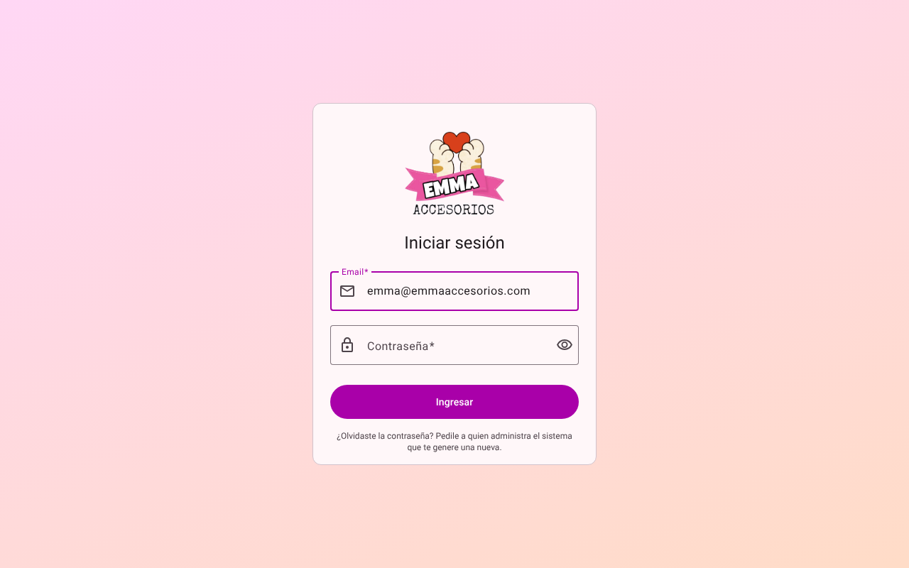

- Si te equivocás 5 veces seguidas, la cuenta se bloquea **15 minutos** por seguridad.
- La sesión dura **8 horas** y se cierra sola al cerrar el navegador. Si vence mientras trabajás,
  el sistema te vuelve a pedir el ingreso.
- ¿Olvidaste la contraseña? Pedile a quien administra el sistema que te genere una nueva.

## 2. La pantalla principal

Al ingresar ves el **Inicio**, con un resumen del mes en curso:

- **Ventas del mes**: total vendido y cantidad de tickets.
- **Ganancia del mes**: lo vendido menos el costo de producción de esos productos.
- **Compras del mes**: lo gastado en insumos.
- **Clientes** y cantidad de productos en el catálogo.
- **Stock bajo**: productos que tienen 5 unidades o menos, para reponerlos a tiempo.

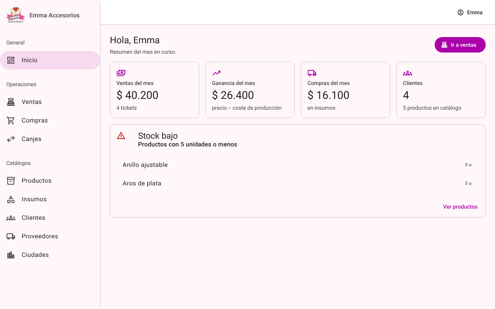

A la izquierda está el **menú** con todas las secciones:

| Grupo | Sección | Para qué sirve |
|---|---|---|
| General | Inicio | Resumen del mes |
| Operaciones | Ventas | Registrar ventas y ver tickets |
| | Compras | Registrar compras de insumos a proveedores |
| | Canjes | Intercambiar productos por insumos con un proveedor |
| Catálogos | Productos | Lo que vendés |
| | Insumos | Los materiales con los que fabricás |
| | Clientes | A quién le vendés |
| | Proveedores | A quién le comprás insumos |
| | Ciudades | Ciudades de clientes y proveedores |

Arriba a la derecha está tu nombre: desde ahí cambiás la contraseña o cerrás la sesión.

## 3. Cómo funcionan los listados

Todas las secciones muestran la información en una tabla que funciona siempre igual:

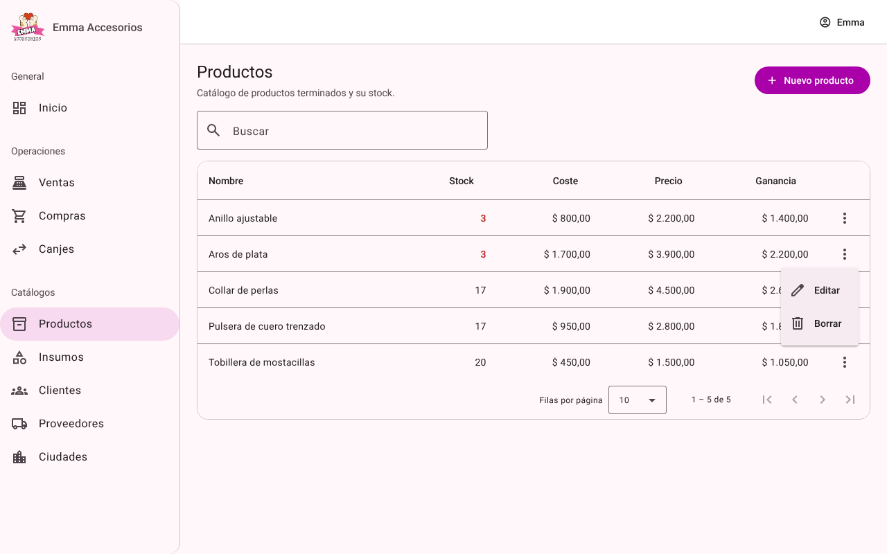

- **Buscar**: escribí en el buscador y la tabla se filtra al instante. No importan las mayúsculas
  ni los acentos ("lucia" encuentra "Lucía").
- **Ordenar**: tocá el título de una columna para ordenar; tocalo otra vez para invertir el orden.
- **Páginas**: abajo elegís cuántas filas ver (10, 25, 50 o 100) y pasás de página con las flechas.
- **Acciones**: el botón **⋮** de cada fila abre **Editar** y **Borrar**.
- Los números en **rojo** avisan stock bajo (5 o menos).

Para cargar algo nuevo usá el botón de color de arriba a la derecha (por ejemplo **Nuevo producto**).
Se abre una ventana (modal) sin salir de la pantalla. Los campos con **\*** son obligatorios; si falta
algo, el campo se marca en rojo con el motivo. **Cancelar** (o la tecla Esc) cierra la ventana sin
guardar.

Antes de borrar, el sistema siempre pide confirmación.

## 4. Clientes

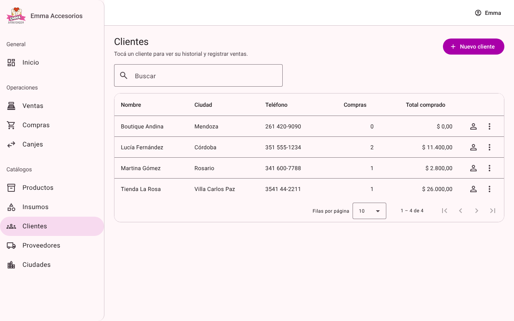

La tabla muestra nombre, ciudad, teléfono, cantidad de compras y total comprado por cada cliente.

**Agregar un cliente:** tocá **Nuevo cliente**, completá el nombre (obligatorio), la ciudad y el
teléfono, y tocá **Crear**.

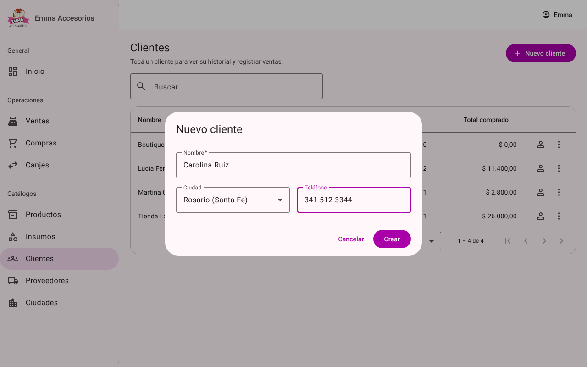

> Si la ciudad no aparece en la lista, primero cargala en **Ciudades** (sección 10).

**Ver el perfil:** tocá cualquier fila (o el ícono de persona). En el perfil ves sus datos, cuánto
compró y el **historial de compras** con cada ticket. Desde ahí también podés **Editar**, **Borrar**
o registrar una **Nueva venta** para ese cliente.

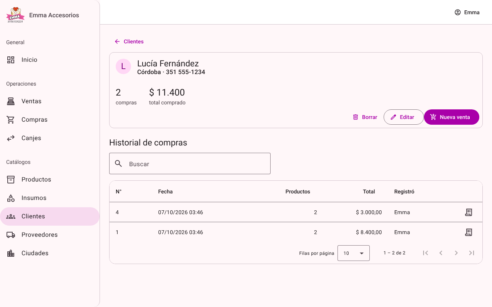

> Borrar un cliente lo quita de los listados, pero su historial de ventas se conserva.

## 5. Ventas

Cada venta genera un **ticket** que puede tener uno o varios productos.

### Registrar una venta

Podés hacerlo desde **Ventas → Nueva venta** (elegís el cliente en la ventana) o desde el **perfil
del cliente → Nueva venta** (el cliente ya viene elegido).

1. Elegí el **producto**. La lista muestra precio y stock disponible; los productos sin stock aparecen
   deshabilitados.
2. Poné la **cantidad**. Debajo ves cuánto stock queda.
3. Para sumar más productos al mismo ticket tocá **Agregar producto**. Con **⊖** quitás un renglón.
4. Abajo ves el **Total** actualizado.
5. Tocá **Concretar venta**.

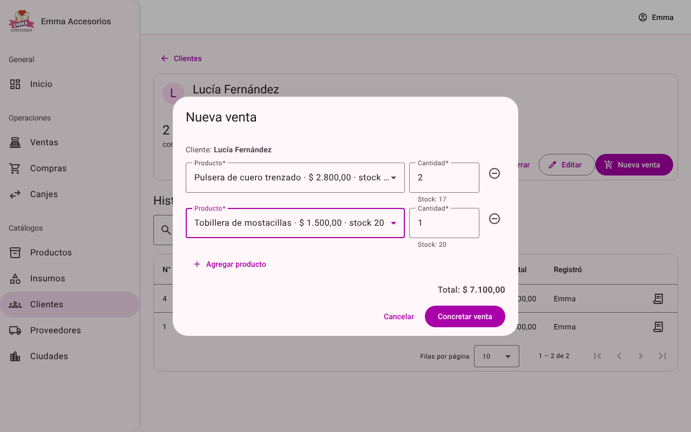

El stock de los productos se descuenta solo. Si algún producto no tiene stock suficiente, el sistema
avisa cuál es y **no guarda nada** (ni siquiera los otros productos), para que puedas corregir la
cantidad y volver a intentar.

### Ver ventas y filtrar

La sección **Ventas** lista todos los tickets: número, fecha, cliente, ciudad, cantidad de productos,
total y **Registró** (la persona que hizo la venta).

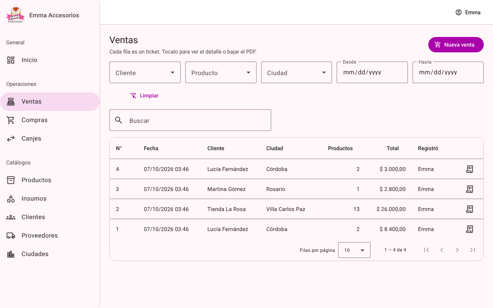

Con los filtros de arriba ves solo las ventas de un **cliente**, que incluyan un **producto**, de una
**ciudad** o entre dos **fechas**. **Limpiar** quita todos los filtros.

### Ticket y comprobante en PDF

Tocá una venta para ver el detalle del ticket: productos, cantidades, precios, total y quién la
registró. Con **Descargar PDF** obtenés el comprobante para imprimir o enviar al cliente.

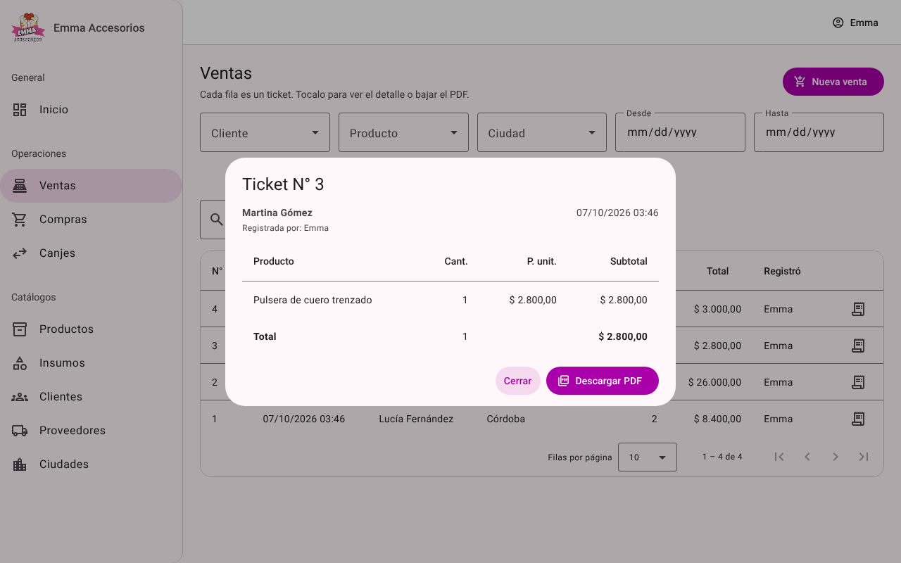

> El precio de cada producto queda guardado tal como estaba el día de la venta: si después cambiás
> el precio de un producto, los tickets anteriores no se modifican.

## 6. Productos

Son los artículos que vendés. La tabla muestra **stock**, **coste** de producción, **precio** de venta
y la **ganancia** por unidad (precio − coste).

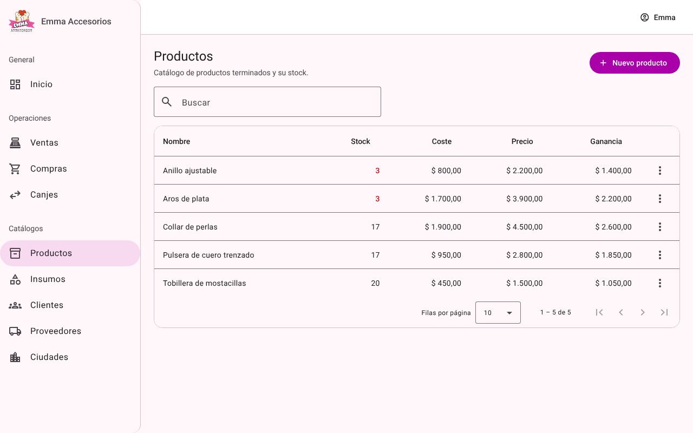

- **Nuevo producto**: nombre, coste de producción, precio de venta y stock inicial.
- **Editar** (menú ⋮): por ejemplo para actualizar el precio o corregir el stock.
- **Borrar**: el producto deja de aparecer para vender, pero las ventas anteriores se conservan.

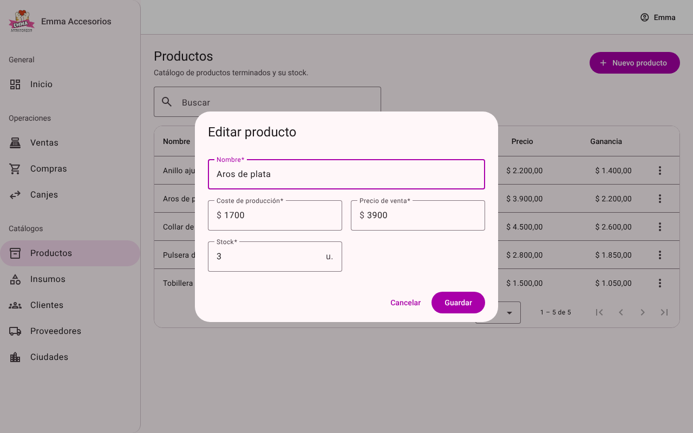

El stock **baja** automáticamente con cada venta y canje.

## 7. Insumos

Son los materiales con los que fabricás (hilos, mostacillas, broches…). Se manejan igual que los
productos: nombre, precio, stock y, opcionalmente, el **descuento pactado para canjes** (en %).

El stock de un insumo **sube** automáticamente con cada compra y cada canje.

## 8. Compras

Registrá acá lo que le comprás a tus proveedores. En una misma compra podés cargar **varios insumos**.

1. Tocá **Nueva compra**.
2. Elegí el **proveedor** y la **fecha** (por defecto, hoy).
3. Por cada insumo: elegilo, poné la **cantidad** y el **costo total** de ese renglón (lo que pagaste
   por todas esas unidades).
4. Para sumar otro insumo, tocá **Agregar insumo**. Con **⊖** quitás un renglón.
5. Revisá el **Total** y tocá **Registrar compra**.

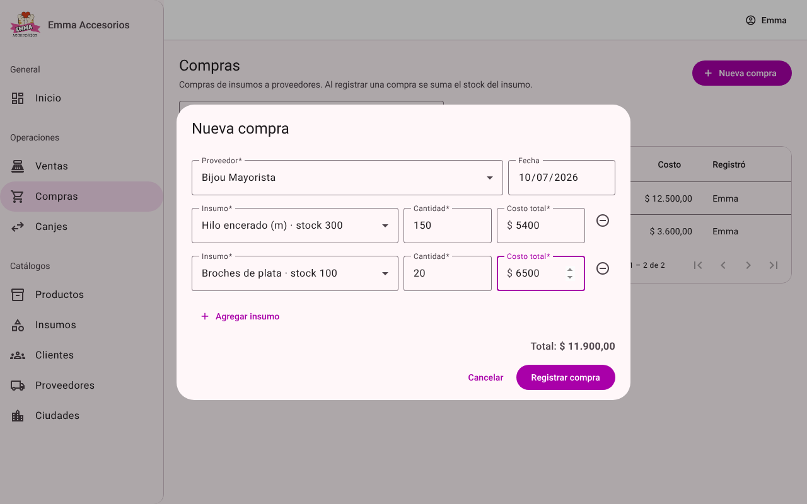

El stock de cada insumo se suma solo. En el listado, cada insumo comprado aparece como una fila, con
la columna **Registró** indicando quién cargó la compra.

## 9. Canjes

Un canje es cuando le entregás productos tuyos a un proveedor y a cambio recibís insumos. En un mismo
canje podés cargar **varios intercambios**.

1. Tocá **Nuevo canje** y elegí el **proveedor**.
2. Si acordaron descuentos, completá **% desc. productos** y/o **% desc. insumos** (son opcionales y se
   aplican a todos los intercambios del canje).
3. En cada intercambio indicá el **producto que entregás** y su cantidad, y el **insumo que recibís**
   y su cantidad.
4. Para sumar otro intercambio, tocá **Agregar intercambio**.
5. Tocá **Registrar canje**.

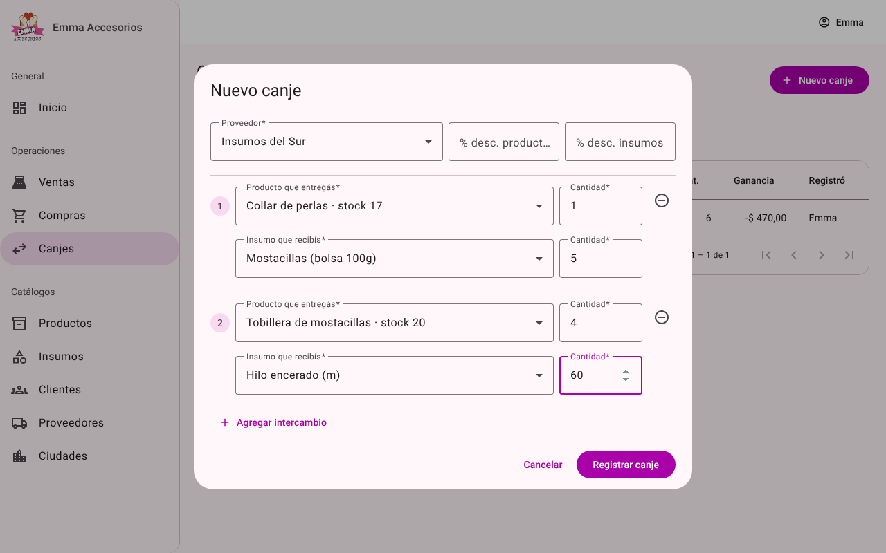

Al registrarlo, baja el stock de los productos entregados y sube el de los insumos recibidos. Si algún
producto no tiene stock suficiente, no se guarda ningún intercambio.

En el listado, la columna **Ganancia** compara lo que recibiste con lo que entregaste (a precio de
lista y con los descuentos): si es **positiva**, recibiste más valor del que diste; si es **negativa**
(con signo −), entregaste más valor.

## 10. Proveedores y ciudades

- **Proveedores**: nombre, ciudad y teléfono. Un proveedor que ya tiene compras o canjes no se puede
  borrar (para no perder el historial).
- **Ciudades**: nombre y provincia. La columna *Clientes* muestra cuántos clientes hay en cada una.
  Una ciudad que tiene clientes o proveedores no se puede borrar.

Conviene cargar las ciudades **antes** que los clientes y proveedores, para poder elegirlas.

## 11. Tu cuenta: contraseña y cierre de sesión

Tocá tu nombre arriba a la derecha:

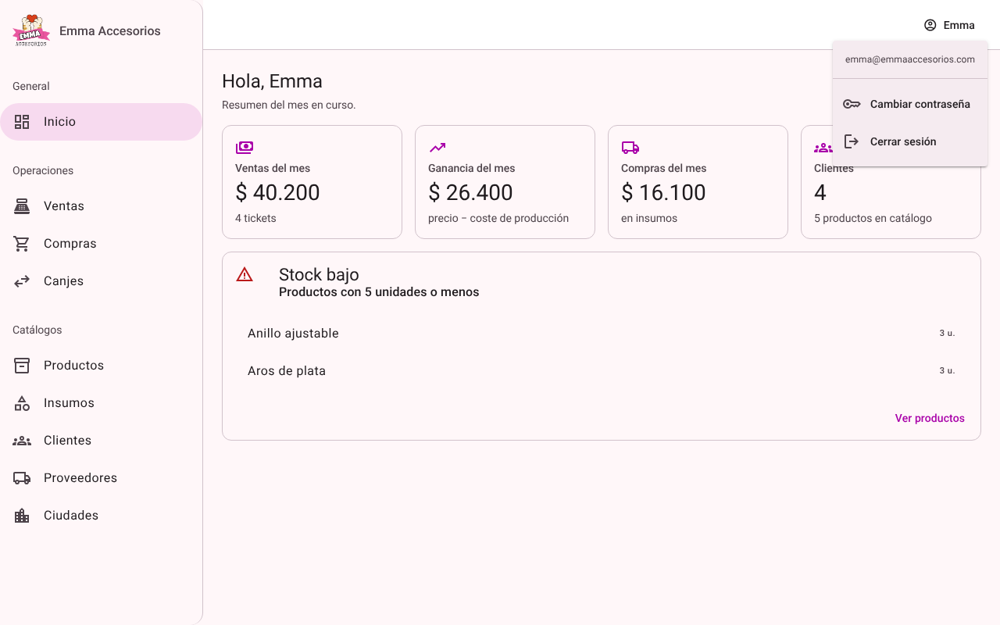

**Cambiar contraseña:** escribí la actual, la nueva (mínimo **12 caracteres**) y repetila. Una frase
larga es más segura y fácil de recordar que una palabra con símbolos (por ejemplo: *"collares rosas
para el verano"*).

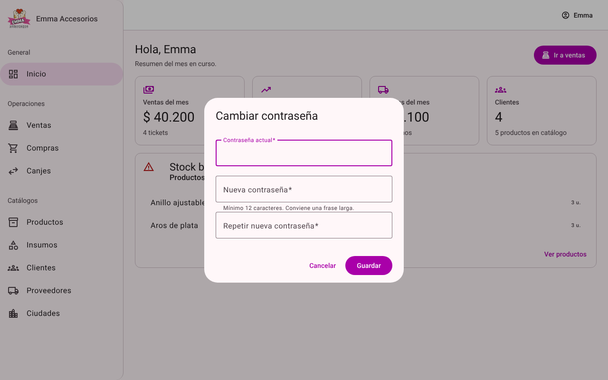

**Cerrar sesión:** hacelo siempre que uses una computadora compartida.

Todo lo que registres (ventas, compras y canjes) queda asociado a tu usuario y se ve en la columna
**Registró**. Por eso cada persona debería tener su propio usuario y no compartir contraseñas.

## 12. Usar el sistema desde el celular

El sistema se adapta a pantallas chicas. El menú se abre con el botón **☰** de arriba a la izquierda.
Si una tabla tiene muchas columnas, deslizala hacia los costados.

  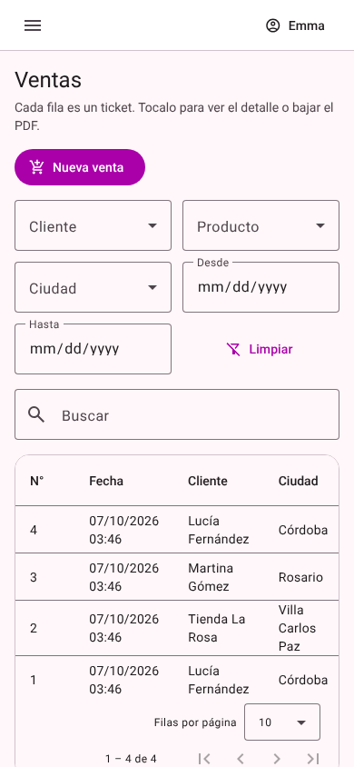
  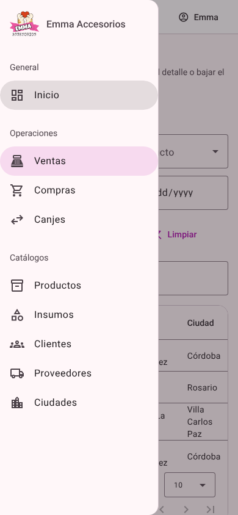

## 13. Preguntas frecuentes y mensajes

| Mensaje o situación | Qué significa / qué hacer |
|---|---|
| *Usuario o contraseña incorrectos* | Revisá el email y la contraseña (las mayúsculas cuentan). |
| *La cuenta está bloqueada temporalmente…* | Hubo 5 intentos fallidos. Esperá 15 minutos o pedile al administrador que te genere una contraseña nueva (eso también la desbloquea). |
| *Demasiados intentos. Esperá unos minutos…* | Hubo muchos intentos fallidos desde esa conexión. Esperá 15 minutos. |
| *Tu sesión venció. Volvé a ingresar.* | Pasaron 8 horas o el sistema se reinició. Ingresá de nuevo; lo ya guardado no se pierde. |
| *No hay stock suficiente de "…" (disponible: N)* | Bajá la cantidad o cargá más stock en Productos. No se guardó nada de esa operación. |
| *No se puede borrar: …* | La ciudad o el proveedor tiene registros asociados. |
| *No se pudo conectar con el servidor.* | Revisá tu conexión a internet; si sigue, avisá a quien administra el sistema. |
| Un campo aparece en rojo | Leé el mensaje debajo del campo (obligatorio, número negativo, etc.). |
| No encuentro una ciudad al cargar un cliente | Cargala primero en **Ciudades**. |
| Me equivoqué en una venta | Hoy no hay anulación de ventas desde el sistema: anotá el número de ticket y consultá con quien administra el sistema. |
| La columna *Registró* muestra "—" | Son operaciones cargadas antes de que el sistema guardara el usuario. |
