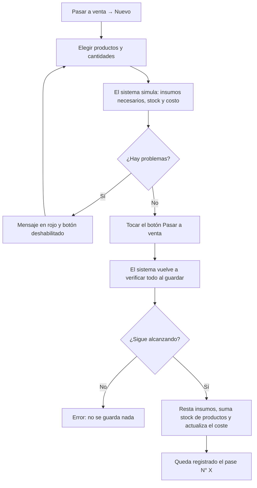
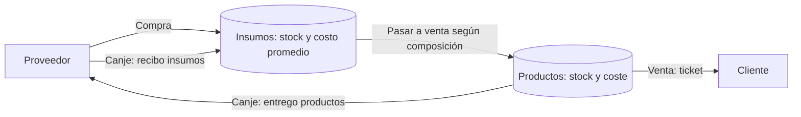
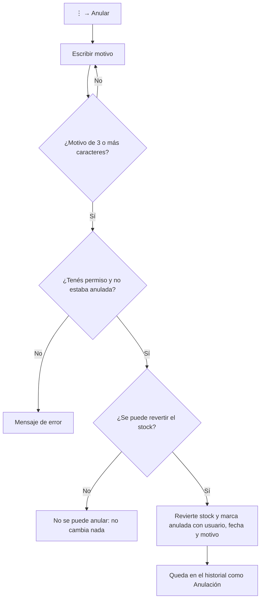

# Emma Accesorios · Manual de usuario

> Manual para las personas que usan el sistema todos los días. Explica qué hace cada pantalla, cómo
> completar cada formulario y qué significa cada mensaje. Está escrito a partir del funcionamiento
> real del sistema (versión del repositorio al 08/10/2026). Cuando algo no se pudo determinar, se
> indica con la frase *"No determinado a partir del código analizado"*.
>
> La documentación para programadores está en [DOCUMENTACION_TECNICA.md](DOCUMENTACION_TECNICA.md).

## Índice

1. [Introducción](#1-introducción)
2. [Acceso al sistema](#2-acceso-al-sistema)
3. [Navegación](#3-navegación)
4. [Módulos del sistema](#4-módulos-del-sistema)
   - 4.1 [Inicio (panel)](#41-inicio-panel)
   - 4.2 [Clientes y perfil del cliente](#42-clientes-y-perfil-del-cliente)
   - 4.3 [Ventas](#43-ventas)
   - 4.4 [Productos (y su composición)](#44-productos-y-su-composición)
   - 4.5 [Insumos](#45-insumos)
   - 4.6 [Compras](#46-compras)
   - 4.7 [Canjes](#47-canjes)
   - 4.8 [**Pasar a venta**](#48-pasar-a-venta) ⭐
   - 4.9 [Reportes](#49-reportes)
   - 4.10 [Proveedores](#410-proveedores)
   - 4.11 [Ciudades](#411-ciudades)
   - 4.12 [Configuración (solo administradores)](#412-configuración-solo-administradores)
   - 4.13 [Anular una operación](#413-anular-una-operación)
5. [Flujos de negocio](#5-flujos-de-negocio)
6. [Formularios y campos](#6-formularios-y-campos)
7. [Mensajes y errores](#7-mensajes-y-errores)
8. [Reportes (detalle de columnas y cálculos)](#8-reportes-detalle-de-columnas-y-cálculos)
9. [Exportaciones y documentos](#9-exportaciones-y-documentos)
10. [Preguntas frecuentes](#10-preguntas-frecuentes)
11. [Solución de problemas](#11-solución-de-problemas)
12. [Glosario](#12-glosario)

---

## 1. Introducción

### 1.1 ¿Qué es el sistema?

**Emma Accesorios** es un sistema de gestión web para un comercio de accesorios (bijouterie). Se usa
desde el navegador de la computadora o del celular y también se puede *instalar* como aplicación
(ver [10. Preguntas frecuentes](#10-preguntas-frecuentes)).

### 1.2 ¿Para qué sirve? ¿Qué problemas resuelve?

| Necesidad del comercio | Cómo la resuelve el sistema |
|---|---|
| Saber cuánto se vende y cuánto se gana | Registra cada venta con su precio y su costo, y calcula la ganancia. |
| No vender lo que no hay | Descuenta el stock al vender y **no deja vender más de lo que hay**. |
| Saber cuánto cuesta realmente cada producto | Calcula el **costo promedio** de los insumos y, al *pasar a venta*, el **coste** de cada producto. |
| Registrar lo que se compra a proveedores | Compras de insumos que suman stock y actualizan el costo. |
| Intercambiar mercadería con proveedores | Canjes: se entregan productos y se reciben insumos. |
| Corregir errores sin perder información | Las operaciones no se borran: se **anulan** con un motivo y el stock vuelve atrás. |
| Saber qué reponer | El panel avisa qué productos e insumos llegaron a su **stock mínimo**. |
| Analizar el negocio | Reportes con filtros y descarga en **Excel**. |
| Mandar el comprobante al cliente | Ticket en **PDF** y envío por **WhatsApp**. |
| Saber quién hizo cada cosa | Cada operación guarda quién la registró y hay un **historial de cambios**. |

### 1.3 Módulos principales

| Grupo del menú | Módulo | Para qué sirve |
|---|---|---|
| General | **Inicio** | Resumen del mes, gráficos y alertas de stock. |
| Operaciones | **Ventas** | Vender productos a clientes; ver y anular tickets. |
| | **Compras** | Comprar insumos a proveedores. |
| | **Canjes** | Entregar productos a un proveedor a cambio de insumos. |
| | **Pasar a venta** | Convertir insumos en productos listos para vender. |
| Análisis | **Reportes** | Reportes de ventas, compras, canjes y pases a venta; Excel. |
| Catálogos | **Productos** | Lo que se vende, con su stock, precio, coste y composición. |
| | **Insumos** | Materiales y mercadería antes de estar a la venta. |
| | **Clientes** | A quién se le vende (con su perfil e historial). |
| | **Proveedores** | A quién se le compra o con quién se hacen canjes. |
| | **Ciudades** | Ciudades de clientes y proveedores. |
| Configuración | **Configuración** | Usuarios e historial de cambios (**solo administradores**). |

### 1.4 ¿Quiénes usan el sistema?

Existen **dos tipos de usuario** (roles):

| Rol | Qué puede hacer |
|---|---|
| **Usuario** | Todo el sistema **excepto** la sección *Configuración* y la opción *Ver historial*. |
| **Administrador** | Todo lo anterior **más** *Configuración* (crear, editar, activar/desactivar, borrar usuarios y restablecer contraseñas) y el *historial de cambios*. |

> **Anular operaciones**: quién puede anular ventas, compras, canjes y pases a venta depende de una
> regla que configura quien instala el sistema. Hay tres posibilidades: *cualquier usuario puede
> anular* (valor predeterminado), *solo administradores*, o *administradores siempre y el resto solo
> las operaciones que registró ese mismo día*. Si no ves la opción **Anular** en una operación, es
> porque la regla vigente no te lo permite (o porque ya está anulada).

### 1.5 Conceptos importantes

Antes de empezar conviene entender estas ideas, porque todo el sistema se apoya en ellas:

- **Insumo**: todo lo que entra al negocio y todavía **no está a la venta**: materiales para fabricar
  (cadenas, dijes, hilos…) y también la mercadería comprada para revender, mientras no se *pase a
  venta*.
- **Producto**: lo que se vende al cliente. Tiene stock, **precio de venta** y **coste** (cuánto le
  cuesta al comercio cada unidad).
- **Composición** de un producto: qué insumos (y cuántos) lleva **cada unidad**. Sin composición, un
  producto **no se puede pasar a venta**.
- **Pasar a venta**: la operación que **descuenta insumos** y **suma stock de productos**, calculando el
  coste de lo producido. Ver [4.8](#48-pasar-a-venta).
- **Costo promedio** (de un insumo): cuánto costó en promedio cada unidad que hay en stock. Lo calcula
  el sistema con cada compra y cada canje.
- **Precio de lista** (de un insumo): un valor de referencia que **solo se usa para calcular la
  ganancia de los canjes**. No es el costo.
- **Ticket**: una venta a un cliente; puede tener varios productos (renglones).
- **Anular**: deshacer una operación. **No se borra**: queda en el historial marcada como anulada, con
  quién, cuándo y por qué, y el stock vuelve a como estaba.
- **Borrar** (clientes, productos, insumos, etc.): el registro deja de aparecer en los listados, pero
  **se conserva** en las ventas, compras, reportes e historial anteriores.
- **Stock mínimo**: cuando el stock llega a ese número **o menos**, el artículo aparece en las alertas
  del panel.

---

## 2. Acceso al sistema

### 2.1 Requisitos

- Un navegador actual (Chrome, Edge, Firefox, Safari) con JavaScript activado. Si JavaScript está
  desactivado se muestra: *"Para usar Emma Accesorios hay que activar JavaScript en el navegador."*
- Conexión a internet: **no se pueden registrar operaciones sin conexión** (ver [2.7](#27-sin-conexión-a-internet)).
- Un usuario (email y contraseña) creado por un administrador.

### 2.2 Iniciar sesión

1. Abrí la dirección del sistema. Si no tenés sesión abierta, aparece la pantalla **Iniciar sesión**.
2. Escribí tu **Email**.
3. Escribí tu **Contraseña**. El ícono del ojo (👁) a la derecha muestra u oculta lo que escribiste.
4. Tocá **Ingresar**.
5. Si los datos son correctos, entrás a la pantalla **Inicio**.

Validaciones de la pantalla (antes de enviar):

| Situación | Mensaje bajo el campo |
|---|---|
| Email vacío | *Ingresá tu email.* |
| Email con formato inválido | *Ingresá un email válido.* |
| Contraseña vacía | *Ingresá tu contraseña.* |

Mensajes que puede devolver el sistema al ingresar (se muestran en rojo arriba del botón; el campo de
contraseña se vacía):

| Mensaje | Qué significa | Qué hacer |
|---|---|---|
| *Usuario o contraseña incorrectos.* | El email no existe, el usuario fue borrado o la contraseña es incorrecta. Por seguridad el mensaje es siempre el mismo. | Revisá mayúsculas, el teclado y el email. |
| *La cuenta está bloqueada temporalmente por demasiados intentos fallidos. Probá de nuevo más tarde.* | Hubo **5 contraseñas incorrectas** seguidas para ese usuario. La cuenta queda bloqueada **15 minutos**. | Esperá 15 minutos o pedile a un administrador que te **restablezca la contraseña** (eso también desbloquea). |
| *Tu usuario está desactivado. Consultá con un administrador.* | La contraseña es correcta pero un administrador desactivó tu usuario. | Pedí a un administrador que lo active. |
| *Demasiados intentos. Esperá unos minutos y volvé a intentar.* | Desde tu conexión (dirección IP) hubo **20 intentos fallidos** en un lapso de 15 minutos. | Esperá unos 15 minutos sin intentar. |
| *No se pudo conectar con el servidor. Verificá que el backend esté funcionando.* | El servidor no responde. | Ver [11. Solución de problemas](#11-solución-de-problemas). |
| *No se pudo iniciar sesión.* | Error no previsto. | Reintentá; si persiste, avisá al administrador. |

### 2.3 Duración de la sesión y cierre automático

- La sesión dura **8 horas** desde que ingresaste (es el valor predeterminado; quien instala el
  sistema puede cambiarlo). Al vencer, el sistema te lleva a la pantalla de ingreso con el aviso
  *"Tu sesión venció. Volvé a ingresar."*
- La sesión se guarda **solo en esa pestaña/ventana del navegador**: al cerrarla, la sesión se pierde.
  *(Inferido: el sistema usa el almacenamiento de sesión del navegador; por ese motivo, abrir el
  sistema en una pestaña nueva normalmente vuelve a pedir el ingreso.)*
- Si un administrador **desactiva o borra** tu usuario mientras estás trabajando, la próxima acción
  que hagas te devuelve a la pantalla de ingreso.

### 2.4 Cerrar sesión

1. Arriba a la derecha tocá tu **nombre** (ícono de persona).
2. Elegí **Cerrar sesión**. Volvés a la pantalla de ingreso.

### 2.5 Cambiar tu contraseña

1. Tocá tu **nombre** arriba a la derecha → **Cambiar contraseña**.
2. Completá **Contraseña actual**, **Nueva contraseña** (mínimo **12 caracteres**; se sugiere una
   frase larga) y **Repetir nueva contraseña**.
3. Tocá **Guardar**. Si todo está bien, aparece *"Contraseña actualizada."*

| Mensaje | Causa |
|---|---|
| *Mínimo 12 caracteres.* | La nueva contraseña es corta. |
| *Las contraseñas no coinciden.* | "Nueva" y "Repetir" son distintas. |
| *La contraseña actual no es correcta.* | La contraseña actual que escribiste no es la tuya. |

> Cambiar la contraseña **no cierra** las sesiones que ya estén abiertas en otros dispositivos.

### 2.6 ¿Olvidaste la contraseña?

El sistema **no tiene** recuperación por email. Como dice la pantalla de ingreso: *"¿Olvidaste la
contraseña? Pedile a quien administra el sistema que te genere una nueva."* Un administrador lo hace
desde **Configuración → Usuarios → ⋮ → Restablecer contraseña** (ver [4.12](#412-configuración-solo-administradores)).

### 2.7 Sin conexión a internet

Si se corta internet aparece una franja roja: *"Sin conexión a internet. Podés mirar lo que ya
estaba abierto, pero no registrar operaciones hasta que vuelva."* Cualquier intento de guardar
mostrará *"No se pudo conectar con el servidor…"*. Cuando vuelve la conexión, la franja desaparece.

### 2.8 Creación de usuarios, bloqueo y desbloqueo

- **Crear usuarios**: solo un administrador, desde *Configuración → Agregar usuario*.
- **Bloqueo automático**: 5 contraseñas incorrectas → 15 minutos bloqueado. El estado se ve en
  *Configuración → Usuarios* como **Bloqueado temporalmente**.
- **Desbloquear**: esperar 15 minutos, o que un administrador *restablezca la contraseña* o *active* al
  usuario.
- **Desactivar**: un administrador puede desactivar a otro usuario; no puede ingresar hasta que lo
  vuelvan a activar.

---

## 3. Navegación

### 3.1 Estructura de la pantalla

```
┌──────────────┬───────────────────────────────────────────────┐
│ Logo  Emma   │                       [☾/☀]  [👤 Tu nombre ▾] │ ← barra superior
│ Accesorios   ├───────────────────────────────────────────────┤
│              │  (franja roja si no hay internet)             │
│ GENERAL      │                                               │
│  Inicio      │   Título de la sección        [Botón acción]  │
│ OPERACIONES  │   Subtítulo explicativo                       │
│  Ventas      │                                               │
│  Compras     │   [Filtros / búsqueda]                        │
│  Canjes      │                                               │
│  Pasar a v.  │   Tabla con los datos         ⋮ por fila      │
│ ANÁLISIS     │                                               │
│  Reportes    │   Paginador                                   │
│ CATÁLOGOS    │                                               │
│  …           │                                               │
│ CONFIGURAC.* │   * solo administradores                      │
└──────────────┴───────────────────────────────────────────────┘
```

- **Menú lateral**: en computadora está siempre visible; en celular o tablet se abre con el botón ☰
  arriba a la izquierda y se cierra solo al elegir una sección. La sección actual queda resaltada.
- **Botón luna/sol**: alterna **modo oscuro / claro**. El navegador recuerda la elección; si nunca
  elegiste, sigue la preferencia del sistema operativo.
- **Menú de tu nombre**: muestra tu email, **Cambiar contraseña** y **Cerrar sesión**.

### 3.2 Panel / dashboard

Es la pantalla **Inicio**. Ver [4.1](#41-inicio-panel).

### 3.3 Cómo funcionan las tablas (listados)

Casi todas las secciones usan la misma tabla:

| Elemento | Qué hace | Detalle |
|---|---|---|
| **Buscar** 🔍 | Filtra las filas que se ven. | Busca en **todas las columnas** a la vez, sin distinguir mayúsculas ni acentos ("cordoba" encuentra "Córdoba"). Con la **✕** se limpia. Solo filtra lo que ya está cargado en pantalla. |
| **Encabezado de columna** | Ordena. | Un toque ordena ascendente, otro descendente, otro quita el orden. |
| **Paginador** | Muestra 10, 25, 50 o 100 filas por página. | Botones de primera/anterior/siguiente/última página; indica "1 – 10 de 57". |
| **⋮ (Acciones)** | Menú por fila. | Según la pantalla: *Editar*, *Borrar*, *Composición*, *Ver historial* (administradores), *Anular*. |
| **👁 / 🧾 / 👤** | Ver detalle. | En Ventas (ticket), Pases a venta (detalle) y Clientes (perfil). También se puede tocar la fila. |
| **Valor en rojo** | Alerta. | Stock en su mínimo o por debajo; composición faltante. |
| **Fila tachada y gris** | Operación anulada. | Ventas, compras, canjes, pases. |
| **"—"** | Dato vacío. | |

Mensajes cuando no hay filas: *"Cargando…"*, *"No hay resultados para "…"."* o el mensaje propio de cada
pantalla (por ejemplo *"No hay ventas registradas."*).

> **No hay acciones masivas** (seleccionar varias filas y actuar sobre todas): cada acción se hace
> fila por fila.

### 3.4 Ventanas (modales)

Altas, ediciones, ventas, compras, etc. se hacen en **ventanas emergentes** sin salir de la pantalla.
Todas tienen **Cancelar** (cierra sin guardar) y un botón principal (Crear / Guardar / Concretar
venta / …). Mientras se guarda, el botón muestra un círculo de carga y no se puede volver a tocar. Si
el servidor rechaza un dato, el error aparece **debajo del campo** correspondiente o en rojo al pie de
la ventana.

### 3.5 Avisos (notificaciones)

Abajo de la pantalla aparecen avisos breves:
- **Verdes/neutros** (3 segundos): confirmaciones, p. ej. *"Cambios guardados."*.
- **Rojos** (6 segundos): errores, p. ej. *"No hay stock suficiente de "Collar" (disponible: 2)."*.
Todos tienen botón **Cerrar**.

### 3.6 Página no encontrada

Si escribís una dirección que no existe, ves *"Esta página no existe"* con botones **Ir al inicio**,
**Volver** (si hay a dónde) y accesos directos a Ventas, Productos, Clientes y Reportes.

### 3.7 Versión nueva del sistema

Cuando se publica una versión nueva aparece *"Hay una versión nueva del sistema."* con el botón
**Actualizar**, que recarga la página.

---

## 4. Módulos del sistema

### 4.1 Inicio (panel)

**Objetivo**: ver de un vistazo cómo viene el mes y qué hay que reponer.

**Acceso**: menú → *General* → **Inicio** (es la primera pantalla al ingresar).

**Pantalla principal**

- Saludo *"Hola, {tu nombre}"* y botón **Ir a ventas**.
- **Cuatro indicadores** (todos del **mes calendario en curso**, sin operaciones anuladas):

| Indicador | Qué muestra | Cómo se calcula |
|---|---|---|
| **Ventas del mes** | Total vendido y cantidad de tickets. | Suma del total de los tickets desde el día 1 del mes. |
| **Ganancia del mes** | "precio − coste de producción". | Suma de la ganancia de cada renglón vendido: (precio − coste del producto en el momento de la venta) × cantidad. |
| **Compras del mes** | Gastado en insumos. | Suma del costo total de las compras con **fecha de compra** desde el día 1. |
| **Clientes** | Cantidad de clientes y de productos en catálogo. | Solo los que no están borrados. |

- **Gráficos** (cada uno se puede ver como gráfico o como **tabla** con los botones de la esquina):
  - *Ventas de {mes}*: total vendido **acumulado día a día** del mes actual comparado con el mes
    anterior.
  - *Más vendidos del mes*: los **10 productos** con más unidades vendidas (con total y ganancia).
  - *Ventas por usuario*: total vendido y tickets de cada persona que registró ventas en el mes
    (las ventas antiguas sin usuario aparecen como *"Sin dato"*).
- **Productos para reponer** e **Insumos para comprar**: hasta **10** artículos cuyo stock está **en su
  mínimo o por debajo**, primero los que más faltan. Muestra nombre, *"mínimo N"* y stock (en rojo si
  es 0). Si no hay ninguno: *"Todo en orden 🎉"*. Botones **Ver productos** / **Ver insumos**.

### 4.2 Clientes y perfil del cliente

**Objetivo**: mantener la lista de clientes y ver lo que compró cada uno.

**Acceso**: menú → *Catálogos* → **Clientes**.

**Pantalla principal**: tabla con **Nombre**, **Ciudad**, **Teléfono**, **Compras** (cantidad de tickets
no anulados) y **Total comprado** (suma de tickets no anulados). Botón **Nuevo cliente**. Tocar una fila
(o 👤 *Ver perfil*) abre el perfil.

**Crear**
1. **Nuevo cliente**.
2. Completar:
   - **Nombre** (obligatorio, máx. 50).
   - **Ciudad** (opcional; lista de ciudades cargadas, con la opción *"— Ninguna —"*). Si no hay
     ciudades cargadas aparece la ayuda *"Primero cargá ciudades en la sección Ciudades"*.
   - **Teléfono** (opcional, máx. 20). Conviene cargarlo con código de área: se usa para enviar el
     comprobante por WhatsApp.
3. **Crear** → *"Se creó "{nombre}"."*

**Consultar**: búsqueda y orden de la tabla. El **perfil** muestra: inicial del nombre, nombre, ciudad
(o *"Sin ciudad"*), teléfono, **compras** y **total comprado**, y la tabla **Historial de compras** (N°,
Fecha, Productos, Total, Registró). Tocar un ticket abre su detalle.

> ⚠️ En el **historial del perfil** las ventas **anuladas también aparecen** y no se ven tachadas; en
> cambio los números de *compras* y *total comprado* **no** las cuentan. Para confirmar si un ticket
> está anulado, abrilo: verás el recuadro *"Venta anulada"*.

**Editar**: desde ⋮ → *Editar* en la tabla, o con **Editar** en el perfil. Se pueden cambiar los tres
campos. Las ventas anteriores siguen asociadas al cliente.

**Eliminar**: ⋮ → *Borrar* (o **Borrar** en el perfil) → confirmar. Es un **borrado lógico**: el
cliente desaparece de la lista y de las opciones para vender, pero **su historial de ventas se
conserva** y sigue apareciendo en reportes. No se le pueden registrar ventas nuevas. Recuperarlo
requiere intervención técnica.

**Nueva venta desde el perfil**: botón **Nueva venta** (el cliente ya viene elegido). Ver [4.3](#43-ventas).

### 4.3 Ventas

**Objetivo**: registrar lo que se vende a cada cliente, descontar stock y emitir el comprobante.

**Acceso**: menú → *Operaciones* → **Ventas**, o **Nueva venta** desde el perfil de un cliente, o
**Ir a ventas** desde el Inicio.

**Pantalla principal**

- Filtros (se aplican solos al cambiarlos): **Cliente**, **Producto** (tickets que incluyen ese
  producto), **Ciudad** (del cliente), **Desde**, **Hasta**. **Limpiar** los borra.
- Tabla (cada fila es un **ticket**): **N°**, **Fecha** (día y hora), **Cliente**, **Ciudad**,
  **Productos** (unidades totales), **Total**, **Registró**, **Estado** (*"Anulada"* o vacío).
  Las anuladas se ven tachadas.
- 🧾 *Ver ticket* (o tocar la fila) abre el detalle. ⋮ → **Anular venta** (si tenés permiso).

**Crear una venta**
1. **Nueva venta**.
2. **Cliente** (obligatorio). Si venís del perfil, ya está elegido.
3. Primer renglón: **Producto** (la lista muestra *nombre · precio · stock*; los productos con stock 0
   aparecen deshabilitados) y **Cantidad** (entero ≥ 1; debajo se ve *"Stock: N"*).
4. **Agregar producto** para más renglones; el ícono ⊖ quita un renglón (siempre queda al menos uno).
   Si repetís un producto en dos renglones, el sistema los **suma**.
5. Abajo se ve el **Total** estimado (precio actual × cantidad).
6. **Concretar venta**.

Qué hace el sistema al confirmar (todo junto, o nada):
- Toma el **precio actual** de cada producto desde el servidor (lo que ves en pantalla es solo una
  estimación) y guarda también la **ganancia** de cada renglón con el **coste** de ese momento.
- Verifica stock: si **algún** producto no alcanza, **no se guarda nada** y aparece
  *"No hay stock suficiente de "{producto}" (disponible: N)."*
- Descuenta el stock, crea el ticket con fecha y hora actuales y registra quién lo hizo.
- Muestra *"Venta registrada (ticket N° X)."*

Errores posibles: *"Elegí un cliente."*, *"Elegí un producto."*, *"Mínimo 1."*, *"El cliente no existe."*
(fue borrado mientras tanto), *"El producto #N no existe."*, falta de stock.

**Detalle del ticket**: cliente, fecha y hora, *"Registrada por"*, tabla Producto / Cant. / P. unit. /
Subtotal y Total. Botones:
- **Descargar PDF**: comprobante (ver [9.1](#91-comprobante-de-venta-pdf)).
- **WhatsApp**: envía el comprobante (ver [9.2](#92-envío-por-whatsapp)). Deshabilitado si la venta está
  anulada.
- **Anular** (en rojo, si tenés permiso). Ver [4.13](#413-anular-una-operación).

**Editar / Eliminar**: una venta **no se edita ni se borra**. Si hubo un error, se **anula** y se vuelve
a registrar.

**Estados de una venta**

| Estado | Significado | Cómo se llega | Permite | Bloquea |
|---|---|---|---|---|
| **Vigente** (columna vacía) | Venta válida. | Al concretarla. | Ver, PDF, WhatsApp, Anular. | — |
| **Anulada** | Deshecha; el stock volvió. | *Anular* con un motivo. | Ver, PDF (con sello ANULADO). | WhatsApp, volver a anular. Es definitivo. |

### 4.4 Productos (y su composición)

**Objetivo**: catálogo de lo que se vende.

**Acceso**: menú → *Catálogos* → **Productos**.

**Pantalla principal**: columnas **Nombre**, **Stock** (en rojo si está en su mínimo o menos),
**Mínimo**, **Coste**, **Precio**, **Ganancia** (precio − coste, por unidad), **Composición**
(*Cargada* o *Falta*, en rojo). Casilla **Solo bajo mínimo (N)** para ver únicamente los que hay que
reponer. Botón **Nuevo producto**. Menú ⋮: *Editar*, *Composición*, *Ver historial* (admin), *Borrar*.

**Crear**
1. **Nuevo producto**.
2. Completar **Nombre** (obligatorio, máx. 50), **Coste por unidad** ($, ≥ 0, obligatorio; ayuda: *"Se
   recalcula solo al pasar a venta."*), **Precio de venta** ($, ≥ 0, obligatorio), **Stock** (entero ≥ 0,
   obligatorio), **Stock mínimo** (entero ≥ 0, obligatorio, viene en **5**).
3. **Crear** → *"Se creó "{nombre}"."*

> Después de crearlo, cargá su **Composición** (abajo) si lo vas a *pasar a venta*.

**Editar**: ⋮ → *Editar*. Se pueden cambiar todos los campos, **incluso el stock y el coste a mano**.
Consecuencias:
- Cambiar el **precio** afecta solo a las ventas **futuras**; los tickets anteriores conservan su precio.
- Cambiar el **coste** afecta la ganancia de las ventas futuras (y el próximo *pasar a venta* lo
  promedia con el nuevo ingreso).
- Cambiar el **stock** a mano queda registrado en el historial de cambios con quién lo hizo.

**Composición** (⋮ → *Composición*)
1. Se abre *"Composición de "{producto}""* con la explicación: *qué insumos lleva **cada unidad**. Si
   lo comprás para revender, poné su mismo artículo de insumos × 1.*
2. Por renglón: **Insumo** (lista con *nombre · costo promedio · stock*) y **Por unidad** (entero ≥ 1).
   **Agregar insumo** suma renglones; ⊖ **Quitar** los saca.
3. **Costo adicional por unidad** ($, opcional): mano de obra, packaging, etc.
4. Se muestra el **Costo por unidad con el costo actual de los insumos** = costo adicional + Σ(cantidad
   × costo promedio del insumo).
5. **Guardar** → *"Se guardó la composición de "{producto}"."* La columna *Composición* pasa a *Cargada*.

Reglas: no se puede repetir un insumo (*"Ese insumo ya está en la composición."*); máximo 50 insumos.
Si un insumo de la composición fue **borrado**, aparece *"Este insumo fue dado de baja: cambialo o
quitalo."* — mientras siga ahí, **no se puede pasar a venta** ese producto. Guardar la composición
**vacía** (quitando todos los renglones) la elimina.

**Eliminar**: ⋮ → *Borrar* → confirmar *"¿Seguro que querés borrar "{nombre}"?"*. Borrado lógico: deja de
aparecer en el catálogo y en las listas para vender/canjear/pasar a venta, pero sigue en tickets,
reportes e historial. **No hay ninguna restricción**: se puede borrar aunque tenga stock.

**Estados / indicadores**: *bajo mínimo* (stock ≤ mínimo: rojo y aparece en el Inicio);
*Composición: Falta / Cargada*.

### 4.5 Insumos

**Objetivo**: catálogo de materiales y de mercadería todavía no puesta a la venta.

**Acceso**: menú → *Catálogos* → **Insumos**.

**Pantalla principal**: **Nombre**, **Stock** (rojo si ≤ mínimo), **Mínimo**, **Costo prom.**,
**Precio lista**, **Desc. canje** (%). Casilla **Solo bajo mínimo (N)**. Botón **Nuevo insumo**. Menú ⋮:
*Editar*, *Ver historial* (admin), *Borrar*.

**Crear**: **Nombre** (obligatorio, máx. 50), **Precio de lista** (obligatorio, $ ≥ 0, *"Valor para los
canjes."*), **Costo promedio** (opcional, $ ≥ 0, viene en 0; *"Se calcula solo con compras y canjes.
Corregilo solo si está mal."*), **Stock** (obligatorio, entero ≥ 0), **Stock mínimo** (obligatorio,
entero ≥ 0, viene en 5), **Descuento pactado en canjes** (opcional, entero 0–100 %).

**Editar**: todos los campos. El **costo promedio** se puede corregir a mano (queda en el historial).
Si el campo se deja vacío, se conserva el valor anterior.

> ℹ️ El campo **Descuento pactado en canjes** se guarda y se muestra, pero **el sistema no lo usa en
> ningún cálculo**: los descuentos de un canje se escriben en la ventana del canje (ver [4.7](#47-canjes)).

**Eliminar**: borrado lógico, sin restricciones. Si el insumo estaba en la composición de algún
producto, ese producto no se podrá pasar a venta hasta quitarlo de la composición.

### 4.6 Compras

**Objetivo**: registrar insumos comprados a un proveedor; suma stock y actualiza el costo promedio.

**Acceso**: menú → *Operaciones* → **Compras**.

**Pantalla principal**: **Fecha**, **Proveedor**, **Insumo**, **Cantidad**, **Costo** (costo **total** del
renglón), **Registró**, **Estado** (*"Anulada: {motivo}"* o vacío). Cada fila es **un insumo comprado**
(una compra con 3 insumos genera 3 filas). Botón **Nueva compra**. ⋮ → **Anular compra**.

**Crear**
1. **Nueva compra**.
2. **Proveedor** (obligatorio) y **Fecha** (viene con la fecha de hoy; se puede cambiar).
3. Por renglón: **Insumo** (*nombre · stock*), **Cantidad** (entero ≥ 1) y **Costo total** ($ ≥ 0,
   obligatorio) — **el total pagado por ese renglón, no el precio unitario**.
4. **Agregar insumo** para más renglones.
5. Se muestra el **Total** (suma de los costos).
6. **Registrar compra** → *"Compra registrada."* o *"Se registraron N compras."*

Qué hace el sistema: en una sola operación (todo o nada) suma la cantidad al stock de cada insumo y
recalcula su **costo promedio** (ver [5.4](#54-costo-promedio-de-un-insumo)).

**Editar / Eliminar**: no se editan ni se borran; se **anulan**. Al anular se **restan** del stock las
unidades compradas. **Si esas unidades ya se usaron** (en un pase a venta, por ejemplo) y no queda
stock suficiente, el sistema no deja anular: *"No se puede anular: No hay stock suficiente del insumo
"…" (disponible: N)."*

> ⚠️ La fecha propuesta se calcula con la hora universal del dispositivo: **después de las 21 h
> (hora argentina) puede aparecer la fecha del día siguiente**. Revisala antes de guardar.

### 4.7 Canjes

**Objetivo**: registrar el intercambio de **productos** que se entregan a un proveedor por **insumos**
que se reciben.

**Acceso**: menú → *Operaciones* → **Canjes**.

**Pantalla principal**: **Fecha**, **Proveedor**, **Producto entregado**, **Cant.**, **Insumo
recibido**, **Cant.**, **Ganancia**, **Registró**, **Estado**. Cada intercambio es una fila. Botón
**Nuevo canje**. ⋮ → **Anular canje**.

**Crear**
1. **Nuevo canje**.
2. **Proveedor** (obligatorio), **% desc. productos** y **% desc. insumos** (opcionales, 0–100; valen
   para todos los intercambios del canje).
3. Por intercambio (numerados 1, 2, …): **Producto que entregás** (los de stock 0 aparecen
   deshabilitados) y su **Cantidad**; **Insumo que recibís** y su **Cantidad**.
4. **Agregar intercambio** para más.
5. **Registrar canje** → *"Canje registrado."* / *"Se registraron N canjes."*

Qué hace el sistema por cada intercambio (todo o nada):
- **Resta** el stock del producto entregado (si no alcanza: *"No hay stock suficiente de "…"
  (disponible: N)."* y no se guarda ningún intercambio).
- **Suma** el stock del insumo recibido. El insumo entra **al costo de lo entregado**: coste del
  producto × cantidad entregada, repartido entre las unidades recibidas, y se promedia con el costo
  que ya tenía.
- Calcula la **Ganancia** del canje:
  `Ganancia = (precio de lista del insumo × (1 − %desc. insumos) × cant. insumo) − (precio de venta del producto × (1 − %desc. productos) × cant. producto)`.
  Puede ser **negativa**.

**Anular**: vuelve el stock del producto y se resta el del insumo (si ese insumo ya se usó, no se puede).

### 4.8 Pasar a venta

> ⭐ **Esta es la operación que conecta los insumos con los productos.** Leela con atención.

#### 4.8.1 ¿Qué es "pasar a venta"?

En Emma Accesorios todo lo que entra (comprado o recibido en canje) entra como **insumo**. Los
clientes, en cambio, compran **productos**. *Pasar a venta* es el paso intermedio que dice:
**"con estos insumos armé (o preparé) tantas unidades de este producto, y ahora están a la venta"**.

Sirve para dos situaciones:

| Situación | Ejemplo | Cómo se configura |
|---|---|---|
| **Producto fabricado** en el local | Un collar que lleva 1 cadena y 2 dijes. | Composición con varios insumos (y, si querés, un costo adicional por mano de obra). |
| **Producto de reventa** | Aros que se compran hechos y se venden igual. | Se crea un **insumo** con el mismo nombre y la composición del producto es **ese insumo × 1**. |

Al pasar a venta, el sistema:
1. **Descuenta** de cada insumo lo que lleva la composición × la cantidad producida.
2. **Suma** esa cantidad al **stock del producto**.
3. **Calcula el coste** de las unidades nuevas con el **costo promedio actual** de los insumos más el
   costo adicional, y **actualiza el coste del producto** promediándolo con el stock que ya tenía.
4. Guarda la operación (N°, fecha, quién la hizo, nota, productos, insumos consumidos y costos) para
   poder consultarla y **anularla**.

#### 4.8.2 Antes de empezar (requisitos)

- [ ] El producto **existe** en *Productos* (con su precio de venta).
- [ ] El producto tiene **Composición cargada** (*Productos → ⋮ → Composición*). En la lista de *Pasar
      a venta* los productos sin composición aparecen **deshabilitados** con la leyenda *"· sin
      composición"*.
- [ ] Los insumos de la composición **no están borrados**.
- [ ] Hay **stock suficiente** de cada insumo (se carga con *Compras* o *Canjes*).
- [ ] Los insumos tienen un **costo promedio** razonable (si es 0, el producto entrará con coste 0 +
      costo adicional). El costo promedio lo calculan solas las compras y los canjes.

#### 4.8.3 Paso a paso

1. Menú → *Operaciones* → **Pasar a venta**.
2. Tocá el botón **Pasar a venta** (arriba a la derecha). Se abre la ventana *"Pasar a venta"* con el
   texto: *"Elegí qué productos pasan a estar a la venta. Se descuentan los insumos de su composición y
   el coste del producto se actualiza solo."*
3. En el primer renglón elegí el **Producto** (la lista muestra *nombre · stock actual*) y escribí la
   **Cantidad** de unidades que pasan a la venta (entero, mínimo 1).
4. Si querés pasar varios productos en la misma operación, tocá **Agregar producto** y repetí. Con ⊖
   **Quitar** sacás un renglón (siempre queda uno). Si repetís un producto, las cantidades se suman.
5. (Opcional) Escribí una **Nota** (hasta 255 caracteres), por ejemplo *"Tanda de collares de
   octubre"*.
6. **Mirá la vista previa.** Cada vez que completás o cambiás un renglón, el sistema calcula —sin
   guardar nada— y muestra:
   - **Se van a consumir**: cada insumo con *cantidad necesaria × nombre* y *"hay N"*. ✅ si alcanza,
     ❗ en rojo si no alcanza.
   - **Problemas** en rojo, si los hay (ver tabla de abajo).
   - **Costo total** de la operación y el **costo por unidad** de cada producto.
7. Si hay algún problema, el botón **Pasar a venta** queda **deshabilitado**. Corregí (cambiá
   cantidades, comprá insumos, arreglá la composición) y la vista previa se actualiza sola.
8. Tocá **Pasar a venta**. Si todo salió bien la ventana se cierra y aparece *"Listo: {10 × Collar,
   5 × Aros} a la venta."*. La operación aparece primera en la tabla.



> La verificación se hace **dos veces**: en la vista previa y otra vez al guardar. Si entre una y otra
> alguien usó esos insumos (por ejemplo, otra persona registró otro pase), al guardar aparece el
> error y **no se modifica nada**.

#### 4.8.4 Problemas que puede mostrar la vista previa (o el guardado)

| Mensaje | Qué significa | Cómo se resuelve |
|---|---|---|
| *"{Producto}" no tiene composición: cargala en Productos → Composición.* | El producto no tiene insumos asignados. | *Productos → ⋮ → Composición*. |
| *No alcanza "{Insumo}": hacen falta N y hay M.* | Falta stock del insumo. | Bajar la cantidad, o registrar una *Compra* / *Canje* del insumo. |
| *El insumo "{Insumo}" fue dado de baja: sacalo de la composición.* | Un insumo de la composición fue borrado. | Editar la composición del producto y quitar/cambiar ese insumo. |
| *El producto #N no existe.* | El producto fue borrado. | Elegir otro producto. |

Se muestran **todos los problemas juntos** para que puedas corregirlos de una vez.

#### 4.8.5 Cómo se calcula el coste (con ejemplo)

**Costo de una unidad producida** = costo adicional + Σ (cantidad del insumo por unidad × costo
promedio actual del insumo).

**Nuevo coste del producto** = promedio ponderado entre lo que ya había y lo nuevo:

`(stock anterior × coste anterior + unidades nuevas × costo por unidad) / (stock anterior + unidades nuevas)`

Si el producto **no tenía stock** o su coste era **0**, el coste pasa a ser directamente el costo por
unidad de lo nuevo.

**Ejemplo – producto fabricado**

- Composición de *Collar Luna*: 1 × Cadena (costo promedio $100) + 2 × Dije ($50 c/u); costo adicional
  $30.
- Costo por unidad = 30 + 1×100 + 2×50 = **$230**.
- Pasás **10** collares → se consumen **10 cadenas** y **20 dijes**; costo total del pase **$2.300**.
- Si había 5 collares con coste $200 → nuevo coste = (5×200 + 10×230) / 15 = **$220**. Stock: 15.

**Ejemplo – reventa**

1. Insumo *Aros Perla* y producto *Aros Perla* con composición *Aros Perla (insumo) × 1*.
2. Compra de 20 aros a $3.000 en total → el insumo queda con stock 20 y costo promedio $150.
3. Pasar a venta 20 → el insumo queda en 0, el producto suma 20 con coste **$150**.
4. Al vender a $400, cada unidad deja **$250** de ganancia.

#### 4.8.6 Consultar los pases

La tabla muestra: **N°**, **Fecha** (y hora), **Productos** (*"10 × Collar, 5 × Aros"*), **Unidades**,
**Costo** (total), **Registró**, **Estado** (*"Anulado"* o vacío; las filas anuladas se ven tachadas).

Tocar una fila (o *Ver detalle*) abre **Pase a venta N° X** con fecha, usuario y nota; si está anulado,
el recuadro *"Anulado el … por … Motivo: …"*; la lista **Productos** (*cantidad × producto a $costo
unitario = $costo total*); **Insumos consumidos** (*cantidad × insumo ($costo c/u)*) y **Costo total**.

#### 4.8.7 Anular un pase

Usalo si te equivocaste (producto o cantidad incorrectos).

1. En la fila, ⋮ → **Anular** (o **Anular** dentro del detalle).
2. Leé el aviso: *"Salen del stock de venta {productos} y los insumos vuelven a su stock. Si esos
   productos ya se vendieron, no se puede anular."*
3. Escribí el **Motivo** (obligatorio, al menos 3 caracteres; *"Queda registrado junto con tu
   usuario."*) y tocá **Anular**.
4. Resultado: *"Se anuló el pase: los insumos volvieron al stock."*

Qué hace el sistema: **resta** del stock del producto las unidades del pase y recalcula su coste
quitando ese ingreso; **devuelve** los insumos al stock con el costo que tenían cuando se consumieron.

No se puede anular si **ya se vendieron** (o canjearon) esas unidades y el stock actual del producto es
menor que lo que entró en el pase: *"No se puede anular: No hay stock suficiente de "{producto}"
(disponible: N)."* En ese caso, conviene hacer los ajustes con nuevas operaciones.

#### 4.8.8 Estados de un pase

| Estado | Significado | Permite | Bloquea |
|---|---|---|---|
| **Vigente** | Los productos están en stock de venta. | Ver detalle, Anular. | — |
| **Anulado** | Se revirtió: salieron los productos y volvieron los insumos. | Ver detalle. | Volver a anular (definitivo). |

#### 4.8.9 Preguntas habituales sobre pasar a venta

- **¿Tengo que pasar a venta para poder vender?** No es obligatorio: el stock de un producto también se
  puede cargar a mano en *Productos → Editar*. Pero solo *pasar a venta* descuenta los insumos y
  calcula el coste automáticamente; el cambio manual queda en el historial.
- **¿Puedo elegir la fecha del pase?** No: se registra con la fecha y hora en que se guarda.
- **¿Puedo editar un pase?** No. Se anula y se registra de nuevo.
- **El coste del producto quedó raro.** Revisá el costo promedio de los insumos (*Insumos*) y la
  composición; si un insumo tenía costo 0, el producto entra con coste 0 + costo adicional.

### 4.9 Reportes

Ver el detalle completo en [8. Reportes](#8-reportes-detalle-de-columnas-y-cálculos).

**Acceso**: menú → *Análisis* → **Reportes**. Pestañas **Ventas**, **Compras**, **Canjes**, **Pases a
venta**. Filtros (se aplican solos), indicadores, tablas de resumen desplegables y tabla **Detalle**.
Botón **Descargar Excel**.

### 4.10 Proveedores

**Acceso**: menú → *Catálogos* → **Proveedores**. Tabla: **Nombre**, **Ciudad**, **Teléfono**.

- **Crear / Editar**: **Nombre** (obligatorio, máx. 50), **Ciudad** (opcional), **Teléfono**
  (opcional, máx. 20).
- **Borrar**: lógico y sin restricciones; sus compras y canjes siguen en el historial.
- Menú ⋮: *Editar*, *Ver historial* (admin), *Borrar*.

### 4.11 Ciudades

**Acceso**: menú → *Catálogos* → **Ciudades**. Tabla: **Ciudad**, **Provincia**, **Clientes**
(cantidad de clientes activos de esa ciudad).

- **Crear / Editar**: **Nombre** (obligatorio, máx. 50) y **Provincia** (obligatoria, lista de las 24
  jurisdicciones argentinas, ordenadas alfabéticamente).
- **Borrar**: solo si **no** hay clientes ni proveedores activos en esa ciudad; si no, aparece *"No se
  puede borrar: hay clientes o proveedores en esta ciudad."*

### 4.12 Configuración (solo administradores)

**Acceso**: menú → *Configuración* → **Configuración**. Si un usuario sin permiso escribe la dirección,
es enviado al Inicio. Tiene tres pestañas.

#### Pestaña Usuarios

Tabla: **Nombre** (el tuyo dice *"(vos)"*), **Email**, **Rol**, **Estado**, **Último ingreso**,
**Creado**. Botón **Agregar usuario** (lleva a la segunda pestaña). Menú ⋮:

| Acción | Qué hace | Restricciones |
|---|---|---|
| **Editar** | Cambia nombre, email y rol. | El email no puede estar usado por otro usuario (ni por uno borrado). No podés quitarte el rol de administrador a vos mismo. Siempre tiene que quedar al menos un administrador activo. |
| **Restablecer contraseña** | Pone una contraseña nueva (mín. 12) y **desbloquea** la cuenta. Botón *Generar contraseña segura* (20 caracteres). | — |
| **Desactivar / Activar** | Desactivar: no puede ingresar y su sesión abierta deja de valer. Activar: vuelve a poder ingresar (y se desbloquea). | No aparece para tu propio usuario. No se puede desactivar al último administrador activo. |
| **Borrar** | Borrado lógico: no puede ingresar más; sus operaciones se conservan. Su email **no se puede reutilizar**. | No aparece para tu propio usuario. No se puede borrar al último administrador activo. |

**Estados de un usuario**

| Estado | Significado | Cómo se llega | Cómo se sale |
|---|---|---|---|
| **Activo** | Puede ingresar. | Al crearlo; al activarlo. | Desactivar, borrar, o 5 intentos fallidos. |
| **Bloqueado temporalmente** | 5 contraseñas incorrectas. Dura 15 min. | Automático. | Esperar, restablecer contraseña o *Activar*. |
| **Inactivo** | Desactivado por un administrador. | *Desactivar*. | *Activar*. |
| *(borrado)* | No aparece en la lista. | *Borrar*. | Solo con intervención técnica. |

#### Pestaña Agregar usuario

1. **Nombre** (obligatorio, máx. 50), **Email** (obligatorio, válido), **Rol** (*Administrador* o
   *Usuario*; viene *Usuario*).
2. **Contraseña** y **Repetir contraseña** (mín. 12, deben coincidir). Opcional: **Generar contraseña
   segura** — la deja visible con el aviso *"Copiala y pasásela al usuario de forma segura: después no
   se vuelve a mostrar."*
3. **Crear usuario** → *"Se creó el usuario {nombre} ({rol})."* y vuelve a la lista. **Limpiar** vacía el
   formulario.

Errores: *"Ya existe un usuario con ese email."*, *"Ese email pertenece a un usuario dado de baja."*,
*"El email no es válido."*, *"La contraseña debe tener al menos 12 caracteres."*, *"Rol inválido."*.

#### Pestaña Historial

Registro de **quién cambió qué y cuándo**: altas, modificaciones, bajas y anulaciones de productos,
insumos, clientes, proveedores, ciudades, usuarios, ventas, compras, canjes y pases a venta.

- Filtros: **Desde**, **Hasta**, **Usuario**, **Tipo de registro** (Producto, Insumo, Cliente,
  Proveedor, Ciudad, Usuario, Venta, Compra, Canje, Pase a venta), **Acción** (Alta, Modificación,
  Baja, Anulación) y **Limpiar**.
- Columnas: **Fecha**, **Usuario** (*"Sistema"* si se hizo por fuera de la aplicación), **Acción**,
  **Registro** (tipo · descripción, p. ej. *"Venta · Ticket #12 · Ana"*), **Detalle**: en las
  modificaciones, cada campo *antes → después*; en las anulaciones, el **Motivo**.
- Paginado de 50 en 50.
- Las contraseñas nunca se muestran: aparece *"(oculta) → (nueva)"*.
- Los cambios de stock y coste causados por ventas, compras, canjes y pases **no** se anotan por
  separado (los explica la operación); los cambios **manuales** de stock sí.

También se puede ver el historial de **un solo registro** desde los catálogos: ⋮ → **Ver historial**.

### 4.13 Anular una operación

Aplica a **ventas, compras, canjes y pases a venta**.

1. En la fila, ⋮ → **Anular …** (o el botón **Anular** del detalle del ticket o del pase).
2. Se abre una ventana con el título (*"Anular venta N° 12"*, *"Anular compra de 10 × Cadena"*,
   *"Anular canje con …"*, *"Anular pase a venta N° 3"*) y un texto que explica qué va a pasar con el
   stock.
3. Escribí el **Motivo** (obligatorio, 3 a 255 caracteres).
4. Tocá **Anular**.

| Operación | Efecto en el stock al anular | No se puede si… |
|---|---|---|
| Venta | Vuelven al stock todos los productos del ticket. | — |
| Compra | Se resta del insumo la cantidad comprada; se recalcula su costo promedio. | El insumo ya no tiene ese stock. |
| Canje | Vuelve el producto; se resta el insumo. | El insumo ya no tiene ese stock. |
| Pase a venta | Sale el producto; vuelven los insumos. | El producto ya no tiene ese stock. |

La operación queda **tachada**, con estado *Anulada/Anulado*, y deja de contar en el Inicio, en los
totales de clientes y en los reportes (salvo que en el reporte marques *Incluir anuladas*). **Es
definitivo**: no se puede "des-anular". La opción funciona aunque el cliente, producto o insumo haya
sido borrado.

Mensajes: *"La operación ya estaba anulada."*, *"No tenés permiso para anular esta operación."*,
*"Contá brevemente el motivo."* (menos de 3 caracteres), *"No se puede anular: …"*.

---

## 5. Flujos de negocio

### 5.1 Ciclo completo de la mercadería



### 5.2 Venta

```
Usuario abre "Nueva venta"
  ↓
Elige cliente y productos/cantidades
  ↓
"Concretar venta"
  ↓
Sistema verifica datos (cliente existe, cantidades ≥ 1)
  ├── No → muestra el error en la ventana
  └── Sí
        ↓
      ¿Todos los productos tienen stock suficiente?
        ├── No → "No hay stock suficiente…" y NO se guarda nada
        └── Sí → descuenta stock, guarda ticket con precios y ganancia del momento
                  ↓
                "Venta registrada (ticket N° X)"
                  ↓
                (opcional) Ver ticket → PDF / WhatsApp
```

### 5.3 Compra

```
"Nueva compra" → proveedor, fecha, insumos (cantidad + costo total)
  ↓
¿Datos válidos? ── No → error
  └── Sí → suma stock de cada insumo y recalcula su costo promedio (todo junto)
            ↓
          "Compra registrada" / "Se registraron N compras"
```

### 5.4 Costo promedio de un insumo

Cada vez que entra stock de un insumo (compra, canje o anulación de un pase):

`nuevo costo promedio = (stock actual × costo actual + unidades que entran × costo unitario de la entrada) / (stock actual + unidades que entran)`

- En una **compra**, el costo unitario de la entrada = costo total del renglón ÷ cantidad.
- En un **canje**, = (coste del producto entregado × cantidad entregada) ÷ cantidad de insumo recibida.
- Si no había stock o el costo era 0, el costo pasa a ser el de la entrada.
- Ejemplo: 10 unidades a $100 + compra de 30 por $4.200 ($140 c/u) → (10×100 + 30×140) / 40 = **$130**.

### 5.5 Canje

```
"Nuevo canje" → proveedor, % descuentos, intercambios (producto→insumo)
  ↓
¿Hay stock de todos los productos? ── No → error, no se guarda nada
  └── Sí → por cada intercambio: resta producto, suma insumo (al costo de lo entregado),
           calcula ganancia con precios de lista y descuentos
            ↓
          "Canje registrado"
```

### 5.6 Pasar a venta

Ver [4.8.3](#483-paso-a-paso) (diagrama incluido).

### 5.7 Anulación



### 5.8 Alta de usuario y primer ingreso

```
Administrador → Configuración → Agregar usuario (nombre, email, rol, contraseña)
  ↓
Le comunica la contraseña al usuario por un medio seguro
  ↓
El usuario ingresa → (recomendado) Cambiar contraseña
```

### 5.9 Reposición

```
Inicio muestra "Productos para reponer" / "Insumos para comprar"
  ↓
Insumo bajo mínimo → Compra (o Canje)
Producto bajo mínimo → Pasar a venta (si hay insumos) o compra del insumo de reventa + Pasar a venta
```

---

## 6. Formularios y campos

> "Obligatorio" indica si el formulario lo exige. Los límites (máximo de caracteres, mínimos, etc.)
> los controla la pantalla **y** el servidor.

### 6.1 Iniciar sesión

| Campo | Tipo | Obligatorio | Valores permitidos | Validaciones | Descripción |
|---|---|---|---|---|---|
| Email | Texto (email) | Sí | Email válido, máx. 100 | Formato de email | Email del usuario. Mayúsculas/espacios no importan. |
| Contraseña | Contraseña | Sí | — | — | Con el ojo se muestra/oculta. |

### 6.2 Cambiar contraseña

| Campo | Tipo | Obligatorio | Validaciones | Descripción |
|---|---|---|---|---|
| Contraseña actual | Contraseña | Sí | Debe ser la correcta | |
| Nueva contraseña | Contraseña | Sí | Mínimo 12 caracteres | |
| Repetir nueva contraseña | Contraseña | Sí | Igual a la nueva | |

### 6.3 Cliente / Proveedor

| Campo | Tipo | Obligatorio | Valores permitidos | Validaciones | Descripción |
|---|---|---|---|---|---|
| Nombre | Texto | Sí | Máx. 50 | — | |
| Ciudad | Lista | No | Ciudades cargadas o *— Ninguna —* | La ciudad debe existir | Se muestra *"Nombre (Provincia)"*. |
| Teléfono | Teléfono | No | Máx. 20 | — | Para WhatsApp conviene con código de área (p. ej. `0351 15-123-4567` o `+54 9 351 123-4567`). |

### 6.4 Ciudad

| Campo | Tipo | Obligatorio | Valores permitidos | Descripción |
|---|---|---|---|---|
| Nombre | Texto | Sí | Máx. 50 | |
| Provincia | Lista | Sí | 24 provincias/CABA | |

### 6.5 Producto

| Campo | Tipo | Obligatorio | Valores | Validaciones | Descripción |
|---|---|---|---|---|---|
| Nombre | Texto | Sí | Máx. 50 | | |
| Coste por unidad | Número ($) | Sí | ≥ 0, con centavos | | Se recalcula al pasar a venta. |
| Precio de venta | Número ($) | Sí | ≥ 0 | | Precio que se cobra en las ventas. |
| Stock | Entero (u.) | Sí | ≥ 0 | Entero | Unidades disponibles. |
| Stock mínimo | Entero (u.) | Sí | ≥ 0; predeterminado 5 | Entero | Umbral de alerta. |

Campo **calculado**: *Ganancia* = Precio − Coste (solo en la tabla).

### 6.6 Composición de un producto

| Campo | Tipo | Obligatorio | Valores | Validaciones | Descripción |
|---|---|---|---|---|---|
| Insumo (por renglón) | Lista | Sí | Insumos activos | No repetido; debe existir | |
| Por unidad | Entero | Sí | ≥ 1 | | Cuántos de ese insumo lleva una unidad. |
| Costo adicional por unidad | Número ($) | No | ≥ 0; predeterminado 0 | | Mano de obra, packaging. |

Campo **calculado**: *Costo por unidad con el costo actual de los insumos*. Máximo 50 renglones.

### 6.7 Insumo

| Campo | Tipo | Obligatorio | Valores | Descripción |
|---|---|---|---|---|
| Nombre | Texto | Sí | Máx. 50 | |
| Precio de lista | Número ($) | Sí | ≥ 0 | Para valuar canjes. |
| Costo promedio | Número ($) | No | ≥ 0; predeterminado 0 | Lo calcula el sistema; corrección manual. Vacío = se conserva. |
| Stock | Entero | Sí | ≥ 0 | |
| Stock mínimo | Entero | Sí | ≥ 0; predeterminado 5 | |
| Descuento pactado en canjes | Entero (%) | No | 0 a 100 | Solo informativo (no se usa en cálculos). |

### 6.8 Nueva venta

| Campo | Tipo | Obligatorio | Valores | Validaciones | Descripción |
|---|---|---|---|---|---|
| Cliente | Lista | Sí | Clientes activos | Debe existir | Preseleccionado desde el perfil. |
| Producto (renglón) | Lista | Sí | Productos activos; los de stock 0 deshabilitados | Debe existir | Muestra precio y stock. |
| Cantidad (renglón) | Entero | Sí | ≥ 1 (predet. 1) | Stock suficiente al guardar | Muestra *"Stock: N"*. |

Mínimo 1 y máximo 100 renglones. **Total**: calculado (precio actual × cantidad).

### 6.9 Nueva compra

| Campo | Tipo | Obligatorio | Valores | Validaciones | Descripción |
|---|---|---|---|---|---|
| Proveedor | Lista | Sí | Proveedores activos | Debe existir | |
| Fecha | Fecha | No (predet. hoy) | Fecha válida | Formato | Fecha de la compra. Si se deja vacía, se usa hoy. |
| Insumo | Lista | Sí | Insumos activos | Debe existir | |
| Cantidad | Entero | Sí | ≥ 1 | | |
| Costo total | Número ($) | Sí | ≥ 0 | | Total pagado por el renglón. |

Mínimo 1, máximo 100 renglones. **Total**: suma de costos.

### 6.10 Nuevo canje

| Campo | Tipo | Obligatorio | Valores | Descripción |
|---|---|---|---|---|
| Proveedor | Lista | Sí | Proveedores activos | |
| % desc. productos | Número | No | 0 a 100 | Descuento sobre el precio de venta de los productos entregados (para la ganancia). |
| % desc. insumos | Número | No | 0 a 100 | Descuento sobre el precio de lista de los insumos recibidos. |
| Producto que entregás | Lista | Sí | Activos; stock 0 deshabilitado | |
| Cantidad (producto) | Entero | Sí | ≥ 1 | |
| Insumo que recibís | Lista | Sí | Activos | |
| Cantidad (insumo) | Entero | Sí | ≥ 1 | |

Mínimo 1, máximo 100 intercambios.

### 6.11 Pasar a venta

| Campo | Tipo | Obligatorio | Valores | Validaciones | Descripción |
|---|---|---|---|---|---|
| Producto | Lista | Sí | Activos **con composición** | Debe existir y tener composición | Muestra stock actual. |
| Cantidad | Entero | Sí | ≥ 1 (predet. 1) | Insumos suficientes | Unidades que pasan a la venta. |
| Nota | Texto | No | Máx. 255 | | Comentario libre. |

Vista previa automática (cuando todos los renglones están completos), con un pequeño retraso después
de escribir. Mínimo 1, máximo 100 renglones.

### 6.12 Anular (cualquier operación)

| Campo | Tipo | Obligatorio | Valores | Validaciones |
|---|---|---|---|---|
| Motivo | Texto largo | Sí | 3 a 255 caracteres | *"Contá brevemente el motivo."* |

### 6.13 Usuario (Configuración)

| Campo | Tipo | Obligatorio | Valores | Validaciones |
|---|---|---|---|---|
| Nombre | Texto | Sí | Máx. 50 | |
| Email | Email | Sí | Máx. 100 | Válido; único (incluso entre usuarios borrados) |
| Rol | Lista | Sí | Administrador / Usuario (predet. Usuario) | |
| Contraseña | Contraseña | Sí (solo al crear/restablecer) | Mín. 12 | |
| Repetir contraseña | Contraseña | Sí | Igual a la anterior | |

### 6.14 Filtros de Reportes

| Campo | Tipo | Predeterminado | Disponible en |
|---|---|---|---|
| Desde | Fecha | Día 1 del mes actual | Todos |
| Hasta | Fecha | Hoy (no puede ser anterior a *Desde*) | Todos |
| Cliente | Lista | Todos | Ventas |
| Proveedor | Lista | Todos | Compras, Canjes |
| Producto | Lista | Todos | Ventas, Canjes, Pases |
| Insumo | Lista | Todos | Compras, Canjes, Pases |
| Ciudad | Lista | Todas | Ventas |
| Registró | Lista | Todos | Todos |
| Incluir anuladas | Casilla | No | Todos |

Al cambiar de pestaña, los filtros que no corresponden al nuevo reporte se limpian.

---

## 7. Mensajes y errores

### 7.1 Éxito

| Mensaje | Dónde |
|---|---|
| *Se creó "{nombre}".* / *Cambios guardados.* / *Se borró "{nombre}".* | Catálogos |
| *Se guardó la composición de "{producto}".* | Productos |
| *Venta registrada (ticket N° X).* | Ventas / perfil |
| *Compra registrada.* / *Se registraron N compras.* | Compras |
| *Canje registrado.* / *Se registraron N canjes.* | Canjes |
| *Listo: {productos} a la venta.* | Pasar a venta |
| *Se anuló la venta N° X y el stock volvió a los productos.* | Ventas |
| *Se anuló la compra y se restó el stock de {insumo}.* | Compras |
| *Se anuló el canje y se revirtió el stock.* | Canjes |
| *Se anuló el pase: los insumos volvieron al stock.* | Pasar a venta |
| *Contraseña actualizada.* | Menú de usuario |
| *Se creó el usuario {nombre} ({rol}).* / *Usuario actualizado.* / *Se cambió la contraseña de {nombre}.* / *Se activó/Se desactivó a {nombre}.* / *Se borró a {nombre}.* | Configuración |
| *Se descargó {archivo}.* | Reportes |
| *Se abrió WhatsApp con el mensaje. Adjuntá el PDF que se descargó.* | Ticket |

### 7.2 Información / advertencia

| Mensaje | Significado |
|---|---|
| *Tu sesión venció. Volvé a ingresar.* | Pasaron las horas de sesión o el usuario fue desactivado. |
| *Sin conexión a internet…* | No hay red; no se puede guardar. |
| *Hay una versión nueva del sistema.* | Tocá *Actualizar*. |
| *El cliente no tiene un teléfono válido: elegí el contacto en WhatsApp y adjuntá el PDF que se descargó.* | El teléfono del cliente no sirve para WhatsApp. |
| *Primero cargá ciudades en la sección Ciudades* | No hay ciudades para elegir. |
| *Este insumo fue dado de baja: cambialo o quitalo.* | Composición con un insumo borrado. |
| *Todo en orden 🎉* | No hay artículos para reponer. |

### 7.3 Validación (debajo del campo o en la ventana)

| Mensaje | Causa |
|---|---|
| *Este campo es obligatorio.* | Campo vacío. |
| *Debe ser mayor o igual a N.* / *Debe ser menor o igual a N.* / *Mínimo 1.* | Número fuera de rango. |
| *Máximo N caracteres.* / *Demasiado largo.* | Texto largo. |
| *Debe ser un número.* / *Debe ser un número entero.* | Formato numérico. |
| *Elegí un cliente / producto / proveedor / insumo.* | Lista sin elegir. |
| *Ingresá el costo.* | Costo vacío en compra. |
| *Las contraseñas no coinciden.* | |
| *Agregá al menos un renglón.* | Operación sin renglones. |
| *Ese insumo ya está en la composición.* | Insumo repetido. |
| *Fecha inválida (formato AAAA-MM-DD).* / *La fecha "hasta" no puede ser anterior a "desde".* | Reportes/historial. |
| *Datos inválidos.* | Encabezado general cuando el servidor rechaza campos. |

### 7.4 Error de negocio

| Mensaje | Qué hacer |
|---|---|
| *No hay stock suficiente de "{producto}" (disponible: N).* | Bajar la cantidad o reponer (pasar a venta). |
| *No hay stock suficiente del insumo "{insumo}" (disponible: N).* | Al anular: el insumo ya se usó. |
| *No alcanza "{insumo}": hacen falta N y hay M.* | Comprar más o bajar la cantidad del pase. |
| *"{producto}" no tiene composición…* | Cargar composición. |
| *El insumo "{insumo}" fue dado de baja…* | Corregir composición. |
| *El cliente no existe.* / *El proveedor no existe.* / *El producto #N no existe.* / *El insumo no existe.* / *La ciudad no existe.* | Fue borrado; recargá la pantalla y elegí otro. |
| *No se puede borrar: hay clientes o proveedores en esta ciudad.* | Cambiá antes la ciudad de esos clientes/proveedores. |
| *La operación ya estaba anulada.* | Recargá la pantalla. |
| *No se puede anular: …* | El stock ya se usó; no es reversible. |
| *Ya existe un usuario con ese email.* / *Ese email pertenece a un usuario dado de baja.* | Usar otro email. |
| *No podés quitarte el rol de administrador a vos mismo.* / *No podés desactivar/borrar tu propio usuario.* / *Tiene que quedar al menos un administrador activo.* | Pedir a otro administrador. |

### 7.5 Permisos y autenticación

| Mensaje | Significado |
|---|---|
| *Usuario o contraseña incorrectos.* | Credenciales erróneas. |
| *La cuenta está bloqueada temporalmente…* | 5 intentos fallidos. |
| *Tu usuario está desactivado…* | Desactivado por un administrador. |
| *Demasiados intentos…* | Demasiados fallos desde tu conexión. |
| *No tenés permiso para anular esta operación.* | Regla de anulación vigente. |
| *No tenés permisos para esta acción.* | Acción reservada a administradores. |
| *Es necesario iniciar sesión.* / *Sesión inválida o vencida.* | Se cierra la sesión y vuelve al ingreso. |

### 7.6 Errores técnicos

| Mensaje | Qué hacer |
|---|---|
| *No se pudo conectar con el servidor. Verificá que el backend esté funcionando.* | Revisar internet; si persiste, avisar al administrador. |
| *El servidor respondió algo que no es la API…* | Problema de instalación; avisar al administrador. |
| *Ocurrió un error inesperado.* / *Ocurrió un error. Intentá de nuevo.* | Reintentar; si se repite, avisar con la hora aproximada. |
| *No se pudo generar el PDF.* / *No se pudo compartir el comprobante.* | Reintentar; probar desde otro navegador. |
| *No se pudo generar el Excel. Revisá los filtros e intentá de nuevo.* | Revisar fechas; reintentar. |
| *Recurso inexistente.* / *… no encontrado.* | La dirección o el registro no existen. |

---

## 8. Reportes (detalle de columnas y cálculos)

### 8.1 Funcionamiento general

1. Menú → **Reportes**. Se abre el reporte de **Ventas** del **mes actual** (desde el día 1 hasta hoy).
2. Elegí la pestaña (**Ventas**, **Compras**, **Canjes**, **Pases a venta**).
3. Ajustá filtros; atajos: **Este mes**, **Mes anterior**, **Este año**, **Sin filtros** (borra todo,
   incluidas las fechas → todos los registros).
4. La pantalla muestra:
   - Una línea con los **filtros aplicados** (*"Desde 01/10/2026 · Hasta 08/10/2026 · Cliente: Ana"* o
     *"Sin filtros (todos los registros)"*).
   - **Indicadores** (tarjetas). Los negativos se ven en rojo.
   - **Tablas de resumen** desplegables (*"N grupos"*), ordenadas de mayor a menor.
   - **Detalle**: un renglón por operación (con búsqueda, orden y paginado).
5. **Descargar Excel** baja exactamente lo mismo (ver [9.3](#93-reporte-en-excel)).

**Anuladas**: por defecto no aparecen. Con **Incluir anuladas** aparecen con la columna **Estado**
(*Vigente*/*Anulada*), pero **los indicadores y resúmenes cuentan solo las vigentes**.

**Fechas**: *Desde*/*Hasta* incluyen el día completo. Ventas y pases usan fecha y hora de registro;
compras y canjes usan su fecha (en compras, la elegida al registrarla).

Los reportes **incluyen** datos de clientes, productos, etc. que hoy estén borrados.

### 8.2 Reporte de ventas

**Detalle** (una fila por producto vendido, más recientes primero):

| Columna | Significado |
|---|---|
| Fecha | Fecha y hora del ticket. |
| Ticket | N° de ticket. |
| Cliente / Ciudad | Del ticket (ciudad del cliente). |
| Producto | Producto vendido. |
| Cantidad | Unidades. |
| Precio unit. | Precio cobrado en ese momento. |
| Total | Precio unit. × cantidad. |
| Ganancia | (Precio − coste del producto al momento de vender) × cantidad. |
| Registró | Usuario que hizo la venta. |

**Indicadores**: *Tickets* (tickets distintos), *Unidades vendidas*, *Total vendido*, *Ganancia*,
*Ticket promedio* = Total vendido ÷ Tickets.

**Resúmenes**: *Por producto* (Tickets, Unidades, Total, Ganancia), *Por cliente* (Tickets, Unidades,
Total), *Por ciudad* (Tickets, Total), *Por usuario* (Tickets, Total). Datos vacíos se agrupan como
*"(sin dato)"*.

### 8.3 Reporte de compras

| Columna | Significado |
|---|---|
| Fecha | Fecha de la compra. |
| Proveedor / Insumo | |
| Cantidad | Unidades. |
| Costo unit. | Costo total ÷ cantidad (redondeado a centavos). |
| Costo total | Lo pagado por el renglón. |
| Registró | Usuario. |

**Indicadores**: *Compras* (renglones), *Unidades compradas*, *Total gastado*.
**Resúmenes**: *Por proveedor* (Compras, Total gastado), *Por insumo* (Compras, Unidades, Total gastado).

### 8.4 Reporte de canjes

| Columna | Significado |
|---|---|
| Fecha / Proveedor | |
| Producto entregado / Cant. producto | |
| Insumo recibido / Cant. insumo | |
| Ganancia | Ver fórmula en [4.7](#47-canjes). |
| Registró | |

**Indicadores**: *Canjes*, *Productos entregados*, *Insumos recibidos*, *Ganancia*.
**Resúmenes**: *Por proveedor* (Canjes, Productos entregados, Insumos recibidos, Ganancia), *Por
producto entregado* (Canjes, Unidades), *Por insumo recibido* (Canjes, Unidades).

### 8.5 Reporte de pases a venta

| Columna | Significado |
|---|---|
| Fecha | Fecha y hora del pase. |
| Pase | N° de pase. |
| Producto / Cantidad | Producto que pasó a la venta y unidades. |
| Costo unit. | Costo por unidad calculado en el pase. |
| Costo total | Costo unit. × cantidad. |
| Registró | |

**Indicadores**: *Pases*, *Unidades*, *Costo total*.
**Resúmenes**: *Por producto* (Pases, Unidades, Costo total) e *Insumos consumidos* (Insumo, Pases,
Unidades, Costo = Σ cantidad × costo unitario al consumirse).
**Filtro Insumo**: muestra los pases que consumieron ese insumo.

---

## 9. Exportaciones y documentos

### 9.1 Comprobante de venta (PDF)

- **Cómo**: abrir un ticket → **Descargar PDF**.
- **Archivo**: `Ticket_{N}.pdf` (o `Ticket_{N}_ANULADO.pdf`).
- **Contenido**: fondo con el diseño de comprobante del comercio; *"Comprobante de venta"*, *Ticket N°*,
  *Fecha* (fecha y hora), *Cliente*, *Atendido por* (usuario), tabla **Producto / Cant. / P. unit. /
  Subtotal** y **Total**. Si hay muchos renglones continúa en otra página.
- Si la venta está **anulada**: sello rojo **ANULADO** en diagonal en cada página y al pie *"Venta
  anulada. Motivo: …"*.
- Se genera en el navegador (no requiere el servidor una vez abierto el ticket).

### 9.2 Envío por WhatsApp

- **Cómo**: abrir un ticket → **WhatsApp** (no disponible en ventas anuladas).
- **En el celular** (si el navegador permite compartir archivos): se abre el menú **Compartir** del
  teléfono con el PDF adjunto y el mensaje; elegí WhatsApp y el contacto.
- **En la computadora**: se abre **WhatsApp Web** con el chat del cliente y el mensaje escrito, y se
  **descarga el PDF** para que lo adjuntes a mano. Si el teléfono del cliente no es válido, WhatsApp
  te pide elegir el contacto.
- **Mensaje** enviado:

```
¡Hola {primer nombre}! Te paso el comprobante de tu compra en Emma Accesorios.

Ticket N° {N} · {fecha}
• {cantidad} × {producto}: {subtotal}
…
Total: {total}

¡Gracias por tu compra!
```

- **Teléfonos aceptados**: números argentinos con código de área, con o sin 0, con o sin 15, o en
  formato internacional (+54 9 …). Ejemplos válidos: `3510000000`, `0351 15-123-4567`,
  `011 15 2345-6789`, `+54 9 351 123-4567`.

### 9.3 Reporte en Excel

- **Cómo**: Reportes → **Descargar Excel** (usa los filtros actuales).
- **Archivo**: `reporte-{ventas|compras|canjes|pases}-{AAAA-MM-DD-HHMMSS}.xlsx`.
- **Hoja "Detalle"**: título *"Emma Accesorios · Reporte de …"*, línea *"Filtros: …"*, *"Generado el
  {fecha hora} por {usuario}"*, tabla con encabezado fijo, **filtro automático** en cada columna,
  formato de moneda/fecha, y fila **TOTAL** que **se recalcula sola si filtrás** en Excel. Sin datos:
  *"No hay registros para los filtros elegidos."*
- **Hoja "Resumen"**: los *Indicadores* y las tablas agrupadas (o *"Sin datos"*).
- Preparado para imprimir en A4 apaisado, con pie *"Emma Accesorios · Página N de M"*.

### 9.4 Otros

- **CSV / impresión directa**: no existen en el sistema. (El Excel y el PDF se pueden imprimir desde
  sus programas.)
- **Emails**: el sistema **no envía** emails.

---

## 10. Preguntas frecuentes

**¿Puedo usar el sistema desde el celular?** Sí. El menú se abre con ☰. En el celular el botón
WhatsApp comparte el PDF directamente.

**¿Se puede instalar como aplicación?** Sí, en la versión publicada el sistema es una aplicación web
instalable (desde el menú del navegador, *"Instalar"* o *"Agregar a pantalla de inicio"*). Igual
necesita internet para registrar operaciones.

**Me equivoqué en una venta, ¿la puedo editar?** No. Anulala (con motivo) y registrala de nuevo. Lo
mismo para compras, canjes y pases.

**¿Puedo "des-anular"?** No. Registrá la operación otra vez.

**Borré un cliente/producto por error.** No hay papelera en pantalla. Pedí al administrador técnico que
lo recupere (los datos no se pierden).

**¿Por qué no puedo vender un producto si tiene stock en el depósito?** El sistema solo conoce el stock
cargado. Hacé un *pase a venta* (o corregí el stock en *Productos*).

**¿El precio de un ticket cambia si modifico el precio del producto?** No, cada ticket guarda el precio
del momento.

**¿Qué diferencia hay entre "precio de lista" y "costo promedio" de un insumo?** El costo promedio es
lo que realmente pagaste por unidad (lo usa *Pasar a venta*). El precio de lista solo valúa canjes.

**¿Por qué la ganancia de un canje es negativa?** Porque lo entregado (a precio de venta) vale más que
lo recibido (a precio de lista), con los descuentos que cargaste.

**¿Por qué no veo "Configuración" ni "Ver historial"?** Son solo para administradores. Si te cambiaron
el rol, cerrá sesión y volvé a entrar para que el menú se actualice *(inferido: el rol se guarda en la
sesión del navegador al ingresar)*.

**¿Por qué no veo "Anular"?** La operación ya está anulada o la regla de anulación vigente no te lo
permite.

**¿Los reportes incluyen lo anulado?** Solo si marcás *Incluir anuladas*, y aun así los totales cuentan
solo lo vigente.

**¿Las fechas están en hora argentina?** Sí, el servidor registra con la zona horaria configurada
(predeterminada: Buenos Aires).

**¿Puedo cargar stock inicial sin compras?** Sí: en *Productos* o *Insumos* al crear o editar se escribe
el stock. Queda en el historial.

**¿Para qué sirve el "Descuento pactado en canjes" del insumo?** Hoy es solo un dato de referencia; no
se aplica automáticamente.

---

## 11. Solución de problemas

### "No se pudo conectar con el servidor"
- **Posible causa**: sin internet; servidor caído o en mantenimiento.
- **Solución**: verificá la conexión (¿aparece la franja roja?), recargá la página.
- **Cuándo contactar al administrador**: si hay internet y el error persiste unos minutos.

### No puedo ingresar: "Usuario o contraseña incorrectos"
- **Posible causa**: contraseña o email mal escritos; usuario borrado.
- **Solución**: mostrar la contraseña con el ojo y revisar; revisar Bloq Mayús.
- **Cuándo contactar**: si estás seguro de los datos → pedir *restablecer contraseña*.

### "La cuenta está bloqueada temporalmente…"
- **Causa**: 5 intentos fallidos.
- **Solución**: esperar 15 minutos.
- **Cuándo contactar**: si no podés esperar → el administrador restablece la contraseña.

### "Tu usuario está desactivado…"
- **Solución / contacto**: solo un administrador puede activarlo.

### La sesión se cierra sola
- **Causa**: pasaron 8 horas, cerraste la pestaña, o te desactivaron.
- **Solución**: volver a ingresar.

### No aparece un producto/cliente/insumo en la lista de una venta, compra o canje
- **Posible causa**: está borrado; o (en ventas/canjes) el producto tiene **stock 0** y aparece
  deshabilitado; o (en pases) no tiene composición.
- **Solución**: verificá en su catálogo; pasá a venta para tener stock; cargá la composición.
- **Cuándo contactar**: si fue borrado por error.

### "No hay stock suficiente de …" al vender
- **Causa**: otra persona vendió antes o el stock real es menor.
- **Solución**: bajar la cantidad; reponer con *Pasar a venta*.

### El botón "Pasar a venta" está gris
- **Causa**: la vista previa detectó problemas (mensajes en rojo), o se está guardando.
- **Solución**: leer los mensajes rojos (ver [4.8.4](#484-problemas-que-puede-mostrar-la-vista-previa-o-el-guardado)).

### No puedo anular una compra o un pase
- **Causa**: el stock que entró ya se usó/vendió.
- **Solución**: registrar operaciones compensatorias (p. ej., ajuste manual de stock con motivo
  explicado a un administrador).
- **Cuándo contactar**: si hace falta corregir números a mano.

### No puedo borrar una ciudad
- **Causa**: tiene clientes o proveedores activos.
- **Solución**: cambiarles la ciudad o borrarlos antes.

### El botón WhatsApp no adjunta el PDF en la computadora
- **Causa**: los navegadores de escritorio no permiten adjuntar archivos a WhatsApp Web desde una
  página.
- **Solución**: el PDF se descarga solo; adjuntalo manualmente en el chat.

### La fecha de la compra aparece con el día siguiente
- **Causa**: la fecha propuesta usa la hora universal (después de las 21 h).
- **Solución**: corregila antes de *Registrar compra*. Si ya se guardó, anulá y registrá de nuevo.

### En el perfil del cliente aparece una venta que fue anulada
- **Causa**: el historial del perfil no marca las anuladas.
- **Solución**: abrir el ticket para ver su estado; los totales del perfil ya la excluyen.

### "Hay una versión nueva del sistema"
- **Solución**: tocar *Actualizar*.

---

## 12. Glosario

| Término | Definición |
|---|---|
| **Administrador** | Rol con acceso a Configuración e historial. |
| **Anular / Anulada** | Deshacer una operación sin borrarla; revierte el stock y guarda motivo, usuario y fecha. |
| **Borrar (baja lógica)** | Ocultar un registro de los listados conservándolo en el historial y reportes. |
| **Canje** | Intercambio con un proveedor: se entregan productos y se reciben insumos. |
| **Coste (de un producto)** | Costo por unidad para el comercio; se recalcula al pasar a venta (promedio ponderado). |
| **Costo adicional** | Costo por unidad que se suma a los insumos (mano de obra, packaging). |
| **Costo promedio (de un insumo)** | Costo por unidad del stock, promediado con cada entrada. |
| **Composición** | Lista de insumos (y cantidades) que lleva cada unidad de un producto. |
| **Compra** | Ingreso de insumos comprados a un proveedor. |
| **Ganancia (venta)** | (Precio − coste) × cantidad, al momento de vender. |
| **Ganancia (canje)** | Valor de insumos recibidos − valor de productos entregados (con descuentos). |
| **Historial** | Registro de altas, modificaciones, bajas y anulaciones. |
| **Insumo** | Material o mercadería que todavía no está a la venta. |
| **Pase a venta** | Operación que convierte insumos en stock de productos según su composición. |
| **Precio de lista** | Valor de referencia de un insumo para canjes. |
| **Precio de venta** | Lo que se cobra al cliente por un producto. |
| **Producto** | Artículo que se vende al cliente. |
| **Proveedor** | A quién se le compra o con quién se canjea. |
| **Renglón** | Una línea dentro de una operación (un producto en un ticket, un insumo en una compra…). |
| **Reventa** | Producto que se compra hecho; su composición es su propio insumo × 1. |
| **Stock mínimo** | Umbral: con ese stock o menos, el artículo aparece en las alertas. |
| **Ticket** | Una venta a un cliente, con uno o más productos. |
| **Usuario (rol)** | Rol estándar, sin acceso a Configuración. |
| **Vigente** | Operación no anulada. |
